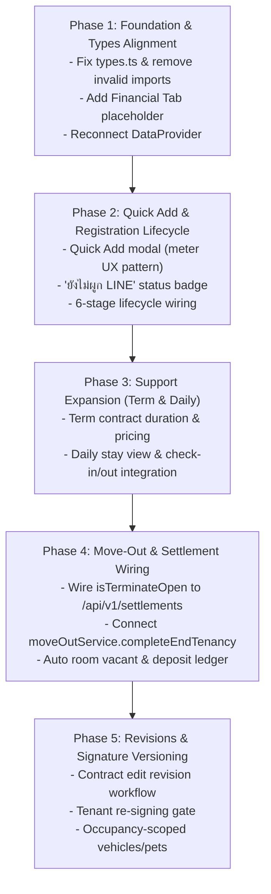

# HORPLUS-V2 — TENANT MENU SOURCE & GAP ANALYSIS REPORT

**Document ID:** `TENANT_GAP_ANALYSIS.md`  
**Repository:** `phoom007/HorPlus-V2`  
**Branch:** `review/tenant-ui-baseline-20260904`  
**Baseline Commit:** `7f129c2e589808636167454695f61dfd973410e8`  
**Date:** September 4, 2026  
**Status:** FORENSIC BASELINE SOURCE AUDIT (Analysis Phase — No Code Modified)

---

## Executive Summary

The Product Owner (PO) redesigned `src/pages/owner/tenants.tsx` locally to introduce modern Thai dormitory tenant management UX patterns (contract printing with signature pad, co-occupant management with audit history, synchronized vehicle & pet lists, and an itemized move-out deduction workflow). 

However, this captured baseline exists purely as a **standalone front-end layout prototype**:
1. **Disconnected from API/Backend:** All mutations (approve, reject, edit, terminate, add/remove co-occupant) operate exclusively on in-memory React state and mock arrays using `setTimeout`.
2. **Key Modals are Empty Placeholders:** The "เพิ่มผู้เช่าใหม่" (Add Tenant) modal and "ต่ออายุสัญญา" (Renew Contract) modal are explicitly stubbed as empty containers (`{/* ว่างเปล่าสำหรับเตรียมพัฒนาต่อ */}`).
3. **Compile-Time Type Discrepancies:** The PO introduced new properties (`vehicles[]`, `pets[]`, `coOccupantHistory[]`, `advancePaymentAmount`) and imported non-existent types (`PetItem`, `VehicleItem`, `CoOccupantHistoryItem`, `LineIcon`) that cause TypeScript compilation failures against `src/types.ts`.
4. **Architectural Gaps vs Locked Requirements:**
   - Missing **Financial Tab** in Tenant Profile.
   - Missing **Quick Add Tenant** (meter-style single-step entry with `"ยังไม่ผูก LINE"` status).
   - Missing **Term & Daily Stay** integration in the Tenant UI.
   - Missing **6-Stage Registration Lifecycle** (`OWNER_CREATED` -> `REGISTERED`).
   - Missing **Contract Revision & Tenant Re-signing Flow**.
   - Vehicles/Pets are currently attached to `Tenant` rather than `Occupancy`.
   - Signatures are stored as flat strings without historical versioning.

---

## Section A: Current UI Structure in Baseline (`src/pages/owner/tenants.tsx`)

### 1. Main Navigation & Filtering Tabs
Located at the top filter box:
- **`pending` ("รอตรวจสอบ"):** Displays combined list of pending applicants (from registration requests) and expired/expiring contracts requiring renewal or checkout. Includes sub-tabs: `'all'`, `'expired'`, `'new_tenant'`.
- **`active` ("พักอาศัย"):** Filtered list of currently staying tenants tied to active billing cycles.
- **`inactive` ("เลิกเช่าแล้ว"):** Historical tenants who have moved out or whose contracts were terminated/cancelled.
- **Search Bar:** Real-time text search filtering by room number, tenant name, phone, or email.

### 2. Layout Structure
- **Left Column (List):** Scrollable card list of tenants/expired contracts with status badges, phone numbers, and room badges.
- **Right Column (Detail Profile):** Detailed profile drawer with context-aware back navigation buttons (return to "ห้องพัก" or "จดมิเตอร์" if navigated from other owner tabs).

### 3. Profile Drawer Tabs
The profile panel provides three sub-tabs:
1. **`info` ("ข้อมูลส่วนตัวและเพิ่มเติม"):**
   - General Contact: Mobile phone, email.
   - Emergency Contact: Name, relationship, phone.
   - Vehicles & Pets Grid: Desktop synchronized 2-column grid and mobile stacked cards. Shows vehicle type (car/motorcycle), license plate, brand, pet type, custom pet type, and pet name.
   - Document History: ID Card view modal launcher and direct image upload dropzone.
2. **`contract` ("สัญญาเช่า"):**
   - Active and historical contract cards.
   - Start/End dates, duration in months.
   - Monthly rent and deposit amount with payment status tag (`paid`/`unpaid`).
   - Action buttons: "พิมพ์สัญญา" (A4 Print Preview) and "ต่อสัญญา" (Renew Contract).
   - Contract terms preview.
3. **`history` ("ประวัติผู้พักร่วม"):**
   - Active co-occupants card list with name, relationship, phone, citizen ID, and check-in date.
   - Action: "เพิ่มผู้พักร่วม" (opens `isAddCoModalOpen`) and "นำออก" (opens `isDeleteCoModalOpen`).
   - Timeline audit log displaying history of additions and removals (`added`/`removed`) with timestamps and notes.

### 4. Existing Modals & Forms

| Modal State | Modal Title / Purpose | Current Implementation Status | Form Fields / Behavior |
| :--- | :--- | :--- | :--- |
| `isAddOpen` | "จดทะเบียนผู้เช่าและย้ายเข้า" | **Empty Placeholder** (`{/* ว่างเปล่าสำหรับเตรียมพัฒนาต่อ */}`) | Old multi-step wizard is disabled behind `{false && (...) }`. |
| `isRenewContractModalOpen` | "ต่ออายุสัญญาเช่า" | **Empty Placeholder** (`{/* ว่างเปล่าสำหรับเตรียมพัฒนาต่อ */}`) | Modal opens with an empty container. |
| `isTerminateOpen` | "ทำเรื่องเลิกเช่าคืนห้องพัก" | **Fully Rendered (In-Memory)** | Tenant/stay summary, deposit choice (`refund` vs `forfeit`), refund bank info, itemized deductions (presets + custom line items), net refund calculation, local state mutation. |
| `isEditOpen` | "แก้ไขข้อมูลผู้เช่า" | **Fully Rendered (In-Memory)** | Name, citizen ID, phone, email, emergency contact, dynamic pets list, dynamic vehicles list. |
| `isApproveOpen` | "ยืนยันอนุมัติและรับผู้เช่าเข้าพัก" | **Fully Rendered (In-Memory)** | Room selection dropdown, start date, rent amount, deposit amount. |
| `isRejectOpen` | "ยืนยันการปฏิเสธคำขอเช่า" | **Fully Rendered (In-Memory)** | Predefined reject reason select + optional custom note input. |
| `isPrintContractModalOpen` | "หนังสือสัญญาเช่าห้องพัก" | **Fully Rendered (PrintView)** | Full A4 printable lease agreement with room details, financial terms, and digital signature boxes. |
| `isEditContractModalOpen` | "แก้ไขข้อความสัญญา" | **Fully Rendered (In-Memory)** | Start date, duration, end date, rent, deposit amount, deposit status (`paid`/`unpaid`), deposit type (`refundable`/`deduct_rent`), terms textarea. |
| `isCreateContractModalOpen` | "จัดทำสัญญาเช่าใหม่" | **Fully Rendered (In-Memory)** | Room dropdown, duration presets (3, 6, 12 months), start date, actual stay date, rent, deposit, terms. |
| `isAddCoModalOpen` | "เพิ่มผู้พักร่วม" | **Fully Rendered (In-Memory)** | Rule disclosure banners (per-person water charge notice), name, phone, relationship select + custom text. |
| `isDeleteCoModalOpen` | "ยืนยันการนำผู้พักร่วมออก" | **Fully Rendered (In-Memory)** | Removal reason note, updates active list and logs timeline item. |
| `isIdCardOpen` | "ภาพสำเนาบัตรประจำตัวประชาชน" | **Fully Rendered (View-only)** | Modal previewing uploaded citizen ID card image. |

---

## Section B: Existing Backend Capability & Data Models

A thorough inspection of PostgreSQL schemas (`server/prisma/schema.prisma`), Express routers (`server/src/routes/*`), and service layers reveals extensive backend infrastructure that is currently **not wired** to the frontend:

### 1. Prisma Models Already Available
- **`Tenant`:** Supports `id`, `dormitoryId`, `linkedUserId`, `tenantNumber`, `firstName`, `lastName`, `phone`, `email`, `nationalIdEncrypted`, `nationalIdMasked`, `status`, `idCardObjectKey`, `petInfo`, `lineFriendId`.
- **`TenantCoOccupant`:** `name`, `phone`, `relationship`, `nationalIdEncrypted`, `nationalIdMasked`, `status`.
- **`TenantEmergencyContact`:** `name`, `phone`, `relationship`, `isPrimary`.
- **`TenantVehicle`:** `type` (`car`/`motorcycle`), `brand`, `model`, `color`, `licensePlate`, `province`, `status`.
- **`Contract` & `ContractSnapshot`:** Immutable financial snapshot, rent, deposit, advance payment, utility rate snapshots, `version`, `terms`, signatures (`tenantSignature`, `ownerSignature`).
- **`ContractStatusHistory`:** Audit trail of contract state transitions.
- **`Occupancy`:** Central operational bridge linking `Room`, `Tenant`, `Contract`, and `Registration` (`startedAt`, `endedAt`, `status: ACTIVE | ENDED`).
- **`ProvisionalRentalTerm`:** First-class model supporting `rentalType: MONTHLY | TERM`, durations, and converted contracts.
- **`DailyStay` & `DailyStayInvoice`:** Complete daily stay booking, invoicing, and check-in/out engine.
- **`TenantMoveOutRequest`:** Dedicated model for move-out submissions (`intendedMoveOutDate`, `refundBankName`, `refundAccountNumber`, `status: SCHEDULED | COMPLETED | CANCELLED`).
- **`ContractSettlement` & `ContractSettlementItem`:** Complete PostgreSQL settlement ledger (`depositAmount`, `unpaidBillAmount`, `damageChargeTotal`, `netSettlement`, `settlementDirection`, `settlementStatus`, line-item damage charges with evidence URLs).
- **`TenantRegistrationRequest`, `TenantRegistrationIntent`, `TenantRegistrationInvite`:** Deep LINE OA registration pipeline with signed tokens and expiry.

### 2. Server APIs Available
- **Tenant Management:** `GET /api/v1/tenants`, `POST /api/v1/tenants`, `PUT /api/v1/tenants/:id`, `DELETE /api/v1/tenants/:id`, `GET /:id/identity-document`.
- **Co-Occupants:** `POST /api/v1/tenants/:id/co-occupants`, `PUT /:id/co-occupants/:coOccupantId`, `DELETE /:id/co-occupants/:coOccupantId` (integrated with water billing auto-recalculation via `billingOrchestrationService`).
- **Contracts:** `GET /api/v1/contracts`, `POST /api/v1/contracts`, `POST /:id/activate`, `POST /:id/extend`, `POST /:id/renew`, `POST /:id/terminate`, `GET /:id/pdf`.
- **Settlement & Damages:** `GET /api/v1/settlements/:contractId`, `POST /:settlementId/damage-items`, `PUT /damage-items/:itemId`, `DELETE /damage-items/:itemId`, `POST /:settlementId/confirm`.
- **Registration Pipeline:** `GET /api/v1/tenant-registrations/public-policy`, `GET /invite-context`, `POST /api/v1/tenant-registrations`, `GET /api/v1/tenant-registrations`, `POST /:id/approve`, `POST /:id/reject`.
- **Move-Out:** `GET /api/v1/tenant-move-out-requests`, `POST /:requestId/emergency-terminate`.

---

## Section C: Detailed Gap Analysis vs Locked Requirements

### Requirement 1: Tenant Profile
| Item | Required Specification | Current Baseline Implementation | Status & Gap |
| :--- | :--- | :--- | :--- |
| **Personal Info** | Name, citizen ID, phone, email, ID card photo | Fully rendered in UI; has direct upload and view modal. | **Partial:** Client mock state only. Not wired to `LocalStorageProvider` or encrypted backend fields. |
| **Contract** | Contract list, details, terms, print, renew | Rendered card list with print modal. | **Partial:** "ต่อสัญญา" is an empty modal; edit contract modifies client state directly without versioning. |
| **History** | Room stay history, co-occupants timeline | Co-occupant timeline implemented. | **Deficient:** Multi-room stay history is not displayed in the UI. |
| **Co-occupants** | Add, remove, relationship, citizen ID, per-person rules | Fully styled UI with modal forms and timeline. | **Partial:** In-memory only; not connected to `/api/v1/tenants/:id/co-occupants`. |
| **Vehicle** | Car, motorcycle, license plate, brand | Rendered in `info` tab. | **Deficient:** Uses `vehicles[]` array on Tenant which does not match `src/types.ts` (`vehicle`). Not tied to `Occupancy`. |
| **Pet** | Pet type, custom type, name, dorm policy check | Rendered in `info` tab. | **Deficient:** Uses `pets[]` array on Tenant which does not match `src/types.ts` (`pet`). Not tied to `Occupancy`. |
| **Financial Tab** | Bills, invoices, deposits, payment history, outstanding balance | **Not present in the profile drawer tabs.** | **MISSING:** Tabs are only `info`, `contract`, `history`. No financial panel exists. |

---

### Requirement 2: Support for Monthly, Term, and Daily
| Stay Type | Required Specification | Current Baseline Implementation | Status & Gap |
| :--- | :--- | :--- | :--- |
| **Monthly (รายเดือน)** | Standard recurring monthly billing and contracts | Fully assumed across all UI calculations. | **Supported** in UI (mock). |
| **Term (รายเทอม)** | Fixed semester/term agreements, lump-sum or term installments | Backend has `ProvisionalRentalTerm` (`rentalType: TERM`), but **UI has zero awareness of term rentals**. | **MISSING in UI.** |
| **Daily (รายวัน)** | Daily check-in/check-out, daily rates, daily deposit, daily stay invoices | Backend has `DailyStay` domain. Previous `DailyStayApprovalModal` was **removed** from `tenants.tsx`. | **MISSING in UI.** |

---

### Requirement 3: Quick Add Tenant
| Item | Required Specification | Current Baseline Implementation | Status & Gap |
| :--- | :--- | :--- | :--- |
| **UI Pattern** | Same pattern as Owner Meter Quick Add (compact, fast single-step entry) | "เพิ่มผู้เช่าใหม่" button opens `isAddOpen`, which is an empty container (`{/* ว่างเปล่าสำหรับเตรียมพัฒนาต่อ */}`). | **MISSING.** Modal is empty. |
| **Basic Tenant** | Owner creates basic record (name, phone, room) | Old 4-step wizard is disabled (`{false && ...}`). | **MISSING.** |
| **Initial Status** | Status explicitly set to `"ยังไม่ผูก LINE"` | Statuses in UI are only `pending`, `active`, `inactive`. No LINE binding state. | **MISSING.** |

---

### Requirement 4: 6-Stage Registration Lifecycle
**Required Flow:**  
`OWNER_CREATED` $\rightarrow$ `WAITING_LINE_BIND` $\rightarrow$ `TENANT_FILLING_DATA` $\rightarrow$ `WAITING_OWNER_APPROVAL` $\rightarrow$ `WAITING_SIGNATURE` $\rightarrow$ `REGISTERED`

| Lifecycle Stage | Backend Schema / Service Support | Current Baseline UI Status |
| :--- | :--- | :--- |
| `OWNER_CREATED` | Supported via `Tenant` record with `linkedUserId: null`. | **Missing in UI.** |
| `WAITING_LINE_BIND` | Supported via `TenantRegistrationInvite` + `DormitoryLineFriend`. | **Missing in UI.** UI has no badge or filter for unbound LINE users. |
| `WAITING_LINE_BIND` $\rightarrow$ `FILLING` | Tenant enters portal via invite token. | Handled partially in `TenantRegisterPage.tsx`. |
| `WAITING_OWNER_APPROVAL` | `TenantRegistrationRequest.status = 'pending_owner_approval'`. | Handled in `tenants.tsx` via `activeStatusTab === 'pending'`. |
| `WAITING_SIGNATURE` | Supported in backend (`Contract.status = 'pending_signature'`). | **Missing in UI.** When owner approves in UI, status immediately jumps to `'active'` without signature gate. |
| `REGISTERED` | `Tenant.status = 'active'`, `Contract.status = 'active'`, `Occupancy.status = 'ACTIVE'`. | Simulated client-side only. |

---

### Requirement 5: Move Out Workflow
**Required Flow:**  
Tenant request OR Owner initiate $\rightarrow$ Settlement (Deposit, Refund record, Penalty, Damage, Outstanding expense, End date) $\rightarrow$ Approve $\rightarrow$ Occupancy END $\rightarrow$ Room AVAILABLE

| Workflow Step | Backend Capability | Current Baseline UI Implementation | Gap / Risk |
| :--- | :--- | :--- | :--- |
| **Initiation** | `TenantMoveOutRequest` exists in schema. | Owner clicks "เลิกเช่า" $\rightarrow$ opens `isTerminateOpen`. | Tenant online move-out route currently returns `403 DEFERRED_BY_PRODUCT_POLICY`. Owner initiation is UI-only. |
| **Settlement Calculation** | `ContractSettlement` & `ContractSettlementItem` with audit trail. | UI has preset deductions (cleaning, water, electric, AC, repairs, keys) and custom line items. | **Client-side only.** Does not persist to `contract_settlements` table. Appends plain text to `Contract.terms`. |
| **Deposit Handling** | Handled in `ContractSettlement`. | UI radio: "คืนเงินประกัน" vs "ไม่คืนเงินประกัน (ยึด)". PromptPay/bank info input. | UI calculations are correct, but disconnected from API. |
| **Approve & Finalize** | `moveOutService.completeEndTenancy` runs atomic transaction with advisory lock. | `handleConfirmTerminate` uses `setTimeout(..., 1000)` and mutates local arrays. | **Severe Data Divergence:** `Occupancy` is not ended in database; Room is not marked vacant in database; Bills are not posted. |

---

### Requirement 6: Authority Model
**Requirement:** Owner financial data cannot be overwritten by tenant.
- **Audit Findings:**
  - In backend services (`TenantRegistrationService`), tenant input is restricted to applicant metadata and preferred room. All pricing, deposits, billing terms, and utility rates are strictly stamped by the Owner upon approval. This is architecturally sound in the backend.
  - In `src/pages/owner/tenants.tsx`, because all operations are mock mutations, there are currently no server schema validations running when editing tenants or contracts.

---

### Requirement 7: Contract Revision Flow
**Requirement:** After registered: Owner edits create revision $\rightarrow$ Tenant confirms and signs again.
- **Audit Findings:**
  - In `src/pages/owner/tenants.tsx`: `handleSaveEditContract` directly overwrites `contract.startDate`, `durationMonths`, `rentAmount`, `depositAmount`, and `terms` in place.
  - **No Revision Entity:** No `revisionNumber` or versioned contract draft is created.
  - **No Tenant Re-signing Gate:** The contract remains in status `'active'` without requiring the tenant to re-sign or confirm.
  - **Backend Gap:** Backend `Contract` has a simple integer `version`, but lacks an explicit `ContractRevision` table or re-signing state machine.

---

### Requirement 8: History & Data Ownership
| Item | Requirement | Current Baseline Reality | Gap / Action Needed |
| :--- | :--- | :--- | :--- |
| **Multi-room History** | Tenant can have multiple rooms history across multiple stays | Stored as a simple string array `rentalHistory: string[]` on `Tenant`. Not rendered as a stay history view. | Needs multi-occupancy timeline rendering in profile. |
| **Vehicle / Pet Ownership** | Vehicle and Pet belong to **`Occupancy`**, not `Tenant` | Attached directly to `Tenant` model in UI (`tenant.vehicles`, `tenant.pets`) and in Prisma schema (`TenantVehicle`, `Tenant.petInfo`). | **Architectural Schema Discrepancy:** Storing vehicles/pets on `Tenant` causes historical pollution across different room leases. |
| **Signature Versions** | Signature keeps versions | Flat string columns `tenantSignature` and `ownerSignature` on `Contract`. | No versioned signature ledger exists. |

---

## Section D: Code Compilation & Baseline Defect Inventory

The following compile-time errors in `src/pages/owner/tenants.tsx` prevent production compilation (`tsc --noEmit`):

1. **Missing Module Import:**
   - Line 54: `import { LineIcon } from '../../components/LineIcon';` $\rightarrow$ File does not exist.
2. **Missing Exported Types in `src/types.ts`:**
   - Line 66: `CoOccupantHistoryItem`, `PetItem`, `VehicleItem` are imported from `../../types`, but are not exported there.
3. **Type Structure Incompatibilities:**
   - Lines 323, 534: `tenant.coOccupantHistory` is accessed, but `coOccupantHistory` does not exist on interface `Tenant`.
   - Line 336, 356: `co.addedAt` is accessed, but `addedAt` does not exist on interface `CoOccupant`.
   - Lines 849, 850: `tenant.vehicles` (plural array) is accessed, but `Tenant` defines `vehicle: Vehicle` (singular).
   - Lines 860, 879: `tenant.pets` (plural array) is accessed, but `Tenant` defines `pet: Pet` (singular).
   - Lines 1159, 1445: `contract.advancePaymentAmount` does not exist on `Contract` in `src/types.ts`.
   - Line 1662: `contract.stayDate` does not exist on `Contract` in `src/types.ts`.
4. **Mock Data Leakage:**
   - Line 67: `import { getDormitory } from '../../data/mockData';` bypasses `getDataProvider()` and production adapters.

---

## Section E: Risk Areas

1. **Financial Integrity & Settlement Drift:**  
   The UI move-out settlement calculates deductions and refunds, but discards them into a text blob in `Contract.terms`. Failing to use `ContractSettlement` and `ContractSettlementItem` means finance/accounting reports cannot audit damage charges or deposit deductions.
2. **Concurrency & Room Availability Conflict:**  
   In the UI, termination marks room vacant via client state. In reality, multiple staff or concurrent registrations could allocate the same room without PostgreSQL `SELECT pg_advisory_xact_lock`.
3. **Tenant Invalidation on Move-Out:**  
   `handleConfirmTerminate` sets `tenant.status = 'inactive'`, which breaks tenants who lease multiple rooms concurrently or have future reservations. Status should belong to `Occupancy`, not the top-level `Tenant`.
4. **Pet and Vehicle Scope Leakage:**  
   Tying pets and parking vehicles directly to `Tenant` creates operational ambiguity when a tenant checks out and re-leases a different unit months later.

---

## Section F: Recommended Development Order

To safely transition the Tenant menu from prototype UI to a fully functional, production-ready implementation, execute in the following 5 phases:

### Phase 1: Foundation & Types Alignment (Non-breaking Baseline Fixes)
1. Add missing type definitions (`PetItem`, `VehicleItem`, `CoOccupantHistoryItem`) to `src/types.ts`.
2. Provide a local inline SVG `LineIcon` component or replace with Lucide icon.
3. Align `Tenant` interface to support plural `vehicles?: VehicleItem[]` and `pets?: PetItem[]` while maintaining backwards compatibility.
4. Replace `../../data/mockData` imports with `getDataProvider()`.
5. Add the **Financial Tab** to the Tenant Profile drawer.

### Phase 2: Quick Add & 6-Stage Registration Lifecycle
1. Implement the **Quick Add Tenant** modal using the compact single-cell/stepper UX pattern established in Owner Meters.
2. Introduce the `"ยังไม่ผูก LINE"` status and invite QR/link generation modal.
3. Wire the 6-stage registration state machine between `TenantRegistrationRequest`, `Contract`, and `Occupancy`.
4. Implement the Tenant Signature Gate before activating contracts.

### Phase 3: Rental Type Expansion (Monthly, Term, Daily)
1. Add Rental Type selector (`MONTHLY` | `TERM` | `DAILY`) in contract creation and tenant registration approval.
2. Wire `ProvisionalRentalTerm` for term contracts.
3. Re-integrate daily stay requests, check-in, and invoice settlements in the Tenant workspace.

### Phase 4: Production Move-Out & Settlement Persistence
1. Wire `isTerminateOpen` deduction items directly to `POST /api/v1/settlements/:settlementId/damage-items`.
2. Connect "ยืนยันการเลิกเช่า" to `moveOutService.completeEndTenancy` atomic database transaction.
3. Ensure Room transitions to `vacant`, Occupancy transitions to `ENDED`, and deposit refund records are saved in the financial ledger.

### Phase 5: Revisions, Multi-room History & Signature Versioning
1. Implement contract revision flow: editing an active contract creates a pending revision rather than an in-place mutation.
2. Add tenant notification & re-signing screen.
3. Re-architect vehicle and pet records to belong to `Occupancy`.
4. Display full room rental history timeline on the Tenant Profile.

---

**ANALYSIS COMPLETE — NO SOURCE CODE MODIFIED.**  
**AWAITING PRODUCT OWNER REVIEW & APPROVAL BEFORE COMMENCING IMPLEMENTATION.**
