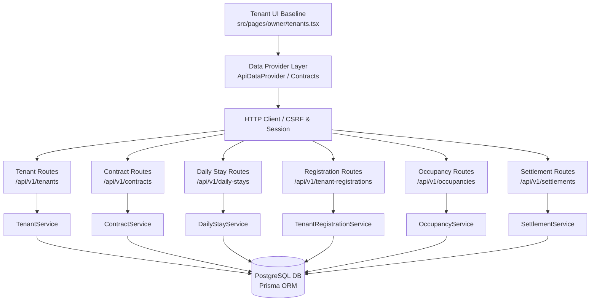
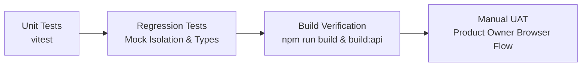

# HORPLUS-V2 — TENANT PHASE 2: ARCHITECTURE ANALYSIS & IMPLEMENTATION PLAN

**Branch:** `review/tenant-ui-baseline-20260904`  
**Baseline Commit:** `6144170` (Phase 1 Foundation Approved)  
**Date:** 2026-09-04  
**Author:** AI Pair Programmer (Antigravity)  
**Target Reviewer:** Product Owner / ChatGPT  
**Directive:** Implementation Plan Request Only (Strict Zero Code Execution in this Phase)

---

## 1. Current Architecture Analysis

### 1.1. System Overview & Technology Stack
HorPlus-V2 operates as a high-integrity dormitory management system utilizing:
- **Frontend:** React 18 with TypeScript, Vite build system, Tailwind CSS for styling, Lucide React icons, TanStack React Query for server cache management.
- **Backend:** Node.js with Express, TypeScript, Zod schema validation, CSRF token validation, session and role-based access control (`requireDormitoryPermission`, `requireDormitoryWriteEntitlement`).
- **Database & ORM:** PostgreSQL running via Prisma ORM with strict advisory locks, transactional concurrency guards, and soft-delete/audit trails.
- **Storage Layer:** Local encrypted storage provider (`LocalStorageProvider`) for sensitive documents (Thai National ID cards, digital signatures).



### 1.2. Authoritative Persistence Models (PostgreSQL Schema)
All core entities required for the Tenant Domain are already modeled and persisted in PostgreSQL (`server/prisma/schema.prisma`):

| Model | Schema Table | Authoritative Responsibility | Key Attributes |
|---|---|---|---|
| `Tenant` | `tenants` | Canonical tenant profile | `id`, `dormitoryId`, `displayName`, `phone`, `email`, `nationalIdEncrypted`, `nationalIdMasked`, `idCardObjectKey`, `lineFriendId`, `petInfo` (JSON), `status` (`String @db.VarChar(50)`). |
| `TenantCoOccupant` | `tenant_co_occupants` | Co-occupant sub-entity | `id`, `tenantId`, `dormitoryId`, `name`, `phone`, `citizenId`, `relationship`, `isPrimary`, `addedAt`, `removedAt`. Linked directly to `billingOrchestrationService` for auto water/utility recalculation. |
| `TenantVehicle` | `tenant_vehicles` | Registered vehicles | `id`, `tenantId`, `dormitoryId`, `type` (`car`, `motorcycle`, `none`), `licensePlate`, `brand`, `model`, `color`, `parkingPermitNo`. |
| `TenantEmergencyContact` | `tenant_emergency_contacts` | Emergency contacts | `id`, `tenantId`, `dormitoryId`, `name`, `phone`, `relationship`, `isPrimary`. |
| `Contract` | `contracts` | Long-term leases (Monthly & Term) | `id`, `dormitoryId`, `roomId`, `tenantId`, `rentBillingType` (`monthly` \| `term`), `rentAmount`, `depositAmount`, `advancePaymentAmount`, `startDate`, `endDate`, `status` (`draft`, `pending_signature`, `active`, `approved_scheduled`, `scheduled`, `expiring_soon`, `expired`, `terminated`, `waiting_extension`). |
| `DailyStay` | `daily_stays` | Short-term physical stay interval | `id`, `dormitoryId`, `roomId`, `tenantId`, `requestSource` (`OWNER` \| `TENANT`), `applicantFullName`, `applicantPhone`, `startDate`, `endDate`, `checkInAt`, `checkOutAt`, `inclusiveDayCount`, `dailyRateAmount`, `totalRentAmount`, `depositAmount`, `depositDeclaredStatus` (`PAID` \| `UNPAID`), `status` (`PENDING_APPROVAL`, `RESERVED`, `ACTIVE`, `CHECKED_OUT`, `COMPLETED`, `CANCELLED`, `REJECTED`). |
| `Occupancy` | `occupancies` | Authoritative room tenancy linkage | `id`, `dormitoryId`, `roomId`, `tenantId`, `contractId`, `dailyStayId`, `registrationId`, `startedAt`, `endedAt`, `status` (`ACTIVE`, `ENDED`), `endedReason`. |
| `TenantRegistrationRequest` | `tenant_registration_requests` | Public / invite-based onboarding | `id`, `dormitoryId`, `requestedRoomId`, `firstName`, `lastName`, `phone`, `acceptanceSnapshot` (JSON), `tenantSignatureObjectKey`, `status` (`pending_owner_approval`, `approved`, `rejected`). |
| `TenantRegistrationInvite` | `tenant_registration_invites` | Cryptographic LINE invite tokens | `id`, `dormitoryId`, `lineFriendId`, `tokenHash`, `expiresAt`, `deliveryStatus` (`PENDING`, `DELIVERED`, `FAILED`), `consumedAt`. |
| `ContractSettlement` | `contract_settlements` | Move-out settlement & deposit return | `id`, `dormitoryId`, `contractId`, `roomId`, `tenantId`, `depositAmount`, `unpaidBillAmount`, `damageChargeTotal`, `netSettlement`, `settlementDirection`, `settlementStatus`. |

---

## 2. Tenant UI Gap Analysis After Phase 1

Phase 1 successfully decoupled `mockData`, aligned base types, resolved `LineLogo`, restored context-aware back navigation, and achieved 100% build and regression test pass. However, the following key gaps remain between the Product Owner's locked requirements and the current baseline:

```
+----------------------------------------------------------------------------------------------------+
|                                    PRODUCT OWNER LOCKED FLOW                                       |
|                                                                                                    |
|    [ เลือกห้อง ]  ───►  [ เลือกรายเทอม / รายเดือน / รายวัน ]  ───►  [ Tenant Profile (6 Tabs) ]   |
|                             (ข้อมูลการเงิน & Quick Add)                                              |
+----------------------------------------------------------------------------------------------------+
```

### Gap 2.1: Quick Add Modal Entry Point ("เพิ่มผู้เช่าใหม่")
- **Current Baseline (`tenants.tsx` L3439):**
  The "เพิ่มผู้เช่าใหม่" button (`handleOpenAddWizard`) opens an empty modal placeholder:
  ```tsx
  {/* Add Tenant Notice Modal */}
  <Modal isOpen={isAddOpen} onClose={() => setIsAddOpen(false)} title="จดทะเบียนผู้เช่าและย้ายเข้า" size="md">
    {/* ว่างเปล่าสำหรับเตรียมพัฒนาต่อ */}
    <div className="min-h-[240px] flex items-center justify-center p-6 text-slate-300">
    </div>
  </Modal>
  ```
- **Required Behavior:**
  Must connect to `QuickAddTenantModal` (which is already implemented and proven in `rooms.tsx`). When opened, the owner selects a vacant room, selects the rental type (Monthly / Term / Daily / LINE Invite), inputs financial terms (rent, deposit, advance payment, dates), and creates the initial tenant record with starting badge "ยังไม่ผูก LINE".

### Gap 2.2: Profile Tabs Mapping (3 Visual Tabs vs. 6 PO Domain Tabs)
- **Product Owner Locked Requirements:**
  Tenant Profile must cover 6 logical domains:
  1. `ข้อมูลส่วนตัว` (Tenant personal info, emergency contacts, Thai ID card photo/details)
  2. `สัญญา` (Contract details, deposit, advance payment, contract PDF, activate/extend/terminate actions)
  3. `ประวัติการพัก` (Stay history, room transfers, move-out audit)
  4. `ผู้พักร่วม` (Co-occupants list, check-in/out history, utility billing people-count impact)
  5. `รถ` (Vehicles, license plates, type car/motorcycle, parking permit)
  6. `สัตว์เลี้ยง` (Pets, type, breed, dormitory pet policy)
- **Current Baseline:**
  Uses a 3-tab layout: `info` (aggregating personal info, emergency, vehicles, pets, ID card), `contract` (contract info), and `history` (co-occupants and co-occupant history).
- **Gap Resolution Strategy:**
  Maintain the visual elegance of the Product Owner's tab container while either:
  - Expanding the profile tab bar cleanly to 6 designated tabs matching the PO lock, OR
  - Organizing the sub-sections cleanly within the existing navigation with dedicated section anchors/cards, preserving 100% of PO layout styling.

### Gap 2.3: 6-Stage Registration Lifecycle Tracking
- **PO Requirement:** Explicit 6-stage lifecycle tracking:
  1. `OWNER_CREATED`: Owner creates basic record via Quick Add. Status = `pending`, Badge = "ยังไม่ผูก LINE".
  2. `WAITING_LINE_BIND`: Waiting for tenant to scan QR / click invite link.
  3. `TENANT_FILLING_DATA`: Tenant opened portal and is completing ID, emergency, co-occupants, vehicles, pets.
  4. `WAITING_OWNER_APPROVAL`: Tenant submitted data; appears in Owner Review list ("รอตรวจสอบ").
  5. `WAITING_SIGNATURE`: Owner approved terms; waiting for contract signature.
  6. `REGISTERED`: Signatures captured, contract `active`, occupancy `ACTIVE`, room `occupied`.
- **Current Baseline:** Only has binary filter tabs (`pending`, `active`, `inactive`). It lacks the "ยังไม่ผูก LINE" visual badge and token generation action.

### Gap 2.4: Review Tab ("รอตรวจสอบ") Expiration Rules
- **PO Requirement:**
  - **Monthly:** Contract expiring alert 15 days before end date.
  - **Term:** Contract expiring alert 15 days before end date.
  - **Daily:** STRICTLY EXCLUDED from contract expiration alerts (handled purely via Checkout).
- **Current Baseline:** The "รอตรวจสอบ" tab currently checks expiring contracts without distinguishing the 15-day threshold or filtering out daily stays.

### Gap 2.5: Live API Mutation Wiring
- **Current Baseline:** Adding/removing co-occupants, emergency contacts, vehicles, and pets currently updates local React state without invoking `billingOrchestrationService` (which recalculates water bills on co-occupant count changes) or persisting to backend endpoints.

---

## 3. Backend API Availability Matrix

| Feature / Domain | Backend API Endpoint | HTTP Method | Availability | Missing In Frontend | Decision Needed |
|---|---|---|---|---|---|
| **Tenant List** | `/api/v1/tenants` | `GET` | **Available** | None | Full support with pagination, status filter, search. |
| **Tenant Details** | `/api/v1/tenants/:id` | `GET` | **Available** | None | Returns tenant, coOccupants, emergencyContacts, vehicles, contracts. |
| **Create Tenant** | `/api/v1/tenants` | `POST` | **Available** | None | Accepts encrypted Thai national ID and metadata. |
| **Update Tenant** | `/api/v1/tenants/:id` | `PUT` | **Available** | None | Accepts partial updates including `petInfo` (JSON). |
| **Archive / Inactivate** | `/api/v1/tenants/:id` | `DELETE` | **Available** | None | Soft-archives tenant and updates status. |
| **Thai ID Card Document** | `/api/v1/tenants/:id/identity-document` | `GET` | **Available** | Adapter helper | Backend streams secure decrypted WebP image. Frontend needs helper method on `ApiTenantAdapter`. |
| **Co-Occupant Add** | `/api/v1/tenants/:id/co-occupants` | `POST` | **Available** | Wired to UI | Calls `billingOrchestrationService.addTenantCoOccupant` with auto people-count utility recalculation. |
| **Co-Occupant Edit** | `/api/v1/tenants/:id/co-occupants/:cid` | `PUT` | **Available** | Wired to UI | Updates co-occupant information. |
| **Co-Occupant Remove** | `/api/v1/tenants/:id/co-occupants/:cid` | `DELETE` | **Available** | Wired to UI | Calls `billingOrchestrationService.removeTenantCoOccupant` with auto recalculation. |
| **Emergency Contact Add** | `/api/v1/tenants/:id/emergency-contacts` | `POST` | **Available** | Method on Adapter | Exists in Express router; needs addition to `TenantDataSource` interface. |
| **Vehicle Add** | `/api/v1/tenants/:id/vehicles` | `POST` | **Available** | Method on Adapter | Exists in Express router; needs addition to `TenantDataSource` interface. |
| **Pet Info Update** | `/api/v1/tenants/:id` | `PUT` | **Available** | Payload helper | Handled via `petInfo` JSON payload on `Tenant`. |
| **Contract List** | `/api/v1/contracts` | `GET` | **Available** | None | Supports `status`, `roomId`, `tenantId`, `expiringWithinDays`. |
| **Contract Details** | `/api/v1/contracts/:id` | `GET` | **Available** | None | Full contract snapshot and terms. |
| **Contract Create** | `/api/v1/contracts` | `POST` | **Available** | None | Creates draft/scheduled contract with `rentBillingType`. |
| **Contract Activate** | `/api/v1/contracts/:id/activate` | `POST` | **Available** | Wired to UI | Activates contract, sets room occupied, sets occupancy active. |
| **Contract Extend** | `/api/v1/contracts/:id/extend` | `POST` | **Available** | Wired to UI | Extends end date with audit log. |
| **Contract Renew** | `/api/v1/contracts/:id/renew` | `POST` | **Available** | Wired to UI | Creates successor contract. |
| **Contract Terminate** | `/api/v1/contracts/:id/terminate` | `POST` | **Available** | Wired to UI | Terminates contract and initiates settlement. |
| **Contract PDF** | `/api/v1/contracts/:id/pdf` | `GET` | **Available** | Button hookup | Generates official PDF document buffer. |
| **Daily Stay Quick Add** | `/api/v1/daily-stays/owner-quick-add` | `POST` | **Available** | None | Multi-part form with ID card image, creates DailyStay + Occupancy. |
| **Daily Stay List** | `/api/v1/daily-stays` | `GET` | **Available** | None | List daily stays by date range / status. |
| **Daily Stay Checkout** | `/api/v1/daily-stays/:id/checkout` | `POST` | **Available** | Button hookup | Checks out daily stay and frees room. |
| **Occupancy Summary** | `/api/v1/occupancy/summary` | `GET` | **Available** | None | Provides active occupancy count and room breakdown. |
| **Room Transfer** | `/api/v1/occupancies/:id/transfer` | `POST` | **Available** | Wired to UI | Transfers active tenant from room A to room B. |
| **Move-Out** | `/api/v1/occupancies/:id/move-out` | `POST` | **Available** | Wired to UI | Ends occupancy and updates room status. |
| **Contract Settlement** | `/api/v1/settlements/:contractId` | `GET` | **Available** | None | Returns deposit, damages, unpaid bills, net settlement. |
| **Settlement Damages** | `/api/v1/settlements/:id/damage-items` | `POST`/`PUT`/`DEL` | **Available** | None | Manages damage charge items with soft-delete audit. |
| **Confirm Settlement** | `/api/v1/settlements/:id/confirm` | `POST` | **Available** | None | Locks settlement and finalizes move-out financial closure. |
| **Registration Requests** | `/api/v1/tenant-registrations` | `GET` | **Available** | List hookup | Returns pending self-registration requests. |
| **Approve Registration** | `/api/v1/tenant-registrations/:id/approve` | `POST` | **Available** | Action hookup | Approves registration, creates tenant, contract, occupancy. |
| **Reject Registration** | `/api/v1/tenant-registrations/:id/reject` | `POST` | **Available** | Action hookup | Rejects registration with reason. |
| **LINE Registration Invite** | `/api/v1/tenant-registrations/invite-context` | `GET` | **Available** | QR/Link UI | Validates token and provides public dormitory onboarding context. |

---

## 4. Proposed Phase 2 Development Steps

```
Step 1: Types & Adapter Extensions
   │
Step 2: Quick Add Modal Connection in tenants.tsx
   │
Step 3: Tenant Profile Tabs Refinement (6 Domain Sections)
   │
Step 4: Lifecycle & "ยังไม่ผูก LINE" Status Badges
   │
Step 5: Review Tab ("รอตรวจสอบ") Expiration & Renewal Rules
   │
Step 6: Live Mutation Wiring (Co-occupants, Utility Recalc, Emergency, Vehicles, Pets)
   │
Step 7: Full Automated Regression Suite & Verification
```

### Step 4.1: Types & Adapter Extensions
- Extend `TenantDataSource` in `src/data/contracts/index.ts` and `src/data/adapters/api/index.ts`:
  - `addEmergencyContact(tenantId: string, contact: EmergencyContactInput)`
  - `addVehicle(tenantId: string, vehicle: VehicleInput)`
  - `getIdentityDocumentUrl(tenantId: string): string`
  - `updatePetInfo(tenantId: string, pets: PetItem[]): Promise<DataResult<Tenant>>`
- Export Registration Lifecycle stage type:
  ```ts
  export type TenantLifecycleStage =
    | 'OWNER_CREATED'
    | 'WAITING_LINE_BIND'
    | 'TENANT_FILLING_DATA'
    | 'WAITING_OWNER_APPROVAL'
    | 'WAITING_SIGNATURE'
    | 'REGISTERED';
  ```

### Step 4.2: Quick Add Modal Connection in `tenants.tsx`
- Replace empty placeholder modal at `isAddOpen` (lines 3439–3443) with the battle-tested `QuickAddTenantModal`:
  - When the owner clicks "เพิ่มผู้เช่าใหม่", `QuickAddTenantModal` opens.
  - Automatically lists vacant rooms for room selection.
  - Handles **Monthly** (`MONTHLY`), **Term** (`TERM`), **Daily** (`DAILY`), and **LINE Invite** (`LINE`).
  - On submit success, refreshes tenant list and sets newly created tenant to `OWNER_CREATED` / `WAITING_LINE_BIND` with the badge "ยังไม่ผูก LINE".

### Step 4.3: Tenant Profile Tabs Refinement (6 Locked Domain Sections)
Refine the profile panel inside `src/pages/owner/tenants.tsx` to cleanly map all 6 domain areas requested by the Product Owner:
1. **ข้อมูลส่วนตัว:** Personal details, emergency contacts, Thai ID card photo/details with secure image loader.
2. **สัญญา:** Rent, deposit, advance payment, contract status, PDF preview/download, and lifecycle buttons (เปิดสัญญา, ต่อสัญญา, ยกเลิกสัญญา).
3. **ประวัติการพัก:** Check-in date, room transfer history, move-out date, linked to `Occupancy` records.
4. **ผู้พักร่วม:** List of co-occupants, check-in/out timestamps, and notification of utility billing people-count recalculation.
5. **รถ:** Registered vehicles, license plates, car vs. motorcycle badges, parking permit allocations.
6. **สัตว์เลี้ยง:** Pet list, animal type, breed, dormitory pet policy compliance banner.

> [!NOTE]
> All styling will strictly preserve the Product Owner's Tailwind CSS design system, typography, padding, color palette, and component hierarchy.

### Step 4.4: Lifecycle & "ยังไม่ผูก LINE" Status Badges
- In the tenant list card and profile header:
  - If tenant has no `lineFriendId`: render clear amber badge: **"ยังไม่ผูก LINE"** with a one-click action to view/copy the registration invite link or display the LINE OA QR Code.
  - If tenant is in `WAITING_OWNER_APPROVAL`: show in "รอตรวจสอบ" tab with approve/reject actions.
  - If tenant is `REGISTERED`: render green badge: **"เข้าพักสมบูรณ์"**.

### Step 4.5: Review Tab ("รอตรวจสอบ") Expiration & Renewal Rules
- Implement authoritative 15-day expiration filter:
  - **Monthly:** Flag contracts expiring within $\le 15$ days (`expiringWithinDays = 15`).
  - **Term:** Flag contracts expiring within $\le 15$ days (`expiringWithinDays = 15`).
  - **Daily:** Excluded from contract expiration alerts; short stays are tracked solely by physical checkout date.
- Integrate pending `TenantRegistrationRequest` items into the "รอตรวจสอบ" tab with approval and room reassignment modal.

### Step 4.6: Live Mutation Wiring
- Connect co-occupant additions/removals to `billingOrchestrationService` endpoints, showing instantaneous feedback on people-count recalculation.
- Connect emergency contact and vehicle addition forms to backend endpoints.
- Connect contract action buttons (Activate, Extend, Terminate, PDF) to authoritative `contractService` endpoints.

### Step 4.7: Full Automated Regression Suite & Verification
- Run full Vite frontend build (`npm run build`).
- Run backend TypeScript compile (`npm run build:api`).
- Run Vitest regression test suite covering all new methods, mock isolation, and state transitions.

---

## 5. Files Expected to Change

| File Path | Nature of Change | Rationale |
|---|---|---|
| `src/pages/owner/tenants.tsx` | `[MODIFY]` | Connect `QuickAddTenantModal`, map 6 profile domain sections, render "ยังไม่ผูก LINE" badge, implement 15-day expiration logic, wire mutations. |
| `src/types.ts` | `[MODIFY]` | Add `TenantLifecycleStage`, `EmergencyContactInput`, `VehicleInput`, `TenantStayHistoryItem`. |
| `src/data/contracts/index.ts` | `[MODIFY]` | Add emergency contact, vehicle, and pet update method signatures to `TenantDataSource`. |
| `src/data/adapters/api/index.ts` | `[MODIFY]` | Implement added methods on `ApiTenantAdapter` calling existing Express routes. |
| `src/tests/tenant-phase2-implementation.test.tsx` | `[NEW]` | Automated test suite verifying Quick Add flow, lifecycle badges, 15-day expiration, and API method wiring. |

---

## 6. Files Forbidden to Change

> [!CAUTION]
> The following files and resources are strictly protected from modification in Phase 2:

1. **`server/prisma/schema.prisma`** — STRICT: ZERO migration policy. All models already exist.
2. **`server/prisma/migrations/*`** — STRICT: No new migration files or schema modifications.
3. **`src/components/LineLogo.tsx`** — Canonical official LINE icon; must not be edited or duplicated.
4. **`src/pages/owner/rooms.tsx`** — Stable Owner baseline; must remain untouched.
5. **`src/pages/owner/meters.tsx`** — Stable Meter baseline; must remain untouched.
6. **`server/src/db/prisma.ts`** — Core database connection pool; forbidden to tamper.

---

## 7. Database Impact

```
DATABASE MIGRATION REQUIRED?  ───►  NO (ZERO MIGRATION POLICY)
SCHEMA CHANGES REQUIRED?      ───►  NO (100% SCHEMA PRESERVATION)
```

- **All Required Models Exist:**
  PostgreSQL already contains `Tenant`, `TenantCoOccupant`, `TenantVehicle`, `TenantEmergencyContact`, `Contract`, `DailyStay`, `Occupancy`, `TenantRegistrationRequest`, `TenantRegistrationInvite`, and `ContractSettlement`.
- **String-Based Status Columns:**
  Status attributes on `Tenant`, `Contract`, `Occupancy`, and `DailyStay` are typed as `VarChar(50)` in Prisma, seamlessly supporting `OWNER_CREATED`, `WAITING_LINE_BIND`, `ACTIVE`, `ENDED`, and other lifecycle values without schema changes.
- **Flexible JSON Payload Storage:**
  `Tenant.petInfo` is stored as native `Json?`, accommodating pet details (type, name, breed, count) with zero schema alterations.

---

## 8. Risk Analysis & Mitigation

| Risk Description | Severity | Impact Area | Mitigation Strategy |
|---|---|---|---|
| **1. Utility Recalculation Side Effects**<br/>Adding/removing co-occupants triggers `billingOrchestrationService` which recalibrates room people count and recalculates draft water bills. | **Medium** | Billing & Co-occupants | Wrap co-occupant calls in safe try-catch blocks; return explicit confirmation message showing the new people count and updated billing status. |
| **2. Financial Authority Boundary Violation**<br/>Modifying contract terms post-activation or without tenant re-confirmation. | **High** | Contract Integrity | Enforce immutability: once a contract is signed and activated, terms are locked via `ContractSnapshot`. Changes must route strictly through formal renewal (`POST /contracts/:id/renew`) or settlement. |
| **3. Daily Stay Conflation with Contracts**<br/>Accidentally treating Daily stays as Contracts in expiration calculations or billing. | **High** | Daily Rental Domain | Strict separation: Daily stays route through `DailyStay` endpoints and are filtered out of 15-day contract expiration alerts. |
| **4. Visual Layout Tampering**<br/>Distorting the Product Owner's UI layout or responsive classes during tab refinement. | **High** | UI Fidelity | Strict zero-redesign rule: preserve all existing container tags, padding, colors, font sizes, and button placements. Only connect dynamic data and hooks. |

---

## 9. Test Strategy



### 9.1. Automated Unit & Regression Suite (`src/tests/tenant-phase2-implementation.test.tsx`)
1. **Quick Add Test:** Verify `QuickAddTenantModal` opens with vacant rooms, handles Monthly, Term, Daily, and LINE tabs, and submits correct payload.
2. **Lifecycle Badge Test:** Verify tenant cards render "ยังไม่ผูก LINE" badge when `lineFriendId` is absent.
3. **15-Day Expiration Filter Test:** Verify Monthly and Term contracts expiring in $\le 15$ days appear in "รอตรวจสอบ", while contracts $> 15$ days and Daily stays are excluded.
4. **Co-Occupant Mutation Test:** Verify adding a co-occupant triggers people-count recalculation and updates the view-model.
5. **Mock Isolation Test:** Verify 0 imports of `mockData` across all tenant pages and components.

### 9.2. Build Verification Commands
```bash
# Frontend Vite build verification
npm run build

# Backend TypeScript build verification
npm run build:api

# Execute Vitest tenant test suite
npx vitest run src/tests/tenant-phase2-implementation.test.tsx
npx vitest run src/tests/tenant-phase1-foundation.test.tsx
```

---

## 10. Manual UAT Checklist (Product Owner Verification)

When Phase 2 execution begins, the Product Owner can verify every capability using the following step-by-step checklist in the web browser:

### Flow 1: Quick Add Tenant
- [ ] Navigate to `/owner/tenants`
- [ ] Click **"เพิ่มผู้เช่าใหม่"**
- [ ] Verify modal opens with Room selection, Monthly, Term, Daily, and LINE tabs
- [ ] Select a vacant room, choose "รายเดือน" (Monthly), enter Name and Phone, click Submit
- [ ] Verify new tenant card appears in list with amber badge **"ยังไม่ผูก LINE"**

### Flow 2: Tenant Profile Navigation (6 Domain Tabs)
- [ ] Select the newly created tenant
- [ ] Verify **ข้อมูลส่วนตัว:** Name, phone, emergency contact, ID card slot
- [ ] Verify **สัญญา:** Monthly rent, deposit, advance payment, contract status
- [ ] Verify **ประวัติการพัก:** Initial check-in date and room assignment
- [ ] Verify **ผู้พักร่วม:** Co-occupant list, add co-occupant button, utility impact alert
- [ ] Verify **รถ:** Vehicle registration, car/motorcycle selection, license plate
- [ ] Verify **สัตว์เลี้ยง:** Pet list, pet type, breed, dormitory pet policy notice

### Flow 3: LINE Invitation & Status Progression
- [ ] On the tenant profile, click "แชร์ลิงก์ลงทะเบียน" / "QR Code"
- [ ] Verify LINE invite link / QR Code displays correctly
- [ ] Verify badge changes to appropriate lifecycle state once bound

### Flow 4: Review Tab ("รอตรวจสอบ") & Expiration Rules
- [ ] Switch to **"รอตรวจสอบ"** filter tab
- [ ] Verify contracts expiring within 15 days appear with renewal/extension actions
- [ ] Verify Daily stays do NOT appear in the contract expiration list
- [ ] Verify pending self-registration requests display with "อนุมัติ" / "ปฏิเสธ" actions

### Flow 5: Contract Management Actions
- [ ] In the Contract section, click **"เปิดสัญญา"** (Activate) $\rightarrow$ verify contract becomes Active and room becomes Occupied
- [ ] Click **"ดาวน์โหลด PDF สัญญา"** $\rightarrow$ verify official PDF document downloads cleanly
- [ ] Click **"ต่อสัญญา"** (Extend) $\rightarrow$ verify modal opens with new end date selection

---

```
TENANT PHASE 2 ANALYSIS COMPLETE — WAITING FOR PRODUCT OWNER APPROVAL.
```
