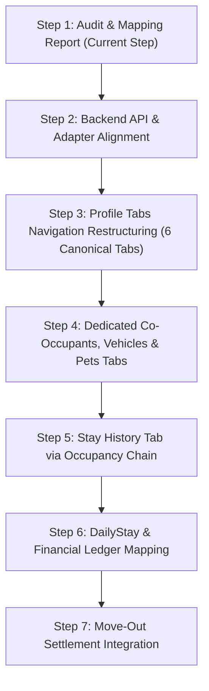

# TENANT PHASE 3 STEP 1: Tenant Profile Domain Audit & Financial History Mapping

**Branch:** `review/tenant-ui-baseline-20260904`  
**Audit Date:** 2026-09-05  
**Audit Target:** Tenant Profile Domain, Data Sources, and Financial History Mapping  
**Mode:** Source-Code Audit Only (No code modifications)  

---

## 1. Current Tenant Profile Architecture

### 1.1 UI Component Tree & Navigation State
- **Entry & Container:** `src/pages/owner.tsx` (`case 'tenants'`) mounts `<OwnerTenants />`.
- **Implementation File:** `src/pages/owner/tenants.tsx` (~5,953 lines of code).
- **Current Tab State:**
  ```tsx
  // Line 263 in src/pages/owner/tenants.tsx
  const [profileTab, setProfileTab] = useState<'info' | 'contract' | 'history'>('info');
  ```
  The profile view is hardcoded to **only 3 tabs**:
  1. `'info'` — Displayed as "ข้อมูลส่วนตัว" (mobile) / "ข้อมูลส่วนตัวและเพิ่มเติม" (desktop).
  2. `'contract'` — Displayed as "สัญญาเช่า".
  3. `'history'` — Displayed as "ผู้พักร่วม" (mobile) / "ประวัติผู้พักร่วม" (desktop) with `Users` icon.
  
  > [!CAUTION]
  > **Tab Misnaming & Missing Tabs**:
  > - The current `'history'` tab does **NOT** show Stay History (ประวัติการพัก). It only renders active co-occupants and co-occupant history.
  > - Stay History (ประวัติการพัก) is **completely missing**.
  > - Vehicles (รถ) and Pets (สัตว์เลี้ยง) are crammed inside the `'info'` tab as sub-cards.
  > - Expected Product Owner structure requires **6 distinct tabs**:
  >   1. ข้อมูลส่วนตัว (Personal Info)
  >   2. สัญญา (Contract)
  >   3. ประวัติการพัก (Stay History)
  >   4. ผู้พักร่วม (Co-Occupants)
  >   5. รถ (Vehicles)
  >   6. สัตว์เลี้ยง (Pets)

### 1.2 Data Ingestion & State Flow
- `src/pages/owner.tsx` fetches tenants via TanStack React Query:
  ```ts
  fetchAllPaginated<Tenant>('/api/v1/tenants', { headers: dormHeader, credentials: 'include' })
  ```
- Backend `GET /api/v1/tenants` (`server/src/routes/tenant.routes.ts` $\rightarrow$ `tenantRepo.findAll`):
  - Returns `TenantEntity[]` with relations `{ coOccupants: true, vehicles: true }`.
  - **Does NOT return**: `emergencyContacts`, `occupancies`, `contracts`, `bills`, `dailyStays`, or `settlements`.
- In `src/pages/owner/tenants.tsx`:
  - `contracts` are passed as prop from `owner.tsx` (from `GET /api/v1/contracts`).
  - `bills` are passed as prop from `owner.tsx` (from `GET /api/v1/bills`).
  - `selectedTenant` is stored in component state: `useState<Tenant | null>(null)`.

### 1.3 Critical Architectural Defect: Persistence Anomaly
When an owner edits tenant details in `EditTenantModal` (`isEditOpen`):
```tsx
// src/pages/owner/tenants.tsx line 1300
onSaveTenants(updatedTenants);
```
And in `src/pages/owner.tsx`:
```tsx
// src/pages/owner.tsx line 887-889
const handleSaveTenants = (_newTenants: Tenant[]) => {
  queryClient.invalidateQueries({ queryKey: queryKeys.tenants(activeDormitoryId) });
};
```
> [!WARNING]
> `handleSaveTenants` in `owner.tsx` simply invalidates the React Query cache! It **never calls `PUT /api/v1/tenants/:id`**. Consequently, tenant profile edits made in the owner modal are lost on next refetch and never reach the database.

---

## 2. UI Component Mapping

| UI Section | Current Source in Code | Authoritative Source (DB / API) | Status / Defect |
|---|---|---|---|
| **1. ข้อมูลส่วนตัว (Personal Info)** | `selectedTenant` in-memory object (`name`, `phone`, `email`, `citizenId`) | `Tenant` model (`firstName`, `lastName`, `displayName`, `phone`, `email`, `nationalIdMasked`) via `GET /api/v1/tenants/:id` | **Partial**: Assumes single `name` string; UI splits on first space instead of using `firstName` & `lastName`. |
| **2. สำเนาบัตรประชาชน (ID Card Photo)** | `selectedTenant.idCardPhotoMock` (base64 string in memory) | `Tenant.idCardObjectKey` via authenticated stream endpoint `GET /api/v1/tenants/:id/identity-document` | **Mock Data**: Uses in-memory mock base64. Authenticated backend image streaming route is not invoked by owner UI. |
| **3. ผู้ติดต่อฉุกเฉิน (Emergency Contact)** | `selectedTenant.emergencyContact` (loose JSON on tenant object) | `TenantEmergencyContact` table via `POST /api/v1/tenants/:id/emergency-contacts` | **Out of Sync**: Stored as tenant JSON; not synced to canonical `tenant_emergency_contacts` table. |
| **4. สัญญา (Contract — รายเดือน)** | `contracts` prop filtered by `c.tenantId === selectedTenant.id` | `Contract` table (`contracts`) | **Supported**: Renders rent, deposit amount, start/end dates, duration. |
| **5. สัญญา (Contract — รายเทอม)** | `contracts` prop filtered by `c.tenantId === selectedTenant.id` | `Contract` (converted) + `ProvisionalRentalTerm` | **Partial**: Converted contracts show; unconverted `ProvisionalRentalTerm` records are invisible. |
| **6. สัญญา (Contract — รายวัน)** | Shows empty state: `"ยังไม่มีประวัติสัญญาเช่าสำหรับผู้เช่ารายนี้"` | `DailyStay`, `DailyStayInvoice`, `DailyStayPayment` | **Wrong Mapping**: Daily rentals are NOT contracts. Daily stay guests appear as having no stay/contract at all. |
| **7. ประวัติการพัก (Stay History)** | **NOT IMPLEMENTED** | `Occupancy` table (`roomId`, `startedAt`, `endedAt`, `status`, `endedReason`, `contractId`) | **Missing**: No tab, no component, and no backend query returning tenant occupancies. |
| **8. ผู้พักร่วม (Co-Occupants)** | Misnamed under `history` tab; renders `selectedTenant.coOccupants` | `TenantCoOccupant` table (`tenant_co_occupants`) | **Misplaced**: Placed under 'history' tab instead of a dedicated "ผู้พักร่วม" tab. |
| **9. ประวัติผู้พักร่วม (Co-Occupant History)** | `getEffectiveCoOccupantHistory` with `coOccupantHistoryMock` | `AuditLog` / `TenantCoOccupant.deletedAt` | **Mock Data**: Generates fake history timeline from in-memory mock array. |
| **10. รถ (Vehicles)** | Crammed inside `info` tab; reads `selectedTenant.vehicles` | `TenantVehicle` table (`tenant_vehicles`) | **Misplaced & Incomplete**: Nested in info tab. `province` field exists in DB but is completely omitted from UI. |
| **11. สัตว์เลี้ยง (Pets)** | Crammed inside `info` tab; reads `selectedTenant.pets` | `Tenant.petInfo` (JSON) | **Misplaced & Incomplete**: Nested in info tab. `breed` (สายพันธุ์) required by PO is missing from UI and schema. |
| **12. ข้อมูลการเงิน (Financial Ledger / Bills)** | **NOT IMPLEMENTED** in detail panel (`bills` prop only used for delete validation) | `Bill`, `BillItem`, `Payment`, `Receipt` tables | **Missing**: No billing ledger, no invoice list, and no payment history in the profile view. |
| **13. Move-Out Settlement (ยอดย้ายออก & คืนเงินประกัน)** | **NOT IMPLEMENTED** | `ContractSettlement`, `ContractSettlementItem` via `GET /api/v1/settlements/:contractId` | **Missing**: No settlement calculation display, deduction list, or refund status. |

---

## 3. Missing Features

### 3.1 Missing Dedicated Profile Tabs
The current UI is missing 3 dedicated tabs required by the Product Owner:
1. **ประวัติการพัก (Stay History Tab):** Must show multi-room history, start dates, end dates, and move-out reasons from `Occupancy`.
2. **รถ (Vehicles Tab):** Dedicated management of tenant vehicles (type, brand, model, license plate, province, status).
3. **สัตว์เลี้ยง (Pets Tab):** Dedicated management of pets (type, custom type, pet name, breed, count).

### 3.2 Missing Financial History Ledger
While the backend has robust `Bill`, `BillItem`, `Payment`, and `Receipt` models, the Tenant Profile detail panel displays **zero** financial data:
- No rent payment status.
- No deposit payment / refund tracking.
- No list of historical bills or itemized charges (water, electricity, amenities).
- No receipt viewing or payment breakdown.

### 3.3 Missing Move-Out Settlement Integration
- `ContractSettlement` and `ContractSettlementItem` exist in the database and have calculation endpoints (`GET /api/v1/settlements/:contractId`).
- The Tenant Profile cannot display settlement summaries, damage deductions, utility deductions, or net refund / payment due amounts.

### 3.4 Missing Secure Identity Document Stream
- Backend has `GET /api/v1/tenants/:id/identity-document` which streams decrypted WebP images from secure local/object storage.
- Frontend `src/pages/owner/tenants.tsx` still reads `idCardPhotoMock` and falls back to a simulated SVG graphic.

---

## 4. Wrong Domain Mapping

### 4.1 Tab Structure & Misnomer
- **Issue:** The button with label "ผู้พักร่วม" / "ประวัติผู้พักร่วม" sets `profileTab = 'history'`.
- **Domain Mismatch:** In the Product Owner specification, "ประวัติการพัก" (Stay History) is room/occupancy history, while "ผู้พักร่วม" (Co-Occupants) is a dedicated entity tab. Currently, co-occupants hijack the `history` tab key, and stay history does not exist.

### 4.2 Cramming Vehicles & Pets into Personal Information
- **Issue:** Lines 2940–3120 of `src/pages/owner/tenants.tsx` place a complex two-column desktop / stacked mobile grid of Vehicles and Pets inside the `info` tab.
- **Domain Mismatch:** Vehicles and Pets are distinct domain aggregates with their own policies, quotas, and lifecycle states. They must have dedicated tabs.

### 4.3 Daily Stay Domain Conflation
- **Locked PO Domain Rule:** "การเข้าพักรายวัน ไม่ใช่สัญญาเช่า (Daily rental is NOT Contract)."
- **Current Behavior:** The `contract` tab only queries the `contracts` table.
- When an occupant is on a DailyStay:
  - `contracts` is empty.
  - Profile renders `"ยังไม่มีประวัติสัญญาเช่าสำหรับผู้เช่ารายนี้"`.
  - The daily stay, daily rate, stay dates, deposit declaration, and daily invoice are completely hidden from the owner.

### 4.4 Repository Update Field Dropping
- In `server/src/db/repositories/tenant.repository.ts` (`PrismaTenantRepository.update` lines 544–555):
  ```ts
  const t = await this.prisma.tenant.update({
    where: { id },
    data: {
      firstName: data.firstName,
      lastName: data.lastName,
      displayName: data.displayName,
      phone: data.phone,
      email: data.email,
      status: data.status,
      version: { increment: 1 },
    },
  });
  ```
- **Dropped Fields:** `nationalIdEncrypted`, `nationalIdMasked`, `dateOfBirth`, `gender`, `address`, `photoUrl`, `petInfo`, `notes`.
- Any update through `PrismaTenantRepository.update` drops these fields because they are omitted from the Prisma update payload!

### 4.5 Tenant Name Assumption
- Frontend `Tenant` interface has a single `name: string`.
- Backend has `firstName: string`, `lastName: string | null`, and `displayName: string`.
- On edit, frontend naively does `name.trim().split(/\s+/)`, which corrupts compound Thai names and prefixes.

---

## 5. Financial Data Readiness

| Domain Entity | DB Model | Backend API Readiness | Frontend Profile Readiness | Audit Finding |
|---|---|---|---|---|
| **Monthly Rent (ค่าเช่า)** | `Contract.rentAmount` | High | High (in Contract tab) | Shown on active contract; not shown as billing ledger. |
| **Deposit / Guarantee (เงินประกัน)** | `Contract.depositAmount`, `Contract.depositStatus` | High | Medium | Shows "จ่ายแล้ว" / "ยังไม่จ่าย" badge, but no receipt link or transaction history. |
| **Bills & Invoices (ใบแจ้งหนี้)** | `Bill`, `BillItem` | High (`GET /api/v1/billing/cycles/...`) | **Zero** | `bills` prop exists in `OwnerTenants` but is never rendered in profile. |
| **Payment History (ประวัติการชำระ)** | `Payment`, `PaymentAllocation` | High (`GET /api/v1/payments`) | **Zero** | No payment list or allocation breakdown in profile. |
| **Receipts (ใบเสร็จรับเงิน)** | `Receipt`, `ReceiptSequence` | High (`GET /api/v1/receipts/:id`) | **Zero** | No receipt viewing or download in profile. |
| **Additional Charges (ค่าใช้จ่ายเพิ่มเติม)** | `BillItem` (`chargeType`, `amount`) | High | **Zero** | Meter charges and ad-hoc additions not displayed in tenant profile. |

---

## 6. DailyStay Separation Status

- **Database Model:** Fully separated in Prisma:
  - `DailyStay` (`id`, `dormitoryId`, `roomId`, `tenantId`, `startDate`, `endDate`, `dailyRateAmount`, `depositAmount`, `status`)
  - `DailyStayInvoice` (`id`, `dailyStayId`, `invoiceNumber`, `totalRentAmount`, `depositAmount`, `outstandingAmount`, `status`)
  - `DailyStayInvoiceItem` (`itemType`: `DAILY_RENT` | `DEPOSIT`)
- **Isolation Rule:** Daily rentals generate **zero** `Contract` rows (verified in Phase 2 Step 4).
- **Profile Integration Gap:**
  - `GET /api/v1/tenants/:id` does not return `dailyStays`.
  - `OwnerTenants` component only looks at `contracts`.
  - Daily stay guests have no stay information, no check-in/out dates, and no invoice details in their profile.

---

## 7. Stay History Model Readiness

- **Authoritative Table:** `Occupancy` (`occupancies` table):
  ```prisma
  model Occupancy {
    id             String    @id @default(uuid()) @db.Uuid
    dormitoryId    String    @map("dormitory_id") @db.Uuid
    roomId         String    @map("room_id") @db.Uuid
    tenantId       String    @map("tenant_id") @db.Uuid
    registrationId String?   @map("registration_id") @db.Uuid
    contractId     String?   @map("contract_id") @db.Uuid
    startedAt      DateTime  @default(now()) @map("started_at") @db.Timestamptz()
    endedAt        DateTime? @map("ended_at") @db.Timestamptz()
    status         String    @default("ACTIVE") @db.VarChar(50) // ACTIVE, ENDED
    endedByUserId  String?   @map("ended_by_user_id") @db.Uuid
    endedReason    String?   @map("ended_reason") @db.Text
    ...
  }
  ```
- **Readiness Assessment:**
  1. **Multi-room History Support:** The schema fully supports multiple occupancies per tenant across different rooms over time.
  2. **Stay Preservation:** When a tenant transfers rooms (`occupancyService.transferRoom`) or moves out (`occupancyService.moveOut`), the existing `Occupancy` is marked `status = 'ENDED'` with `endedAt` and `endedReason`, and a new `Occupancy` is created.
  3. **Backend API Gap:** `TenantService.getTenantDetails` (`server/src/services/tenant.service.ts`) does **NOT** query `occupancies`.
  4. **Frontend UI Gap:** There is no component in `src/pages/owner/tenants.tsx` to render the occupancy chain.

---

## 8. Data Authority Rules

### 8.1 Owner-Created Tenant
- **Owner Authority:** Controls Room assignment, Rental Type (`MONTHLY`, `TERM`, `DAILY`), Rent amount, Deposit amount, and Contract terms.
- **Tenant Self-Service Authority:** Tenant can view and edit personal contact info, emergency contacts, vehicles, and pets via LINE OA / Tenant Portal.

### 8.2 LINE Self-Registered Tenant
- **Owner Approval Authority:** Tenant proposes financials, but terms become binding only after Owner Review and Tenant Digital Signature Confirmation (Phase 2 Step 4 Two-Phase rule).
- **Immutable Financials:** Tenant cannot unilaterally modify rent, deposit, or duration.

---

## 9. Recommended Implementation Order (Tenant Phase 3 Roadmap)



1. **Phase 3 Step 2 — Backend API & Repository Alignment:**
   - Update `TenantService.getTenantDetails` to include `occupancies` and `dailyStays`.
   - Fix `PrismaTenantRepository.update` to persist `nationalId`, `address`, `dateOfBirth`, `petInfo`, etc.
   - Wire `ApiTenantAdapter.updateTenant` to `PUT /api/v1/tenants/:id` in `owner.tsx` / `tenants.tsx`.
2. **Phase 3 Step 3 — Profile Tabs Restructuring:**
   - Expand `profileTab` from `'info' | 'contract' | 'history'` to 6 explicit tabs:
     `'info' | 'contract' | 'stay_history' | 'co_occupants' | 'vehicles' | 'pets'`.
   - Update tab navigation bar with correct icons, counts, and badges.
3. **Phase 3 Step 4 — Dedicated Co-Occupants, Vehicles & Pets Tabs:**
   - Move Vehicles and Pets out of `info` into dedicated tabs.
   - Add missing `province` field to Vehicles.
   - Add `breed` field to Pets.
   - Replace mock co-occupant history with actual database log data.
4. **Phase 3 Step 5 — Stay History Tab (ประวัติการพัก):**
   - Render chronological timeline of room occupancies (`Room Number`, `Floor`, `Start Date`, `End Date`, `Status`, `Move-Out Reason`).
   - Clearly delineate current active room vs past rooms.
5. **Phase 3 Step 6 — DailyStay & Financial Ledger Display:**
   - For Daily Stay occupants, render dedicated Daily Stay card (dates, rate, nights, deposit status, invoice status) in place of empty contract state.
   - Implement read-only financial ledger aggregating tenant bills, payments, and receipts.
6. **Phase 3 Step 7 — Move-Out Settlement Integration:**
   - Wire `GET /api/v1/settlements/:contractId` into tenant profile when contract is terminated or moving out.
   - Display itemized deductions, damages, deposit return, and net settlement status.

---

## 10. Risks & Mitigations

1. **Regression on Existing 41 Vitest Tests:**
   - *Risk:* 41 tests across Steps 1–4 assert on specific button names, selectors, and modals in `tenants.tsx`.
   - *Mitigation:* Preserve existing `data-testid` attributes and backwards-compatible tab fallback mappings.
2. **Persistence Mismatch in Demo / In-Memory Mode:**
   - *Risk:* Calling `PUT /api/v1/tenants/:id` directly might fail in test environments where HTTP mocking is partial.
   - *Mitigation:* Ensure `ApiTenantAdapter` and `DemoTenantAdapter` both handle the updated payload cleanly.
3. **Sensitive Data Exposure:**
   - *Risk:* Streaming unmasked National ID or ID Card photos to unauthorized users.
   - *Mitigation:* Strictly preserve `nationalIdMasked` for regular UI display and require `requireDormitoryPermission('tenant:document:read')` for ID card photo streaming.

---

## 11. Verification Checklist

- [x] No source files modified (`git status` clean).
- [x] No schema changes (`server/prisma/schema.prisma` intact).
- [x] No database migrations created.
- [x] Protected files untouched (`server/prisma/schema.prisma`, `src/pages/owner/rooms.tsx`, `src/pages/owner/meters.tsx`).
- [x] Audit report generated and awaiting Product Owner confirmation.
