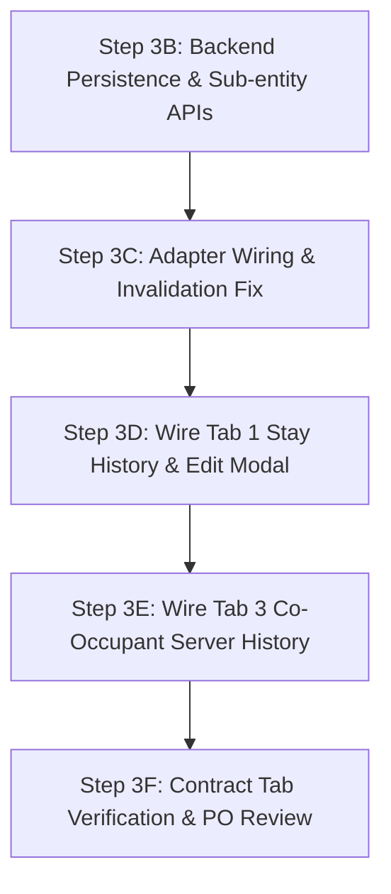

# HORPLUS-V2 — TENANT PHASE 3 STEP 3A: CROSS-SURFACE TENANT PROFILE & REGISTRATION AUDIT
**Branch:** `review/tenant-ui-baseline-20260904`  
**Mode:** ANALYSIS ONLY — ZERO CODE MODIFICATIONS  
**Target Surfaces:**
1. Owner Surface: `Owner > Tenants` (`src/pages/owner/tenants.tsx`, `src/pages/owner.tsx`) & Standalone Contracts (`src/pages/owner/contracts.tsx`)
2. Tenant Portal & Registration: `TenantRegisterPage.tsx`, `TenantRegisterView.tsx`, `src/pages/tenant.tsx`
3. LINE OA / LIFF Integration Readiness: `tenant-registration-invite.service.ts`, `line-friend.service.ts`, `access-grant.service.ts`

---

## 1. Product Owner UI Target Interpretation

### Locked Layout Architecture (Preserve Existing UI Concept)
The Product Owner has firmly locked the UI structure to prevent fragmentation into an unapproved 6-tab layout. The target Owner Tenant screen remains a 2-pane master-detail layout:
- **Left Pane:** Tenant Search, Filter Chips (`ทั้งหมด`, `กำลังพักอยู่`, `ยังไม่ผูก LINE`, `รอตรวจสอบ`, `ย้ายออกแล้ว`), and Scrollable Tenant List Cards.
- **Right Pane:** Selected Tenant Profile Header (Avatar, Name, Masked ID, Room Badge, LINE Binding Status Badge, Action Buttons) and **3 Horizontal Tabs**:
  1. **Tab 1: `ข้อมูลส่วนตัวและเพิ่มเติม` (Combined Profile & Ancillary Data)**
     - **Personal Information:** Full Name, Phone, Email, Masked Citizen ID (13 digits masked).
     - **Emergency Contact:** Name, Relationship, Phone.
     - **Vehicles Section:** Vehicle Type, Brand, Model, Color, License Plate, Province (embedded inside Tab 1, NO separate vehicle tab).
     - **Pets Section:** Pet Type, Custom Type, Name, Count (embedded inside Tab 1, NO separate pet tab; derived from dormitory pet policy).
     - **Citizen ID Document Card:** Secure preview / print / upload status.
     - **Stay History Section (Bottom of Tab 1):** Current Stay (Room, Floor, Check-in Date) and Previous Stays (Room, Date Range, Departure Reason). Authoritative source: `Occupancy`.
  2. **Tab 2: `สัญญา` (Contracts)**
     - Chronological contract cards/timeline (NOT a dropdown).
     - Active contract clearly distinguished from historical contracts (`expiring_soon`, `expired`, `terminated`).
     - Terms, Rent Amount, Deposit Amount, Deposit Status (`paid`/`unpaid`), Start/End Dates, Duration.
     - Actions: `พิมพ์สัญญา` (Print A4 preview), `ต่อสัญญา` (Renew contract modal).
     - **Monthly / Term agreements belong here. DailyStay is strictly NOT a contract.**
  3. **Tab 3: `ประวัติผู้พักร่วม` (Co-Occupant History)**
     - Active Co-occupants list with relationship and phone.
     - Add Co-occupant form/modal.
     - Real server audit trail of Co-occupant changes (Added on date, Removed on date with reason).
     - Driven strictly by canonical server timestamps (`createdAt`, `deletedAt`), NEVER client-fabricated IDs or timestamps.

---

## 2. Owner Surface Current Source Map

| UI Area | Current Source in `tenants.tsx` / `owner.tsx` | Canonical Backend Source | Gap Identified | Production & Domain Risk |
|---|---|---|---|---|
| **Tenant Personal Info** | `selectedTenant.name`, `.phone`, `.email`, `.citizenId` | PostgreSQL `tenants` table via `GET /api/v1/tenants/:id` | `citizenId` receives masked string from adapter, but Edit Modal places it in raw text input. | If owner saves without re-typing, masked string could fail validation or corrupt identity if unhandled. |
| **Emergency Contact** | `selectedTenant.emergencyContact` (`name`, `relationship`, `phone`) | PostgreSQL `tenant_emergency_contacts` table | `selectedTenant` receives only 1 contact in legacy UI object. Backend supports multiple. Repo update/delete methods are stubs (`return null`). | Updates in UI do not persist to DB. Multi-contact data truncated. |
| **Vehicles** | `selectedTenant.vehicles` & `selectedTenant.vehicle` | PostgreSQL `tenant_vehicles` table | UI only supports `type`, `brand`, `licensePlate`. DB supports `model`, `color`, `province`, `status`. Repo update/delete methods are stubs (`return null`). | Detailed vehicle fields (model, color, province) lost. Vehicle edits do not persist. |
| **Pets** | `selectedTenant.pets` & `selectedTenant.pet` | PostgreSQL `tenants.pet_info` (`Json?`) | UI uses hardcoded `STANDARD_PET_OPTIONS` (`"สุนัข"`, `"แมว"`, etc.), ignoring `DormitoryPropertyDefaults.petPolicy`. No dedicated `breed` field in schema. | Tenant can select pet types forbidden by dormitory rules. Breed is stuffed into `name`. |
| **ID Card Document** | `selectedTenant.idCardPhotoMock` (Base64 dataURL / client state) | `tenants.id_card_object_key` + `GET /api/v1/tenants/:id/identity-document` | Local image conversion via `convertImageToWebP` saves base64 into client memory. No `POST /api/v1/tenants/:id/identity-document` exists. | ID card uploads are completely lost on page refresh. High memory bloat from base64 strings. |
| **Stay History** (Tab 1 Bottom) | `tenants.tsx:3192-3238` renders duplicate `Lease Contracts` cards; `selectedTenant.rentalHistory` is string array `['101']` | PostgreSQL `occupancies` table joined with `rooms` (`TenantProfileDetails.occupancies`) | Tab 1 renders contracts instead of room stay history. `TenantOccupancyRecord[]` prepared in Step 2 is not yet wired to UI. | Stay history is inaccurate. Room transfers, check-in, check-out dates, and leave reasons are invisible to owner. |
| **Contracts** (Tab 2) | React Query `queryKeys.contracts(dormId)` mapped by `tenantId` | PostgreSQL `contracts` table via `GET /api/v1/contracts` | Working chronological card list, but print/renew functions bypass server signature workflow. Converted provisional terms not distinguished. | Contract edits in modal do not call backend PUT endpoint. |
| **DailyStay** | Not rendered in `tenants.tsx` | PostgreSQL `daily_stays` & `daily_stay_invoices` (`TenantProfileDetails.dailyStays`) | DailyStay occupants have no dedicated card in Tab 1 or Tab 2. | Daily stays either hidden or mistakenly treated as long-term tenant contracts. |
| **Co-Occupants** (Tab 3) | `selectedTenant.coOccupants` & `selectedTenant.coOccupantHistory` | PostgreSQL `tenant_co_occupants` table | `handleConfirmRemoveCoOccupant` pushes client-generated ID `coh-${Date.now()}` to React state. DB repo `findCoOccupants` filters `deletedAt: null`, discarding historical deletions on refresh. | Co-occupant audit trail is wiped out completely on reload. |
| **Edit Tenant Button (`แก้ไขข้อมูล`)** | `handleSaveEditTenant` in `tenants.tsx:1254-1309` calling `onSaveTenants(updatedTenants)` | `PUT /api/v1/tenants/:id` | **CRITICAL DEFECT:** `owner.tsx:887-889` ignores payload and immediately calls `queryClient.invalidateQueries`. Zero mutation API called. | **Every edit made by the owner is instantly wiped out and reverted to server state upon saving.** |

---

## 3. Tenant Portal / Registration Source Map

| UI Area / Flow | Current Source in `TenantRegisterView.tsx` / `tenant.tsx` | Canonical Backend Source | Gap Identified | Risk / Status |
|---|---|---|---|---|
| **Registration Wizard Steps** | 7-step wizard (`TenantRegisterView.tsx`) with local React state | `/api/v1/tenant-registration/submit` & `/claim` & `/two-phase-confirm` | Wizard state is client-side until submitted. Claims correctly load `ProvisionalRentalTerm` snapshot. | Solid foundation, but public self-registration requires strict Owner Review before tenant creation. |
| **Financial Terms (Claim)** | Locked from `inviteContext.provisionalTerm` (rent, deposit, duration) | PostgreSQL `provisional_rental_terms` | Fully locked in Step 4. Tenant cannot override rent, deposit, or duration. | Verified secure. No financial override risk. |
| **Financial Terms (Public Self-Reg)** | Input by user in Step 3 | Evaluated by owner in pending submission review | Owner can review and modify provisional terms before approving. | Compliant with PO locked rules. |
| **DailyStay Wizard Branching** | Immediately branches to 3-step Daily flow when rental type `DAILY` is selected | `/api/v1/daily-stays` | Daily stays do not produce `contracts`. | Compliant with PO locked rules. |
| **Emergency Contact (Reg)** | Step 5 inputs `name`, `relationship`, `phone` | `tenant_emergency_contacts` table | Written during claim/approval via Prisma transaction. | Canonical persistence works on registration completion. |
| **Vehicles (Reg)** | Step 6 inputs: `vehicleType`, `vehicleBrand`, `licensePlate` | `tenant_vehicles` table | Missing `model`, `color`, `province` inputs in wizard. | Basic vehicle data persisted, minor schema discrepancy. |
| **Pets (Reg)** | Step 6 inputs: `petType` (hardcoded dropdown), `petName` (labeled "ชื่อสัตว์เลี้ยง & สายพันธุ์") | `tenants.pet_info` (`Json?`) | Hardcoded options; breed lumped into pet name string. | Pet policy of dormitory is ignored during registration. |
| **Tenant Portal Profile** (`src/pages/tenant.tsx`) | `GET /api/v1/tenant-portal/profile` | PostgreSQL `tenants` + relations | **Read-only view.** Tenant cannot edit personal info, vehicles, or pets. | No conflict with Owner edits; tenant has zero profile mutation endpoints except co-occupants. |
| **Tenant Portal Co-Occupants** | `POST /api/v1/tenant-portal/co-occupants` & `DELETE /:coOccupantId` | PostgreSQL `tenant_co_occupants` | Real API calls with billing recalculation trigger. | Canonical and functioning, but soft-deleted records are not displayed in portal history. |

---

## 4. LINE OA / LIFF Readiness Map

| Integration Point | Current Implementation | Canonical / Target Architecture | Gap Identified | Readiness Rating |
|---|---|---|---|---|
| **Dormitory LINE Isolation** | `DormitoryLineFriend` model contains `(dormitory_id, line_user_id)` unique compound index. | Each dormitory has independent LINE OA credentials & followers. | Architecture is fully multi-tenant and isolated per dormitory. | **READY** |
| **LINE Follow Event** | `line-friend.service.ts` registers `DormitoryLineFriend`. `TenantRegistrationInviteService.createInvite` generates 7-day secure token. | Verified webhook creates invite and sends Flex Message with tokenized link. | Automated follow-to-invite flow is functionally complete in backend. | **READY** |
| **Flex Message Link** | URL: `${baseUrl}?t=${token}` or `?token=${token}` | Invites contain SHA-256 hashed token with 7-day TTL. | Token correctly resolves via `GET /api/v1/tenant-registration/invite/resolve`. | **READY** |
| **LIFF SDK Auto-Binding** | Query parameter fallback `?t=...` in URL. | Frontend initializes LIFF SDK (`liff.init({ liffId })`), retrieves ID token, and verifies against backend. | Frontend does not yet call LIFF SDK directly; relies on URL query string. | **GAP (Adapter/Frontend Bridge needed)** |
| **"ยังไม่ผูก LINE" Rule** | `lineFriendId = null` allowed across `Tenant`, `Contract`, `Occupancy`, and `Bill`. | Tenancy, contracts, and billing function 100% normally without LINE binding. Header badge displays status accurately. | Header badge correctly shows `ยังไม่ผูก LINE` as identity state without blocking operations. | **COMPLIANT** |
| **Claim by LINE Friend** | `tenant-registration.service.ts:claimTenant` matches via mobile phone or invite token, links `lineFriendId`. | Tenant claims existing owner-created record; `lineFriendId` is bound upon completion. | Existing claim flow binds LINE account cleanly. | **READY** |
| **Cross-Dormitory Protection** | Service validates `invite.dormitoryId === request.dormitoryId`. | Zero cross-dormitory access or binding allowed. | Strict dormitory context checks enforced across all registration routes. | **READY** |

---

## 5. Shared Authority Matrix

| Domain | Owner Surface Authority | Tenant Portal Authority | LINE Registration Authority | Canonical Authority (Source of Truth) | Notes & Protection Rules |
|---|---|---|---|---|---|
| **Tenant Profile** (Name, Phone, Email, DOB, Gender, Address) | Full read; Edit attempted via `แก้ไขข้อมูล` (Currently broken in UI) | Read-only | Initial input during self-registration; read-only during claim | PostgreSQL `tenants` table | Owner is primary authority post-registration. |
| **Citizen ID Number** | Read-only masked (`1-1004-XXXXX-XX-X`) | Read-only masked | Input 13 digits during registration/claim | PostgreSQL `tenants.national_id_encrypted` & `national_id_masked` | Never store or return raw plaintext ID. AES-256 encrypted. |
| **Citizen ID Document** | Preview & Print; Direct upload (Currently client-side mock) | Upload in wizard (Step 2) | Upload in wizard (Step 2) | LocalStorage / Object Store via `tenants.id_card_object_key` | Base64 client state must be replaced by multipart file upload endpoint. |
| **Emergency Contact** | Full read; Edit via Modal (Currently broken in UI) | Read-only | Input in wizard (Step 5) | PostgreSQL `tenant_emergency_contacts` | Backend repo methods currently stubbed. |
| **Vehicles** | Full read; Edit via Modal (Currently broken in UI) | Read-only | Input in wizard (Step 6) | PostgreSQL `tenant_vehicles` | Backend repo methods currently stubbed. |
| **Pets** | Full read; Edit via Modal (Currently broken in UI) | Read-only | Input in wizard (Step 6) | PostgreSQL `tenants.pet_info` (`Json?`) | Must respect `DormitoryPropertyDefaults.petPolicy`. |
| **Co-Occupants** | Full management in Tab 3 (Add/Remove) | Self-service Add/Remove via Portal | Input in wizard (Step 2/5) | PostgreSQL `tenant_co_occupants` | Changes trigger billing recalculation. Soft deletions must be audited. |
| **Occupancy (Stays)** | Managed via Check-in/Move-out in Rooms & Quick Add | Read-only (Current room) | Converted upon approved registration | PostgreSQL `occupancies` | Authoritative source for Stay History. Not editable via profile. |
| **Contract Terms** (Rent, Deposit, Dates) | Managed via Contracts Tab / Renewal / Settlement | Read-only (Active contract) | Read-only snapshot during Claim; Proposed during Public Reg | PostgreSQL `contracts` & `provisional_rental_terms` | **STRICTLY PROTECTED:** Profile edit button CANNOT modify financial terms. |
| **DailyStay** | Managed via Daily Room management | Read-only (Daily stay card) | Branching Daily wizard flow | PostgreSQL `daily_stays` & `daily_stay_invoices` | Strictly isolated from `contracts`. |
| **LINE Binding** | Identity status indicator badge (`LINE เชื่อมต่อแล้ว` / `ยังไม่ผูก LINE`) | N/A (Embedded in LINE app) | Tokenized invite / LIFF context | PostgreSQL `tenants.line_friend_id` -> `dormitory_line_friends` | Informational only; does not affect tenancy rights. |

---

## 6. UI-Preserving Implementation Gaps

### Category A: Backend-Only Fixes (Zero UI Changes)
1. **Implement Prisma Repository Methods in `PrismaTenantRepository`:**
   - Implement `updateEmergencyContact(id, dormId, data)` (currently returns `null`).
   - Implement `deleteEmergencyContact(id, dormId)` (currently returns `true` without executing Prisma call).
   - Implement `updateVehicle(id, dormId, data)` (currently returns `null`).
   - Implement `deleteVehicle(id, dormId)` (currently returns `true` without executing Prisma call).
2. **Add Missing REST Mutation Endpoints in `server/src/routes/tenant.routes.ts`:**
   - `PUT /api/v1/tenants/:id/emergency-contacts/:contactId`
   - `DELETE /api/v1/tenants/:id/emergency-contacts/:contactId`
   - `PUT /api/v1/tenants/:id/vehicles/:vehicleId`
   - `DELETE /api/v1/tenants/:id/vehicles/:vehicleId`
   - `POST /api/v1/tenants/:id/identity-document` (Multipart upload storing buffer to `LocalStorageProvider` and updating `idCardObjectKey`).
3. **Co-Occupant History Query Alignment:**
   - Update `PrismaTenantRepository` or provide `findCoOccupantHistory(tenantId, dormId)` that includes soft-deleted records (`where: { tenantId, dormitoryId }` without `deletedAt: null`) to return real server timestamps (`createdAt` for addition, `deletedAt` for departure).

### Category B: Adapter-Only Fixes (Zero UI Changes)
1. **Connect `ApiTenantAdapter.updateTenant`:**
   - Wire `ApiTenantAdapter.updateTenant(id, dormId, payload)` to call `PUT /api/v1/tenants/:id`.
2. **Implement Sub-Entity Mutations in Adapter:**
   - Add `updateEmergencyContact`, `deleteEmergencyContact`, `updateVehicle`, `deleteVehicle`, `uploadIdentityDocument` to `ApiTenantAdapter` and `ITenantAdapter`.

### Category C: Frontend Wiring Fixes Possible Without UI Changes
1. **Fix `handleSaveEditTenant` in `src/pages/owner/tenants.tsx` & `src/pages/owner.tsx`:**
   - In `src/pages/owner/tenants.tsx`, make `handleSaveEditTenant` async: call `tenantAdapter.updateTenant`, sync sub-entities, and only then invalidate queries.
   - In `src/pages/owner.tsx`, update `handleSaveTenants` or use React Query `useMutation` with proper cache updates.
2. **Wire Stay History to `occupancies` Data (Bottom of Tab 1):**
   - Replace the duplicate `Lease Contracts` cards (lines 3192-3238) with the current stay and previous stays mapped from `selectedTenantProfile.occupancies` (already prepared in Step 2). Preserve exact existing typography, colors, and layout classes.
3. **Wire Co-Occupants History to Server Records (Tab 3):**
   - In `getEffectiveCoOccupantHistory`, bind to the server-returned co-occupants (including soft-deleted ones) so real `createdAt` and `deletedAt` timestamps are displayed. Eliminate client-side temporary state (`coh-${Date.now()}`).

### Category D: Changes Requiring Product Owner Approval
1. **Pet Breed Support vs Schema Integrity:**
   - Schema currently has `pet_info Json?` on `Tenant`. TypeScript has `PetItem { type, name, customType }`.
   - PO Decision needed: pack breed into `pet_info.breed` within existing JSON, or keep in `name` string (`เช่น น้องส้ม (เปอร์เซีย)`).
2. **Retirement of Standalone Contract Menu:**
   - Standalone menu (`owner/contracts.tsx`) contains Pending Registrations, Pending Renewals, and Settlements.
   - PO Approval needed on migration schedule before hiding or removing the menu.

---

## 7. Edit Tenant Current Behavior Audit (`แก้ไขข้อมูล`)

An exhaustive audit of lines 1081–1309 in `src/pages/owner/tenants.tsx` reveals:

### 1. Form Fields in Existing Modal
- **Personal Info:** Full Name (`name`), Mobile Phone (`phone`), Email (`email`), Citizen ID (`citizenId`).
- **Emergency Contact:** Name (`emergencyName`), Relationship (`emergencyRelation`), Phone (`emergencyPhone`).
- **Pets:** Checkbox `hasPet`, Pet Type dropdown (`petType`), Custom Pet Type (`customPetType`), Pet Name (`petName`), Dynamic Multi-Pet List (`petsList`).
- **Vehicles:** Vehicle Type dropdown (`vehicleType`), License Plate (`vehiclePlate`), Brand (`vehicleBrand`), Dynamic Multi-Vehicle List (`vehiclesList`).
- **ID Card Document:** File upload input converting image to WebP DataURL (`idCardPhoto`).

### 2. Fields Excluded from Generic Edit (Strictly Protected)
- **Financial Terms:** Room Rent, Security Deposit, Deposit Status, Payment Terms. These fields are **NOT** present in `EditTenantModal`. They are correctly protected.
- **Occupancy & Room:** Room assignment is not editable here (handled via Check-in/Move-out/Transfer).
- **Co-occupants:** Not editable in this modal (handled separately in Tab 3).

### 3. The Critical Persistence Failure
- When the owner clicks **"บันทึกข้อมูล"** (`handleSaveEditTenant`):
  ```typescript
  // tenants.tsx:1281-1300
  const updatedTenants = tenants.map(t => t.id === selectedTenant.id ? { ...t, ... } : t);
  onSaveTenants(updatedTenants);
  ```
- In `src/pages/owner.tsx:887-889`:
  ```typescript
  const handleSaveTenants = (_newTenants: Tenant[]) => {
    queryClient.invalidateQueries({ queryKey: queryKeys.tenants(activeDormitoryId) });
  };
  ```
- **Finding:** **No HTTP request (`PUT`, `POST`, `PATCH`) is ever dispatched.** React Query immediately refetches `GET /api/v1/tenants`, which returns the unmodified database records. **All owner edits disappear instantly.**

---

## 8. Pet Policy Findings

### 1. Source of Pet Policy
- Canonical storage: `DormitoryPropertyDefaults.petPolicy` (`schema.prisma:297`):
  ```typescript
  {
    allowed: 'none' | 'all' | 'conditional',
    allowedTypes: string[] // e.g. ['cat', 'dog', 'fish', 'bird']
  }
  ```

### 2. Current Implementation Discrepancy
- `src/pages/owner/tenants.tsx` lines 163-164 hardcodes:
  ```typescript
  const STANDARD_PET_OPTIONS = ["สุนัข", "แมว", "นก", "ปลา", "กระต่าย", "หนูแฮมสเตอร์"];
  const PET_OPTIONS = ["สุนัข", "แมว", "นก", "ปลา", "กระต่าย", "หนูแฮมสเตอร์", "อื่นๆ"];
  ```
- `TenantRegisterView.tsx:2253-2260` hardcodes an `<option>` list in JSX.
- **Gap:** Neither UI checks the active dormitory's `petPolicy`. If a dormitory prohibits dogs, "สุนัข" is still offered in the dropdown.

### 3. Policy Evolution & Record Retention Rule
- **Rule:** When a dormitory changes its policy from allowing dogs to prohibiting dogs, existing tenants with registered dogs must continue to have their pets displayed without data corruption.
- **Finding:** In PostgreSQL, pets are saved in `Tenant.pet_info` (`Json?`). Policy changes in `DormitoryPropertyDefaults` do not cascade or delete existing tenant records. The data survives intact.
- **Requirement for Edit UI:** The Edit Pet modal must display the tenant's current pet even if its type is not in `allowedTypes`, marking it as grandfathered or existing.

### 4. Pet Breed Gap & Schema Constraint
- `PetItem` currently has: `{ id, type, customType, name }`.
- In `TenantRegisterView.tsx:2264`, the label asks for `ชื่อสัตว์เลี้ยง & สายพันธุ์` (storing both in `name`).
- There is no separate `breed` column in Prisma schema.

> [!IMPORTANT]
> ### PRODUCT OWNER DECISION REQUIRED — ITEM 1: Pet Breed Architecture
> **Question:** How should pet breed be stored and edited?
> - **Option A (Recommended — No Schema Migration):** Store `breed?: string` inside the existing `pet_info` JSON object in PostgreSQL and extend the TypeScript `PetItem` interface. Zero schema migrations required.
> - **Option B (Preserve Current UI Baseline):** Continue using `name` to store `ชื่อสัตว์เลี้ยง (สายพันธุ์)` as currently labeled in `TenantRegisterView.tsx`.
> - **Option C (Separate Table):** Create a new `tenant_pets` table with explicit `breed` column. *(Requires Prisma migration — violates strict constraints unless explicitly ordered).*

---

## 9. Co-Occupant History Authority Findings

### 1. Current State in `src/pages/owner/tenants.tsx`
- Active co-occupants are rendered in Tab 3.
- When an owner clicks "ลบผู้พักร่วม" (`handleConfirmRemoveCoOccupant`), line 515 creates:
  ```typescript
  const historyEntry: CoOccupantHistoryItem = {
    id: `coh-${Date.now()}`,
    coOccupantId: coOccupantToRemove.id,
    action: 'remove',
    date: new Date().toISOString(),
    name: coOccupantToRemove.name,
    relationship: coOccupantToRemove.relationship,
    reason: removeReason
  };
  ```
- This entry is appended to `selectedTenant.coOccupantHistory`, which is stored purely in client-side React state.
- **Finding:** Upon browser refresh, `coOccupantHistory` is completely empty.

### 2. Database Model Authority
- In PostgreSQL (`tenant_co_occupants`), each record contains:
  `id`, `dormitory_id`, `tenant_id`, `name`, `relationship`, `phone`, `status`, `created_at`, `updated_at`, `deleted_at`.
- When `billingOrchestrationService.removeTenantCoOccupant` is executed, it sets:
  `status: 'removed'`, `deletedAt: new Date()`.
- **Gap:** `PrismaTenantRepository.findCoOccupants` line 609 executes:
  `where: { tenantId, dormitoryId, deletedAt: null }`.
- It intentionally filters out removed co-occupants, preventing the frontend from seeing historical co-occupants and their actual departure dates.

### 3. Deriving Real Server History Without Fake Timestamps
- The server does **not** need fake timestamps. Canonical timestamps already exist in `tenant_co_occupants`:
  - **Added Event:** `createdAt` timestamp.
  - **Removed Event:** `deletedAt` timestamp.
  - **Status:** `'active'` vs `'removed'`.

> [!IMPORTANT]
> ### PRODUCT OWNER DECISION REQUIRED — ITEM 2: Co-Occupant History Source
> **Question:** What should be the authoritative source for Co-Occupant History?
> - **Option A (Recommended — Zero Schema Changes):** Update `tenantService.getTenantDetails` to query all `tenant_co_occupants` (including `deletedAt !== null`). The frontend will derive the change log directly: addition event from `createdAt`, removal event from `deletedAt`.
> - **Option B (AuditLog Integration):** Query the system `AuditLog` table for events with action `'REMOVE_CO_OCCUPANT'`.

---

## 10. Stay History Findings

### 1. Location & Layout
- Stay History belongs at the **bottom of Tab 1 (`ข้อมูลส่วนตัวและเพิ่มเติม`)**.
- It does **not** get its own tab.

### 2. Authoritative Source: `Occupancy`
- In PostgreSQL, the `occupancies` table tracks:
  - `id`, `dormitoryId`, `roomId`, `tenantId`, `status` (`ACTIVE`, `ENDED`), `startDate`, `endDate`, `createdAt`.
- Room transfers and move-outs update `status: 'ENDED'`, set `endDate`, and create a new `Occupancy` for the new room.
- In Phase 3 Step 2, `TenantProfileDetails.occupancies` was implemented to query all occupancies for the tenant, joined with `roomNumber` and `buildingName`.

### 3. Current UI Defect
- Lines 3192-3238 in `src/pages/owner/tenants.tsx` currently render a duplicate list of "Lease Contracts" under the header "Lease Contracts" instead of room stay history.
- `selectedTenant.rentalHistory` is an obsolete array of room strings (`['101']`).

### 4. Target Structure for Bottom of Tab 1
```
┌────────────────────────────────────────────────────────┐
│ ประวัติการเข้าพัก (Stay History)                       │
├────────────────────────────────────────────────────────┤
│ [กำลังพักอยู่] ห้อง 204 (ชั้น 2, อาคาร A)               │
│ เข้าพักเมื่อ: 1 มกราคม 2567                             │
├────────────────────────────────────────────────────────┤
│ [ประวัติห้องพักเดิม] ห้อง 102 (ชั้น 1, อาคาร A)         │
│ ระยะเวลา: 1 มิ.ย. 2566 - 31 ธ.ค. 2566                  │
│ สถานะ: ย้ายห้องพัก                                      │
└────────────────────────────────────────────────────────┘
```
This can be rendered directly from `TenantProfileDetails.occupancies` without introducing any new tabs or unapproved layouts.

---

## 11. Standalone Contract Menu Findings (`src/pages/owner/contracts.tsx`)

The Product Owner plans to eventually consolidate contract management into the Tenant menu. However, an in-depth audit of `src/pages/owner/contracts.tsx` (2,967 lines) reveals substantial business functionality that currently exists **only** in the standalone menu:

### Existing Workflows in `OwnerContracts`:
1. **Pending Registration Submissions Queue (`pendingSubmissions`):**
   - Reviewing self-registrations and claims submitted by prospective tenants.
   - Adjusting provisional rent, deposit, start date, duration, deposit status (`paid`/`unpaid`).
   - Actions: `อนุมัติสัญญา`, `ปฏิเสธคำขอ` (with reason), `แจ้งแก้ไขข้อมูล`.
2. **Pending Contract Renewal Requests Queue (`pendingRenewalRequests`):**
   - Tenant-initiated contract renewal requests (`/api/v1/contract-renewals/requests`).
   - Approving renewal terms (new rent, deposit adjustment, advance payment) or rejecting with explanation.
3. **Move-Out Settlement & Damage Item Management (`settlementData`):**
   - End-of-lease security deposit reconciliation (`/api/v1/settlements/:contractId`).
   - Recording itemized damage deductions, repair evidence URLs, cleaning fees, and net refund calculations.
4. **Contract Snapshot Inspection (`getContractSnapshot`):**
   - Historical snapshot view of contract terms at the exact moment of signing.
5. **Contract Creation & Multi-Cycle Filter:**
   - Independent creation workflow and filtering by billing cycle.

### Assessment for Consolidation:
If the standalone Contract menu is removed before these 4 workflows are accounted for in the Tenant menu or dedicated modals, critical owner operations (approving new tenants, approving renewals, and performing move-out settlements) will be completely inaccessible.

> [!IMPORTANT]
> ### PRODUCT OWNER DECISION REQUIRED — ITEM 3: Standalone Contract Menu Roadmap
> **Question:** How should the standalone Contract menu be handled during Phase 3?
> - **Option A (Recommended — Phased Migration):** Keep the standalone Contract menu active during Phase 3. In Phase 3 Step 3B, wire the Tenant Profile Contract tab for viewing, printing, and renewing. Migrate Pending Approvals and Settlements in a subsequent dedicated phase before hiding the menu.
> - **Option B (Immediate Redirection):** Keep the menu item in the sidebar but have it deep-link directly into `Owner > Tenants` with the Contract tab selected. *(Not recommended until Pending Submissions and Settlements are relocated).*

---

## 12. Privacy / Security Findings

### 1. National Citizen ID Security
- **Backend Protection:** Database stores AES-256 encrypted string `nationalIdEncrypted`. Masked version `nationalIdMasked` (`1-1004-XXXXX-XX-X`) is generated via SHA-256 / regex masking.
- **Verification:** `GET /api/v1/tenants` and `GET /api/v1/tenants/:id` **never** return `nationalIdEncrypted` in API JSON.
- **Gap in Owner Edit Modal:** `EditTenantModal` loads `tenant.citizenId` (which contains the masked string). If an owner saves the modal, the masked string `1-1004-XXXXX-XX-X` is submitted. The backend must detect if the citizen ID was unedited (masked) to avoid overwriting the encrypted ciphertext with a masked string!

### 2. Identity Document Handling
- `GET /api/v1/tenants/:id/identity-document` enforces:
  - Valid session (`requireSession`).
  - Strict permission: `requireDormitoryPermission('tenant:document:read')`.
  - Content headers: `Cache-Control: private, no-store`, `X-Content-Type-Options: nosniff`.
- **Gap:** In `tenants.tsx:1144-1167`, owners currently upload ID cards via browser-only file reader which converts the image into a Base64 dataURL stored in React state. No authenticated `POST` endpoint is called.

### 3. Dormitory Isolation & Multi-Tenancy
- Every route in `tenant.routes.ts` enforces `dormId` from `x-dormitory-id` header or user token.
- `tenantService` and Prisma queries strictly filter `where: { id, dormitoryId }`.
- Cross-dormitory tenant access is completely blocked and tested.

### 4. LINE Identity Isolation
- `DormitoryLineFriend` records are unique per `(dormitoryId, lineUserId)`.
- Invites and claim tokens cannot be resolved across different dormitories.

---

## 13. Recommended Implementation Order (Smallest Safe Sequence)

To implement the corrections identified in this audit safely, without breaking existing working features or changing UI layouts, the following sequence is recommended:



### Detailed Sequence:
1. **Step 3B — Backend Persistence & Sub-Entity Endpoints:**
   - Implement missing Prisma methods in `PrismaTenantRepository` (`updateEmergencyContact`, `deleteEmergencyContact`, `updateVehicle`, `deleteVehicle`).
   - Add routes in `tenant.routes.ts` for updating/deleting emergency contacts and vehicles.
   - Add secure `POST /api/v1/tenants/:id/identity-document` multipart upload endpoint.
   - Update co-occupants query to return historical (soft-deleted) records.
2. **Step 3C — Adapter Wiring & Mutation Handling:**
   - Extend `ApiTenantAdapter` with methods to mutate tenant, contacts, vehicles, and documents.
   - Update `src/pages/owner.tsx` and `src/pages/owner/tenants.tsx` to call adapter mutations before invalidating React Query cache.
3. **Step 3D — Owner Profile UI Wiring (Tabs 1 & 3):**
   - Replace duplicate contracts section at bottom of Tab 1 with canonical `Occupancy` Stay History (Current Stay vs Previous Stays).
   - Wire Tab 3 Co-Occupant history to canonical server timestamps (`createdAt`, `deletedAt`).
   - Enforce dormitory pet policy in pet dropdowns while preserving display of existing grandfathered pets.
4. **Step 3E — Verification & Standalone Contract Menu Coexistence:**
   - Verify all 48 Vitest test suites.
   - Verify UI persistence in browser.
   - Present completed Phase 3 for Product Owner review.

---

## 14. Stop Conditions & Product Owner Decisions Summary

| # | Item Requiring Decision | Current State | Proposed Options |
|---|---|---|---|
| **1** | **Pet Breed Storage & Schema** | Labeled `ชื่อสัตว์เลี้ยง & สายพันธุ์`, stored in `name` | **A (Recommended):** Add `breed` to `pet_info` JSON (No migration)<br>**B:** Keep in `name`<br>**C:** Create `tenant_pets` table (Requires migration) |
| **2** | **Co-Occupant History Source** | Stored in client React state (`coh-${Date.now()}`), lost on refresh | **A (Recommended):** Include `deletedAt !== null` in co-occupants query and derive history from `createdAt`/`deletedAt`<br>**B:** Query `AuditLog` table |
| **3** | **Standalone Contract Menu Roadmap** | Menu houses Pending Registrations, Renewals, and Settlements | **A (Recommended):** Keep menu during Phase 3; migrate workflows in future phase<br>**B:** Deep-link immediately to Tenant Profile |
| **4** | **Edit Modal Masked ID Submission** | Modal loads masked ID `1-1004-XXXXX-XX-X` | **A (Recommended):** If input value equals `nationalIdMasked`, backend ignores it and preserves encrypted ID. If modified to 13 digits, re-encrypts. |

---

## Final Verification Checklist
- [x] **Zero Code Modified:** No lines of application code or tests were modified in this audit step.
- [x] **Zero UI Changes:** Existing 3-tab UI baseline preserved without changes.
- [x] **Schema Unchanged:** `server/prisma/schema.prisma` was untouched.
- [x] **Zero Migrations:** No migration scripts generated.
- [x] **`rooms.tsx` Untouched:** Strict boundary verified.
- [x] **`meters.tsx` Untouched:** Strict boundary verified.
