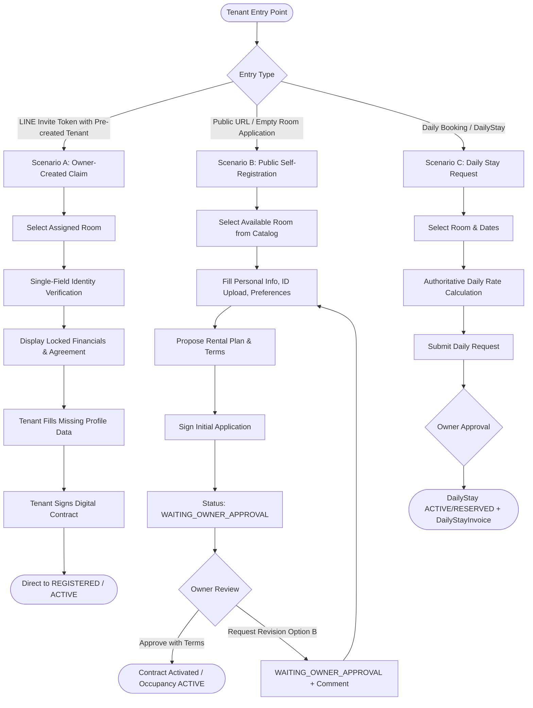

# HORPLUS-V2 — TENANT REGISTRATION DOMAIN CONFIRMATION

**Repository:** `phoom007/HorPlus-V2`  
**Branch:** `review/tenant-ui-baseline-20260904`  
**Date:** 2026-09-04  
**Status:** DOMAIN CONFIRMATION & DECISION SPECIFICATION (NO CODE MODIFIED)

---

## 1. Registration Entry Scenarios Analysis

Based on the source audit of `server/src/services/tenant-registration.service.ts`, `server/src/services/tenant-claim.service.ts`, `server/src/services/daily-stay.service.ts`, and frontend components, the system encounters three distinct onboarding scenarios:



---

### Scenario A: Owner Creates Tenant from Owner Dashboard (Claim Flow)

#### Current Source Behavior:
- Owner creates tenant via `QuickAddTenantModal.tsx` / `tenants.tsx`.
- Creates `Tenant` (with `lineFriendId: null`, `linkedUserId: null`, `status: 'active'`), `Occupancy`, and `Contract`.
- In Owner Dashboard, tenant appears with an amber badge: `"ยังไม่ผูก LINE"`.
- Tenant joins LINE Official Account (OA). Webhook creates `TenantRegistrationIntent` and `TenantRegistrationInvite` with a 7-day token link: `/tenant/register?t=<token>`.
- When tenant clicks the link, they land on `/tenant/register?t=<token>`.

#### Domain Clarifications Required:
1. **Does this bypass Owner Approval?**
   - **Domain Logic:** YES. The Owner already explicitly created, reviewed, and finalized the financial agreement in Quick Add. Once the tenant proves their identity and signs the contract, the record transitions directly to `REGISTERED` (active with bound LINE ID).
2. **Which fields are LOCKED for the tenant?**
   - Room Number (`roomId`)
   - Monthly Rent, Term Rent, or Daily Rate (`rentAmount`)
   - Deposit Amount (`depositAmount`)
   - Rental Duration & Billing Cycle
   - Payment Status of initial deposit/rent
3. **Which fields can the tenant edit?**
   - Personal details (Honorific, Full Name spelling corrections, Citizen ID, Birthdate, Address)
   - Citizen ID Card Photo Upload
   - Emergency Contact (Name, Relationship, Phone)
   - Co-occupants list (Name, Citizen ID, Phone)
   - Vehicle Information (Type, Brand, License Plate)
   - Pet Information (Type, Name, Count — subject to dormitory pet policy)
   - Digital Signature

---

### Scenario B: Tenant Selects Available Room by Themselves (Self-Registration)

#### Current Source Behavior:
- Public applicant accesses `/tenant/register` directly without an Owner pre-assignment.
- Selects an available room (`vacant` or `reserved`).
- Submits contact info and digital signature via `POST /api/v1/tenant-registrations`.
- Request status becomes `pending_owner_approval` (`WAITING_OWNER_APPROVAL`).
- Owner inspects the request in Owner Dashboard, sets contract terms (`rentAmount`, `depositAmount`, `durationMonths`, `startDate`, `endDate`), and clicks "Approve".

#### Domain Clarifications Required:
1. **Which financial fields can the tenant propose?**
   - Rental Plan preference (`monthly`, `term`, `daily`).
   - Intended check-in date and desired duration (e.g. 6 months, 12 months).
   - Deposit installment preference (if allowed by dormitory policy).
2. **Which fields can the Owner edit at approval?**
   - The Owner has 100% authoritative override on:
     - Exact `rentAmount`
     - Exact `depositAmount`
     - Exact `advancePaymentAmount`
     - Effective `startDate` and `endDate`
     - Custom terms / addendum clauses
3. **When does Occupancy become ACTIVE?**
   - At the moment the Owner approves the request:
     - If `startDate <= today`, `Occupancy.status` becomes `ACTIVE`, and `Room.status` becomes `occupied`.
     - If `startDate > today`, `Occupancy.status` is scheduled/future (`RESERVED`), and `Room.status` is reserved.

---

### Scenario C: Daily Rental (Short-Stay Guest)

#### Current Source Behavior:
- Daily rentals are managed by the dedicated **`DailyStay` and `DailyStayInvoice`** domain (`server/src/services/daily-stay.service.ts`), completely separated from long-term `Contract`.
- Tenant submits via `TenantDailyRequestModal.tsx` (`POST /api/v1/daily-stays/requests`).

#### Domain Analysis & Verification:
1. **Does daily require a long-term Contract?**
   - **NO.** In HorPlus-V2 architecture, daily rentals do NOT create a `Contract` row. They create a `DailyStay` record and generate a `DailyStayInvoice` with line items (`DAILY_RENT` and `DEPOSIT`).
2. **Does daily require a digital signature?**
   - **NO.** Standard daily check-in does not require contract signing. If dormitory terms require rules acceptance, a simple checkbox agreement snapshot is sufficient.
3. **Does daily require Citizen ID upload?**
   - **OPTIONAL / MINIMAL.** Existing daily requests only record `applicantFullName` and `applicantPhone`. Citizen ID upload is not mandatory for daily booking, but can be requested at physical key handoff.
4. **When does Occupancy start and end?**
   - Created upon Owner approval:
     - `status: 'ACTIVE'` if `startDate <= today`
     - `status: 'RESERVED'` if `startDate > today`
   - Ends automatically or upon explicit checkout (`actualCheckedOutAt`) by Owner.

---

## 2. Existing Wizard Decision: `TenantRegisterView.tsx` vs `TenantRegisterPage.tsx`

The codebase currently contains two registration frontends:

```
┌─────────────────────────────────────────────────────────────┐
│ Option A: Promote TenantRegisterView.tsx (Recommended)       │
├─────────────────────────────────────────────────────────────┤
│ • 1,630 lines of rich, fully-designed UI components         │
│ • 7 steps: Room, Personal Info + ID Upload, Rent/Deposit,   │
│   Dates, Emergency + Co-occupants, Vehicle/Pet, Signature   │
│ • Matches Product Owner 6-tab domain requirements           │
│ • Needs: Connect API adapter & support Mode A/B             │
└─────────────────────────────────────────────────────────────┘
                             vs
┌─────────────────────────────────────────────────────────────┐
│ Option B: Rebuild on TenantRegisterPage.tsx                 │
├─────────────────────────────────────────────────────────────┤
│ • Currently active on /tenant/register                      │
│ • Only 554 lines, single basic form                         │
│ • Missing 6 out of 7 domain steps                           │
│ • Would require duplicating thousands of lines of UI work   │
└─────────────────────────────────────────────────────────────┘
```

### Comparison Matrix:

| Evaluation Criteria | Option A: `TenantRegisterView.tsx` | Option B: `TenantRegisterPage.tsx` |
|:---|:---|:---|
| **UI Design & UX Completeness** | **95% complete:** Full responsive step-bar, ID card mask formatter, deposit schedule calculator, emergency contact form, co-occupants array, vehicle & pet panels, contract preview, canvas signature. | **15% complete:** Only basic form with 4 inputs and a signature canvas. |
| **Product Owner Domain Alignment** | **Exact match:** Implements all 6 domain tabs (Profile, Contract, Co-occupants, Vehicle, Pet, Financial). | **Severe mismatch:** Omits co-occupants, vehicles, pets, ID upload, emergency contacts. |
| **Effort to Production Ready** | **Low-Medium:** Wire existing form states to `ApiTenantAdapter` / `submitTenantRegistrationRequest`. | **Extremely High:** Rebuilding 6 missing steps from scratch. |
| **Risk of UI Regression** | **Zero:** Preserves Product Owner's UI baseline. | **High:** Duplicating or redesigning existing work. |

### Decision for Product Owner:
> **Do you confirm adopting `TenantRegisterView.tsx` as the canonical registration interface for `/tenant/register`, connecting it to real APIs and supporting Mode A (Claiming) and Mode B (Public)?**

---

## 3. Identity Verification Flow Decision

### Existing Architecture:
The engine in `server/src/utils/thai-identity.util.ts` and `server/src/services/tenant-claim.service.ts` provides:
- Single-field input matching both Name and Phone.
- Honorific title removal (`นาย`, `นาง`, `นางสาว`, `น.ส.`, `Mr.`, `Mrs.`, `Ms.`, etc.).
- Levenshtein name similarity ($\ge 0.90$).
- Phone normalization (digits only, `+66` $\rightarrow$ `0`).

### Decision Points for Product Owner:

#### Question 3.1: Supported Verification Input
- **Option 1 (Recommended):** Allow **either** Full Name **OR** Phone number in the single input field.
  - *Behavior:* If input has digits, the system normalizes phone and performs exact match. If input has letters, it strips prefixes and evaluates name similarity $\ge 90\%$.
- **Option 2:** Force Name only.

#### Question 3.2: Brute-Force Rate Limiting & Lockout Policy
Currently, `tenant-claim.routes.ts` enforces:
- Room key: Max 5 attempts per 15 minutes per room/user/IP.
- Actor key: Max 15 attempts per 15 minutes across all rooms.

If a user fails 5 attempts:
- **Decision Choice A:** Lockout for 5 minutes per user/IP.
- **Decision Choice B (Current Implementation):** Lockout for 15 minutes per Room + LINE User combined.
- **Decision Choice C:** Require LINE OA re-authentication link.

---

## 4. Rental Financial Authority Decision

### Case A: Owner-Created Tenant (Claiming Existing Profile)

The Owner previously created the tenant via Quick Add, establishing:
- Rent amount
- Deposit amount
- Payment status (Paid / Unpaid)

#### Decision Choice for Tenant View:
- **Choice A.1 (Recommended):** **Display Only + Locked.**
  - The tenant sees a clear financial agreement card showing: Monthly Rent, Deposit, and Payment Status with a lock icon and explanatory badge: `"กำหนดโดยผู้ดูแลหอพักตามสัญญา"`.
  - The tenant **CANNOT** edit rent, deposit, or duration.
- **Choice A.2:** Hide financial details entirely during claim.
- **Choice A.3:** Allow tenant to submit proposed adjustments as comments.

---

### Case B: Self-Registration Tenant (Selecting Empty Room)

The applicant selects an available room from the catalog.

#### Decision Choice for Financial Proposal:
- **Choice B.1 (Recommended):** Display room catalog default rates (e.g. Rent: 4,500, Deposit: 5,000). The applicant selects duration (e.g. 6 or 12 months) and deposit plan, but the **Owner retains final authority** to edit and lock rent and deposit upon approval.
- **Choice B.2:** Applicant can type custom proposed rent amounts.

---

## 5. Signature Flow Decision

Both `TenantRegisterPage.tsx` and `TenantRegisterView.tsx` contain canvas drawing components. `SignatureStorageService.ts` validates PNG headers, pixel density, and computes SHA-256 hashes.

### Decision Points for Product Owner:

#### Scenario A (Owner-Created Claiming Tenant):
When must the tenant sign?
- **Choice 5.1A (Recommended):** **Before entering REGISTERED status.**
  - After identity verification and filling missing profile data, the tenant must sign the contract before the claim is finalized. Once signed, status transitions to `REGISTERED` and contract `tenantSignature` is recorded.
- **Choice 5.1B:** Allow claim without signature, prompt to sign later in Tenant Portal.

#### Scenario B (Self-Registration Applicant):
When must the applicant sign?
- **Choice 5.2A (Current Implementation):** **Before submitting application.**
  - Applicant signs the rules and application snapshot upfront. Upon Owner approval, this signature is automatically copied to `contract.tenantSignature`.
- **Choice 5.2B:** Applicant submits without signature; signs only after Owner approves the financial terms.

---

## 6. Revision / Reject Flow Decision (Option B)

### Product Owner Locked Directive:
> Use **Option B**: NO terminal rejected status. Request stays in `WAITING_OWNER_APPROVAL` with owner comments and rejection history. Tenant sees `"ข้อมูลต้องแก้ไข"`, previous information remains populated, and tenant can edit and resubmit.

### Technical Implementation Options (Zero Migration):

| Option | Schema Change | Technical Mechanics | Recommended? |
|:---|:---|:---|:---|
| **Option 6.1 (Recommended)** | **Zero Migration** | Keep `status = 'pending_owner_approval'`, set `rejectedReason = comment`, and append audit entry to `acceptanceSnapshot.revisionHistory: [{ action: 'REVISION_REQUESTED', comment, at, by }]`. | **YES** — Adheres strictly to Zero Migration rule. |
| **Option 6.2** | **Zero Migration** | Set `status = 'revision_requested'` (already listed in Prisma schema enum comment at line 1019) + store comment in `rejectedReason`. When tenant resubmits, update `status = 'resubmitted'` or `'pending_owner_approval'`. | **Alternative** |

#### Resubmission Mechanics:
- When tenant re-opens `/tenant/register?t=<token>`:
  - System detects existing request in revision status.
  - UI displays banner: `"ข้อมูลต้องแก้ไข: <Owner Comment>"`.
  - All previously entered fields remain pre-filled.
  - Tenant updates fields, signs if needed, and clicks `"ส่งข้อมูลอีกครั้ง"` (`POST /api/v1/tenant-registrations/:id/resubmit`).

---

## 7. Summary of Required Decisions from Product Owner

Please review and confirm the preferred choices for the following 6 decision items:

| # | Decision Item | Recommended Choice | PO Choice |
|:---|:---|:---|:---|
| **D1** | **Main Registration UI** | **Option A:** Adopt `TenantRegisterView.tsx` 7-step wizard for `/tenant/register`. | [ ] Option A / [ ] Option B |
| **D2** | **Owner-Created Claim Approval** | **Bypass Owner Approval:** Direct transition to `REGISTERED` upon identity match + signature. | [ ] Approve / [ ] Require Owner Re-approval |
| **D3** | **Identity Verification Input** | **Name OR Phone:** Single-field matching with Thai prefix removal & Levenshtein similarity $\ge 90\%$. | [ ] Name OR Phone / [ ] Name Only |
| **D4** | **Financial Authority (Owner-Created)** | **Locked & Display-Only:** Tenant sees agreed rent/deposit but cannot edit. | [ ] Locked / [ ] Other |
| **D5** | **Signature Enforcement** | **Mandatory Before Active:** Both claiming tenants and new applicants must sign before contract activation. | [ ] Mandatory / [ ] Post-login |
| **D6** | **Option B Revision Implementation** | **Option 6.1:** Store revision history in `acceptanceSnapshot.revisionHistory` with zero migration. | [ ] Option 6.1 / [ ] Option 6.2 |

---

## 8. Confirmation of Zero Code Changes

- No existing source code has been altered during this analysis.
- No database migrations have been generated.
- `schema.prisma` remains strictly untouched.
- All proposals rely entirely on existing database models and columns (`acceptanceSnapshot`, `tenantSignatureObjectKey`, `daily_stays`, `occupancies`, `contracts`).

**READY FOR PRODUCT OWNER REVIEW AND CONFIRMATION.**
