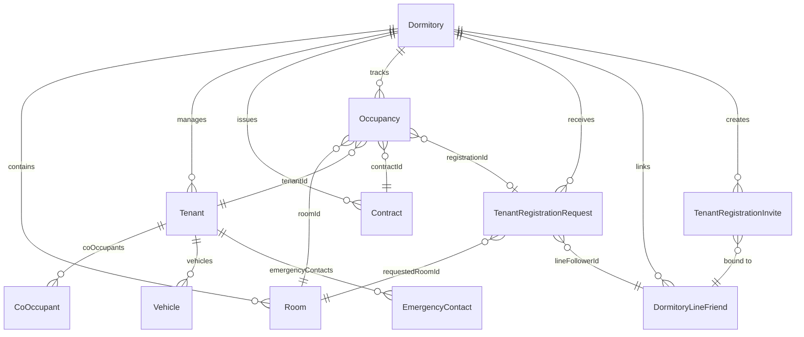

# HORPLUS-V2 — TENANT REGISTRATION SOURCE AUDIT REPORT

**Branch:** `review/tenant-ui-baseline-20260904`  
**Repository:** `phoom007/HorPlus-V2`  
**Audit Date:** 2026-09-04  
**Scope:** Existing Tenant Registration Website, Tenant Claim Flow, Identity Verification, Financial Authority, Revision Flow, Signature Handling, and Backend Capabilities.  
**Constraint Enforcement:** Zero code modified, zero migrations created, zero schema altered. Analysis and source audit only.

---

## Executive Summary

An exhaustive audit of the actual GitHub repository source code was conducted to compare the existing Tenant Registration implementation against the Product Owner's locked domain requirements.

Key high-level findings:
1. **Frontend Divergence:** The frontend contains two separate registration components:
   - `TenantRegisterPage.tsx` (554 lines): The public registration route (`/tenant/register`), which provides a basic form (applicant names, phone, note, terms, signature canvas).
   - `TenantRegisterView.tsx` (1630 lines): A rich 7-step wizard (Room selection, Profile & ID upload, Rent/Deposit calculator, Dates & Duration, Emergency Contact & Co-occupants, Vehicle & Pet, Contract Preview & Signature). However, this component is **isolated** inside `src/pages/tenant.tsx` (subView: `'register'`) with hardcoded empty stubs (`getRooms = () => []`, `saveTenants = () => {}`) and is **completely disconnected** from the public registration URL and backend APIs.
2. **Claim Flow & Identity Verification Engine:** The backend already contains an advanced, battle-tested single-field identity verification utility (`thai-identity.util.ts`) with honorific title stripping, phone normalization, Levenshtein name similarity ($\ge 0.90$), dual-tier rate limiting, and PostgreSQL advisory locking (`tenant-claim.service.ts`). However, this is currently wired only to `TenantClaimModal.tsx` for pre-authenticated app users, not to incoming LINE OA invitees.
3. **Owner-Created Claim Flow Gap:** When an Owner creates a tenant via Quick Add, the tenant status is correctly set to "ยังไม่ผูก LINE" (`OWNER_CREATED` / `WAITING_LINE_BIND`). When the tenant follows the LINE OA invite link, the system lacks an integrated flow to detect the unlinked room, verify the tenant's single-field identity, display locked financial terms (Case A), collect supplementary profile data, and capture the digital signature.
4. **Approval vs Revision Flow (Option B):** The existing backend implements terminal rejection (Option A via `rejectRequest`), which sets `status = 'rejected'`. There is no revision workflow, no rejection comment history tracking, and no tenant resubmission endpoint.
5. **Contract Signature Linkage Gap:** `SignatureStorageService` robustly verifies PNG magic bytes, checks non-blank pixel density, computes SHA-256 hashes, and stores tenant signatures in S3/R2 or local storage. However, during request approval (`approveRequest`), `contract.tenantSignature` is **never populated** from `tenantRegistrationRequest.tenantSignatureObjectKey`.

---

## 1. Tenant Registration Website Audit

### 1.1 Existing Files & Components

| File Path | Component | Responsibility | Current Connection Status |
|:---|:---|:---|:---|
| `src/App.tsx` | Routes Config | Defines `/tenant/register`, `/tenant/claim`, `/tenant/daily-request` pointing to `TenantRegisterPage`. | Canonical route provider |
| `src/pages/tenant/TenantRegisterPage.tsx` | `TenantRegisterPage` | Public registration form handling `?t=<token>` (LINE invite) or `?dormitoryId=<id>`. Contains room dropdown, applicant names, phone, note, terms checkbox, and signature canvas. | Active on `/tenant/register`, connected to Express API |
| `src/components/tenant/TenantRegisterView.tsx` | `TenantRegisterView` | Comprehensive 7-step onboarding wizard: Room, Personal Info & ID card upload, Rental Plan & Deposit, Dates & Duration, Emergency & Co-occupants, Vehicle & Pet, Contract & Signature. | **Disconnected Stub** (uses mock getters in `src/pages/tenant.tsx`) |
| `src/components/TenantClaimModal.tsx` | `TenantClaimModal` | Candidate discovery and single-field verification (`claimInput`) modal for authenticated users. | Connected to `/api/v1/tenant-claims/*`, but requires existing user session |
| `src/components/TenantDailyRequestModal.tsx` | `TenantDailyRequestModal` | Daily rental booking request modal. | Connected to daily stay endpoints |
| `src/pages/tenant/TenantInvitePage.tsx` | `TenantInvitePage` | Demo invite activation page for Google demo users. | Independent demo component |
| `src/pages/owner/tenants.tsx` | `TenantsView` | Owner-side tenant management dashboard with Quick Add modal, status badges, and 7-tab tenant detail panel. | Active, Phase 1 & 2 baseline |

### 1.2 Route Definitions (`src/App.tsx`)

```tsx
// Lines 129-131 in src/App.tsx:
<Route path="/tenant/register" element={<TenantRegisterPage />} />
<Route path="/tenant/claim" element={<TenantRegisterPage />} />
<Route path="/tenant/daily-request" element={<TenantRegisterPage />} />
```

- When a tenant visits `/tenant/register?t=<token>`, `TenantRegisterPage` parses the token and calls `getTenantRegistrationInviteContext(token)`.
- When a tenant visits `/tenant/claim` or `/tenant/daily-request`, `TenantRegisterPage` checks `auth/session`. If not authenticated, it blocks the user with an error message.

### 1.3 Registration Wizard Flow Comparison

| Requirement Feature | `TenantRegisterPage.tsx` (Current Public) | `TenantRegisterView.tsx` (Rich Wizard) | Backend API Support |
|:---|:---|:---|:---|
| **Room Selection** | Dropdown (from invite context) or text input | Interactive room card grid filtered by vacant/reserved | `room.findMany`, `hasPendingRegistrationForRoom` |
| **Rental Type Selection** | **Missing** (Implicitly monthly) | **Supported** (Radio: `monthly`, `term`, `daily`) | Supported across `Contract`, `ProvisionalRentalTerm`, `DailyStay` |
| **Installment & Deposit Plan** | **Missing** | **Supported** (Equal vs First-period schedule calculator) | `createDepositBillForAgreementInTx` |
| **Personal Info & ID Upload** | Names & phone only | Prefix, Citizen ID (with mask), Birthdate, Address, ID photo upload | Stored as string/JSON; ID document API exists |
| **Emergency Contact** | **Missing** | **Supported** (Name, relationship, phone) | Supported in Phase 2 Step 1 adapter & Prisma |
| **Co-occupants** | **Missing** | **Supported** (Array of name, phone, citizen ID) | Supported in `CoOccupant` model |
| **Vehicle Information** | **Missing** | **Supported** (Type, brand, license plate) | Supported in `Vehicle` model |
| **Pet Information** | Policy display only (read-only) | **Supported** (Type, name, count) | Supported in `petInfo` JSON column |
| **Contract Terms Preview** | Plaintext default terms | Real-time formatted contract preview | Dormitory policy snapshot |
| **Digital Signature** | HTML5 Canvas (Base64 PNG) | HTML5 Canvas (Base64 PNG) | Stored via `SignatureStorageService` |
| **API Submission** | Calls `POST /api/v1/tenant-registrations` | Calls local mock stubs (`saveTenants`, `saveRooms`) | Fully functional API endpoint exists |

### 1.4 Existing API Endpoints

- `GET /api/v1/tenant-registrations/public-policy?dormitoryId=...`: Returns dormitory policy, pet rules, and terms version.
- `GET /api/v1/tenant-registrations/invite-context?t=<token>`: Validates 7-day token hash and returns `{ policy, lineDisplayName, rooms, dormitoryId }`.
- `POST /api/v1/tenant-registrations`: Submits public registration request with snapshot hash and signature base64.
- `GET /api/v1/tenant-claims/candidate?dormitoryId=...&roomNumber=...`: Privacy-masked candidate discovery.
- `POST /api/v1/tenant-claims/claim`: Executes single-field claim with advisory locks and rate limiting.

### 1.5 Missing Parts in Existing Registration Website

1. **Disconnected Wizard:** `TenantRegisterView.tsx` has the full, beautiful 7-step UI requested by the Product Owner, but it is not exported to `/tenant/register` and has no real API adapter calls.
2. **Missing Extended Data in Registration Request:** `POST /api/v1/tenant-registrations` only accepts `{ requestedRoomId, firstName, lastName, phone, note, agreedTerms, signatureBase64, expectedPolicyVersion }`. It drops emergency contacts, co-occupants, vehicles, pets, and ID card photos.
3. **Unauthenticated Claiming Blocked:** A new LINE OA tenant clicking the invite link is not authenticated with a HorPlus account, preventing them from using `TenantClaimModal`.

---

## 2. Owner-Created Tenant Claim Flow Audit

### 2.1 Target Locked Flow

```
Owner creates tenant (Quick Add)
        ↓
Tenant status: "ยังไม่ผูก LINE" (OWNER_CREATED / WAITING_LINE_BIND)
        ↓
Tenant joins LINE OA
        ↓
Tenant selects assigned room
        ↓
Identity verification (Single-field name or phone)
        ↓
Fill additional information (ID, emergency, vehicle, pet)
        ↓
Sign contract
        ↓
REGISTERED (ACTIVE)
```

### 2.2 Existing Code Support Analysis

| Stage | Existing Code Status | Implementation Details & Gaps |
|:---|:---|:---|
| **1. Owner creates tenant** | [x] **Supported** | `QuickAddTenantModal.tsx` & `tenants.tsx` create `Tenant`, `Occupancy`, `Contract` with `lineFriendId: null` and `linkedUserId: null`. |
| **2. Status "ยังไม่ผูก LINE"** | [x] **Supported** | Badge rendered in `src/pages/owner/tenants.tsx` (amber pill "ยังไม่ผูก LINE") when `!t.lineFriendId && !t.linkedUserId`. |
| **3. Tenant joins LINE OA** | [x] **Supported** | `line-oa.service.ts` detects `follow` event, creates `TenantRegistrationIntent` and `TenantRegistrationInvite`, replies with link `/tenant/register?t=<token>`. |
| **4. Room Selection** | [!] **Partial** | `TenantRegisterPage` parses invite token and loads available rooms. However, it does not highlight or indicate the room specifically pre-assigned by the Owner. |
| **5. Identity Verification** | [ ] **Disconnected** | Backend `TenantClaimService.claim` supports single-field matching, but `TenantRegisterPage` ignores it and displays a blank name/phone entry form instead of verifying against the pre-created tenant. |
| **6. Fill Additional Info** | [ ] **Missing** | `TenantClaimModal` immediately redirects to `/tenant/dashboard` after claim without prompting for missing profile data. `TenantRegisterPage` does not collect profile details. |
| **7. Sign Contract** | [ ] **Missing** | Quick Add does not capture a signature. The claim flow does not present the contract or canvas to the claiming tenant before activating their record. |
| **8. State REGISTERED** | [!] **Partial** | Tenant record remains in `status: 'active'`, but `lifecycleStage: 'REGISTERED'` is not updated upon claim completion. |

---

## 3. Identity Verification Requirement Audit

### 3.1 Product Owner Locked Requirement

Tenant enters **ONE** single field (either full name or phone number).
- Example: Owner created `"นาย กบ อบอบ"`
- Tenant enters: `"กบ อบอบ"`
- **Result:** System MUST normalize, match, and pass.

### 3.2 Source Audit of `server/src/utils/thai-identity.util.ts`

The repository **already contains** a production-grade identity normalization and matching utility:

#### A. Title & Honorific Prefix Removal (`normalizeFullName`)
- Strips recognized Thai prefixes: `นาย`, `นางสาว`, `นาง`, `น.ส.`, `น.ส`, `นส.`, `นส`, `เด็กชาย`, `เด็กหญิง`, `ด.ช.`, `ด.ช`, `ดช.`, `ดช`, `ด.ญ.`, `ด.ญ`, `ดญ.`, `ดญ`.
- Strips English honorific titles: `mr.`, `mr`, `mrs.`, `mrs`, `ms.`, `ms`, `miss`.
- Sorts prefixes by character length descending so that longer compound prefixes (e.g., `นางสาว`, `เด็กชาย`) are matched and stripped before shorter substrings (`นาง`, `ด.ช.`).
- Normalizes Unicode NFC, removes extraneous whitespace, and lowercases text.

```ts
// Verification of existing algorithm in thai-identity.util.ts:
normalizeFullName("นาย กบ อบอบ")  // => "กบ อบอบ"
normalizeFullName("กบ อบอบ")       // => "กบ อบอบ"
// Exact match: 100% similarity!
```

#### B. Phone Number Normalization (`normalizeThaiPhone`)
- Strips all non-digit characters (`-`, ` `, `+`, `(`, `)`).
- Normalizes international code `+66` / `66` to leading `0` (e.g., `+66812345678` -> `0812345678`).
- Validates 9-to-10 digit Thai mobile/landline numbers.

#### C. Deterministic Name Similarity (`calculateNameSimilarity`)
- Computes standard Levenshtein edit distance: similarity = 1 - (distance / max(len(s1), len(s2))).
- Match threshold in `tenant-claim.service.ts`: >= 0.90 (90% similarity).

#### D. Brute-Force & Duplicate Attempt Protection
- **Room-Scoped Rate Limiter:** Maximum 5 claim attempts per 15 minutes per room/user/IP (`rate_limit:tenant_claim:room:${dormId}:${roomRef}:${userId}:${ip}`).
- **Actor-Scoped Rate Limiter:** Maximum 15 claim attempts per 15 minutes per actor across all rooms (`rate_limit:tenant_claim:actor:${userId}:${ip}`).
- **PostgreSQL Advisory Locks:** Serializes claim transactions using `pg_advisory_xact_lock(hashtext('tenant_claim_user:' + userId + ':' + dormitoryId))` and room authority lock `pg_advisory_xact_lock(hashtext(dormitoryId + ':' + room.id))`.

### 3.3 Missing Logic / Gaps

1. **Frontend Isolation:** The single-field verification is implemented in `TenantClaimModal.tsx`, but `TenantRegisterPage.tsx` requires separate `firstName`, `lastName`, and `phone` fields.
2. **LINE Friend ID Linkage:** `TenantClaimService.claim` links `tenant.linkedUserId = userId`, but does **not** update `tenant.lineFriendId = lineFollowerId`. For a tenant arriving from LINE OA, `lineFriendId` must be stored to enable billing notifications and receipt pushes.

---

## 4. Rental Financial Authority Audit

### 4.1 Case A: Owner-Created Tenant (Locked Agreement)

**Requirement:**
- Financial fields defined by Owner during Quick Add (`monthlyRent`, `termRent`, `dailyRate`, `depositAmount`, `depositDeclaredStatus`) must be **LOCKED** (read-only).
- Tenant can edit: Personal information, contact details, co-occupants, vehicle, pet.
- Tenant CANNOT edit: Financial agreement, rent amounts, or deposit amounts.

**Current Support in Code:**
- In `TenantRegisterView.tsx`, rent and deposit fields are currently editable input boxes (`<input type="number" value={rentAmount} onChange={...} />`). They are NOT locked.
- In `TenantRegisterPage.tsx`, financial terms are not displayed at all.
- In backend `tenant-claim.service.ts`, claiming does not modify existing contracts, so the financial agreement remains preserved, but the UI fails to display the locked terms clearly to the tenant.

### 4.2 Case B: Tenant Selects Available Room (Self-Application)

**Requirement:**
- Tenant can propose desired rental terms or accept published catalog terms.
- Owner reviews and has final authority to approve or adjust financial terms before binding.

**Current Support in Code:**
- In `TenantRegisterPage.tsx`, the applicant only submits personal info and requested room. Financial terms are not submitted.
- In `tenant-registration.service.ts` (`approveRequest`), the Owner explicitly supplies `rentAmount`, `depositAmount`, `advancePaymentAmount`, `durationMonths`, and `startDate` / `endDate` at approval time. This adheres to owner authority.

---

## 5. Reject / Revision Flow Audit (Option B)

### 5.1 Product Owner Locked Requirement: Option B

```
WAITING_OWNER_APPROVAL
        ↓ (Owner clicks Reject/Request Revision)
WAITING_OWNER_APPROVAL
        + Approval History Entry
        + Owner Comment ("ข้อมูลต้องแก้ไข: ...")
        ↓
Tenant opens registration link
        ↓
Tenant sees: "ข้อมูลต้องแก้ไข" with Owner comment
        ↓
Previous information remains populated and visible
        ↓
Tenant modifies incorrect fields and clicks "ส่งข้อมูลอีกครั้ง" (Resubmit)
        ↓
Status remains WAITING_OWNER_APPROVAL (with updated timestamp)
```

### 5.2 Current Backend Implementation Audit

The current codebase implements **Option A (Terminal Rejection)**:

```ts
// server/src/services/tenant-registration.service.ts (lines 809-834):
public async rejectRequest(id: string, dormitoryId: string, reason?: string, actorUserId?: string) {
  const req = await this.getRequestById(id, dormitoryId);
  // ...
  return prisma.tenantRegistrationRequest.update({
    where: { id },
    data: {
      status: 'rejected',
      rejectedReason: reason || 'Owner rejected registration request',
      reviewedAt: new Date(),
      reviewedByUserId: actorUserId,
    },
  });
}
```

### 5.3 Gap Analysis against Option B

1. **No Separate History Table:** There is no `tenant_registration_histories` table in `schema.prisma`. However, `TenantRegistrationRequest.acceptanceSnapshot` is a `Json?` column! We can store revision audit trails inside `acceptanceSnapshot.revisionHistory` without any database migrations!
2. **Terminal Status Issue:** Currently, `rejectRequest` sets `status = 'rejected'`, which prevents further edits. Option B requires either keeping `status = 'pending_owner_approval'` with a revision flag, or using `status = 'revision_requested'` (allowed in schema enum comment: `// draft, pending_owner_approval, approved, rejected, resubmitted, suspended, revoked`).
3. **No Resubmit Endpoint:** There is currently no `POST /api/v1/tenant-registrations/:id/resubmit` endpoint in `tenant-registration.routes.ts`.
4. **Tenant View Lacks Rejection Display:** `TenantRegisterPage.tsx` only handles initial creation. If a request is rejected or returned for revision, the page does not reload previous data or display the owner's feedback.

---

## 6. Signature Flow Audit

### 6.1 Audit Findings

| Question | Audit Result | Source Verification Reference |
|:---|:---|:---|
| **Is signature already implemented?** | [x] **YES** | HTML5 Canvas drawing in `TenantRegisterPage.tsx` and `TenantRegisterView.tsx`. Server validation in `SignatureStorageService.ts`. |
| **Where is signature stored?** | [x] **Object Storage / Local FS** | Saved via `SignatureStorageService.saveTenantSignature` to `dormitories/${dormitoryId}/tenant-signatures/${uuid}-${sha256}.png`. Key stored in `TenantRegistrationRequest.tenantSignatureObjectKey`. |
| **Is signature linked with Contract?** | [ ] **NO (Critical Gap)** | In `tenant-registration.service.ts` (`approveRequest` lines 707-724), `contract.tenantSignature` is **NEVER populated** from `req.tenantSignatureObjectKey`! It remains NULL. |
| **Does owner-created tenant require signature?** | [!] **Required by PO, Missing in Code** | Quick Add does not collect a signature. When the owner-created tenant claims their room via LINE, they MUST be prompted to sign the contract. Currently, the claim flow skips signing entirely. |
| **Does registration complete after signing?** | [!] **Partial** | Public applicants: status becomes `pending_owner_approval`. Owner-created claiming tenants: should transition immediately to `REGISTERED` upon signing, but this transition does not exist yet. |

### 6.2 Signature Quality Control in `SignatureStorageService.ts`

The repository already includes strict server-side validation:
1. **PNG Magic Header Verification:** Validates `[0x89, 0x50, 0x4E, 0x47, 0x0D, 0x0A, 0x1A, 0x0A]`.
2. **Blank Canvas Rejection:** Decodes PNG raster and verifies non-background pixel count (>= 1% of canvas or >= 25 px). Rejects blank signatures with `BLANK_SIGNATURE_REJECTED`.
3. **Cryptographic Integrity:** Computes SHA-256 hash of signature binary and stores it alongside the object key.

---

## 7. Existing Database Relations Used



### Prisma Models & Attributes Inspected:
1. **`TenantRegistrationRequest`:** `id`, `dormitoryId`, `lineFollowerId`, `requestedRoomId`, `firstName`, `lastName`, `phone`, `note`, `status` (`pending_owner_approval`, `approved`, `rejected`), `acceptanceSnapshot` (`Json?`), `acceptanceSnapshotSha256`, `tenantSignatureObjectKey`, `tenantSignatureSha256`.
2. **`Tenant`:** `id`, `dormitoryId`, `tenantNumber`, `firstName`, `lastName`, `displayName`, `phone`, `citizenId`, `lineFriendId`, `linkedUserId`, `status`, `lifecycleStage`, `petInfo` (`Json?`).
3. **`Contract`:** `id`, `contractNumber`, `roomId`, `tenantId`, `status`, `startDate`, `endDate`, `rentAmount`, `depositAmount`, `advancePaymentAmount`, `tenantSignature` (`String? @db.Text`), `ownerSignature`.
4. **`Occupancy`:** `id`, `roomId`, `tenantId`, `registrationId`, `contractId`, `status` (`ACTIVE`, `ENDED`).
5. **`DormitoryLineFriend`:** `id`, `dormitoryId`, `lineUserId`, `displayName`, `pictureUrl`.
6. **`TenantRegistrationInvite`:** `id`, `tokenHash`, `dormitoryId`, `lineFriendId`, `expiresAt`, `purpose`.

---

## 8. Missing Features Summary

| ID | Gap Description | Severity | Impact |
|:---|:---|:---|:---|
| **GAP-01** | `TenantRegisterView.tsx` (1630-line wizard) is disconnected and uses mock getters instead of real APIs. | **HIGH** | Public registration lacks multi-step wizard, ID upload, co-occupants, vehicles, and pets. |
| **GAP-02** | Owner-Created Tenant Claim Flow is not integrated with LINE invite context. | **HIGH** | Tenants arriving from LINE OA cannot claim their pre-created profile or view their assigned room. |
| **GAP-03** | Financial Terms are not locked for Owner-Created Tenants (Case A). | **MEDIUM** | Risk of tenant editing agreed rent or deposit amounts. |
| **GAP-04** | Contract tenant signature is not linked upon registration approval. | **HIGH** | Approved contracts have `tenantSignature = null` even though applicant signed on canvas. |
| **GAP-05** | Reject / Revision Flow uses Option A instead of Option B. | **MEDIUM** | No revision loop; rejected tenants cannot see owner comments, edit, and resubmit. |
| **GAP-06** | Claimed tenants are not prompted to complete signature and profile before entering portal. | **HIGH** | Owner-created tenants skip contract signing completely. |

---

## 9. Recommended Next Implementation Order for Phase 2 Step 3

To safely bridge all identified gaps without modifying `schema.prisma` or creating database migrations, the following execution order is recommended:

### Phase 2 Step 3.1: Connect Single-Field Claim & LINE Invite Engine
- Integrate `TenantClaimService` single-field matching (`normalizeFullName`, `normalizeThaiPhone`) into the public invite landing flow (`/tenant/register?t=<token>`).
- If an Owner-created tenant matches the room and identity input:
  - Bind `Tenant.lineFriendId` to the verified LINE follower.
  - Load the Owner-created profile with **LOCKED financial terms** (Case A).

### Phase 2 Step 3.2: Wire `TenantRegisterView` Wizard to Real Backend APIs
- Replace dummy stubs (`getRooms`, `saveTenants`) in `TenantRegisterView` with calls to `TenantDataSource` and Express API endpoints.
- Allow `TenantRegisterView` to operate in two modes:
  - **Mode A (Claiming Existing Profile):** Financial fields locked, pre-fills name and phone, collects ID photo, emergency contact, co-occupants, vehicle, pet, and signature.
  - **Mode B (Public New Applicant):** Full wizard where applicant proposes room, personal info, preferences, and signature for Owner review.

### Phase 2 Step 3.3: Link Signature to Approved Contract
- In `server/src/services/tenant-registration.service.ts` (`approveRequest`), populate `contract.tenantSignature` with `req.tenantSignatureObjectKey` (or data URL).
- For claiming tenants, capture canvas signature and store it directly onto the existing active contract.

### Phase 2 Step 3.4: Implement Revision Flow (Option B) via `acceptanceSnapshot`
- Update `rejectRequest` to record rejection reasons inside `acceptanceSnapshot.revisionHistory` and keep/set status as `revision_requested` or `pending_owner_approval`.
- Add `POST /api/v1/tenant-registrations/:id/resubmit` endpoint to allow applicant resubmission with updated data.
- In frontend, display owner revision comments and allow in-place editing.

---

**AUDIT COMPLETED. ZERO CODE HAS BEEN WRITTEN OR MODIFIED. READY FOR PRODUCT OWNER REVIEW.**
