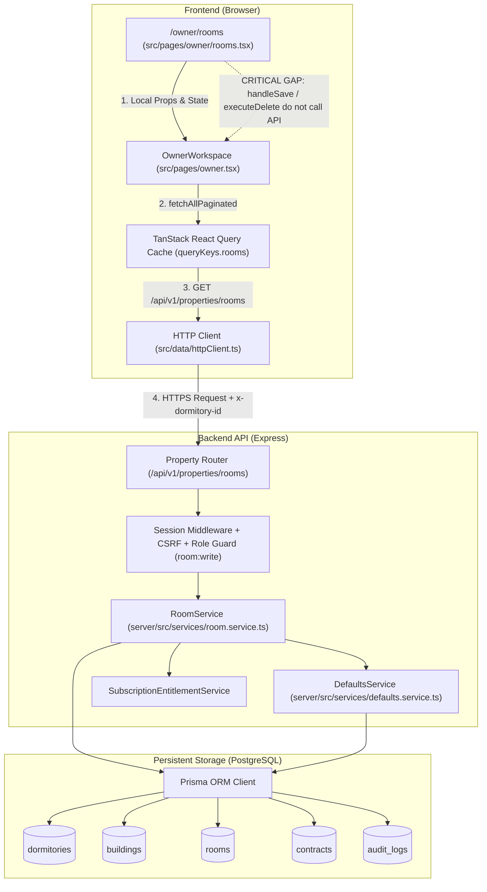

# OWNER ROOMS INTEGRATION AUDIT

**Date:** 2026-08-28  
**Repository:** `phoom007/HorPlus-V2`  
**Target Route:** `/owner/rooms`  
**Review Branch:** `review/owner-rooms-integration-audit-20260828`  
**Audit Purpose:** Comprehensive evidence-based audit, integration trace, source-of-truth verification, and phased implementation planning for the Owner Rooms management module prior to functional code modifications.

---

## 1. Git Truth

| Property | Value / Evidence |
|---|---|
| **Repository Root** | `d:/HorPlus-V2` |
| **Current Review Branch** | `review/owner-rooms-integration-audit-20260828` |
| **Base Branch** | `origin/main` |
| **Base `origin/main` SHA** | `7609817303e1403b87ab790935941ee8f90f1258` |
| **Merge Base SHA** | `7609817303e1403b87ab790935941ee8f90f1258` |
| **Snapshot Commit SHA** | `eaf44d5a9d60ec9823f666f21c258d4a69c0d768` (`snapshot(owner-rooms): preserve current product owner changes`) |
| **Working Tree Status** | Only `docs/uat/local07-expected-results.json` (timestamp change) unstaged; PO changes committed to snapshot |
| **Remotes** | `origin` -> `https://github.com/phoom007/HorPlus-V2.git` (fetch & push) |

---

## 2. Current Product Owner Changes

### A. `/owner/rooms` Related Changes (`src/pages/owner/rooms.tsx`)
The Product Owner completely redesigned the `/owner/rooms` user experience with the following improvements:
- **Display Views**: Added 3 distinct viewing modes:
  1. `Grid View` (`grid`): Visual room cards grouped with occupancy status badges, monthly/term/daily rents, deposit, and quick action buttons.
  2. `List View` (`list`): Dense operational table displaying Room #, Building, Floor, Tenant, Phone, Rent, Deposit, Initial Meters, Status, and Action dropdown.
  3. `Floor Map View` (`floor`): Building-and-floor-grouped visual matrix highlighting room layout, occupancy percentages, and floor statistics.
- **Filtering & Search**: Real-time search by room number or tenant name, filter by building, and filter by status (`vacant`, `occupied`, `maintenance`).
- **Create / Edit Room Modal**: Redesigned form covering Room Number, Building, Floor, Monthly Rent, Term Rent, Daily Rent, Rent Cycle, Deposit Amount (Monthly/Term/Daily), Max Occupants, Initial Water Meter, Initial Electricity Meter, and Status toggle (`เปิดใช้งาน` vs `ปิดปรับปรุง`).
- **Validation**: Added validation rules preventing setting a room to `ปิดปรับปรุง` (maintenance) if a tenant is currently occupying the room.
- **Delete Room Confirmation**: Detailed warning dialog listing current tenants, active contracts, and associated bills before confirming room deletion.
- **Quick Add Tenant Placeholder**: Modal skeleton for adding tenants directly from the rooms page.

### B. Unrelated Working Tree Changes (`docs/uat/local07-expected-results.json`)
- Only a test timestamp `generatedAt` was touched during a local test run (`2026-08-28T02:28:58.412Z`). Not staged in snapshot.

---

## 3. `/owner/rooms` Current Architecture

### Architecture Flow Diagram



---

## 4. Room Data Model Inventory

Based on actual `server/prisma/schema.prisma` and frontend types in `src/types.ts`:

| Field Name | Source of Truth | Prisma Model & Field | API Contract / DTO | Frontend Consumer | Editable? | Default Source Hierarchy | Dependent Menus |
|---|---|---|---|---|---|---|---|
| `id` | PostgreSQL | `Room.id` (UUID) | `id` (string) | `rooms.tsx`, `owner.tsx` | No (PK) | Auto-generated UUID | All Owner & Tenant menus |
| `dormitoryId` | PostgreSQL | `Room.dormitoryId` (UUID FK) | Scoped via Header / Auth | `owner.tsx` | No | Authoritative Session Context | All Owner menus |
| `buildingId` | PostgreSQL | `Room.buildingId` (UUID FK) | `buildingId` (UUID string) | `rooms.tsx`, `owner.tsx` | Yes | First building in dorm | Meter, Tenant, Settings |
| `roomNumber` | PostgreSQL | `Room.roomNumber` (VarChar 100) | `roomNumber` (string) | `rooms.tsx`, UI cards | Yes | User input | All menus |
| `normalizedRoomNumber` | PostgreSQL | `Room.normalizedRoomNumber` | Normalized server-side | Backend only | Auto | `normalizeRoomNumber()` | Unique index validation |
| `floor` | PostgreSQL | `Room.floor` (Int) | `floor` (number) | `rooms.tsx` (Floor Map) | Yes | Derived from Room Number / pattern | Floor Map view |
| `status` | PostgreSQL | `Room.status` (VarChar 50) | `status` (`vacant`, `occupied`, `maintenance`, `archived`) | `rooms.tsx`, `dashboard.tsx` | Yes | `vacant` | Dashboard, Meters, Tenants |
| `rentCycle` | PostgreSQL | `Room.rentCycle` (VarChar 50) | `rentCycle` (`monthly`, `term`, `daily`) | `rooms.tsx`, `contracts.tsx` | Yes | `monthly` | Contracts, Meters |
| `monthlyRent` | PostgreSQL | `Room.monthlyRent` (Decimal 12,2) | `monthlyRent` / `effectiveValues.monthlyRent` | `rooms.tsx`, `contracts.tsx` | Yes | `Building.monthlyRent` -> `DormitoryPropertyDefaults.defaultMonthlyRent` | Contracts, Quick Add, Meters, Billing |
| `termRent` | PostgreSQL | `Room.termRent` (Decimal 12,2) | `termRent` / `effectiveValues.termRent` | `rooms.tsx` | Yes | `Building.termRent` -> `DormitoryPropertyDefaults.defaultTermRent` | Quick Add, Meters |
| `dailyRent` | PostgreSQL | `Room.dailyRent` (Decimal 12,2) | `dailyRent` / `effectiveValues.dailyRent` | `rooms.tsx` | Yes | `Building.dailyRent` -> `DormitoryPropertyDefaults.defaultDailyRent` | Quick Add, Daily Stay, Meters |
| `depositAmount` | PostgreSQL | `Room.depositAmount` (Decimal 12,2) | `depositAmount` / `effectiveValues.depositAmount` | `rooms.tsx`, `tenants.tsx` | Yes | `Building.depositAmount` -> `DormitoryPropertyDefaults.defaultDeposit` | Contracts, Tenants, Settlements |
| `depositInheritsBuildingDefault` | PostgreSQL | `Room.depositInheritsBuildingDefault` (Boolean) | `depositInheritsBuildingDefault` | Backend resolver | Yes | `true` | DefaultsService resolver |
| `advancePaymentAmount` | PostgreSQL | `Room.advancePaymentAmount` (Decimal 12,2) | `advancePaymentAmount` | Backend resolver | Yes | `Building.advancePaymentAmount` -> `DormitoryPropertyDefaults.defaultAdvancePayment` | Contracts, Quick Add |
| `waterRate` | PostgreSQL | `Room.waterRate` (Decimal 12,2) | `waterRate` | Backend resolver | Yes (override) | `Building.waterRate` -> `DormitoryBillingSettings.waterRate` | Meter Workspace, Billing |
| `electricityRate` | PostgreSQL | `Room.electricityRate` (Decimal 12,2) | `electricityRate` | Backend resolver | Yes (override) | `Building.electricityRate` -> `DormitoryBillingSettings.electricityRate` | Meter Workspace, Billing |
| `commonFee` | PostgreSQL | `Room.commonFee` (Decimal 12,2) | `commonFee` | Backend resolver | Yes (override) | `Building.commonFee` -> `DormitoryBillingSettings.commonFee` | Billing |
| `internetFee` | PostgreSQL | `Room.internetFee` (Decimal 12,2) | `internetFee` | Backend resolver | Yes (override) | `Building.internetFee` -> `DormitoryBillingSettings.internetFee` | Billing |
| `parkingFee` | PostgreSQL | `Room.parkingFee` (Decimal 12,2) | `parkingFee` | Backend resolver | Yes (override) | `Building.parkingFee` -> `DormitoryBillingSettings.parkingFee` | Meter Workspace, Billing |
| `waterMeterNumber` | PostgreSQL | `Room.waterMeterNumber` (VarChar 100) | `waterMeterNumber` | Backend / Meters | Yes | User input | Meters |
| `electricityMeterNumber` | PostgreSQL | `Room.electricityMeterNumber` (VarChar 100) | `electricityMeterNumber` | Backend / Meters | Yes | User input | Meters |
| `initialWaterReading` | PostgreSQL | `Room.initialWaterReading` (Decimal 12,2) | `initialWaterReading` | `rooms.tsx` (`initialWaterMeter`) | Yes | `0.00` | Meter baseline pull |
| `initialElectricityReading` | PostgreSQL | `Room.initialElectricityReading` (Decimal 12,2) | `initialElectricityReading` | `rooms.tsx` (`initialElectricMeter`) | Yes | `0.00` | Meter baseline pull |
| `currentTenantId` | PostgreSQL | `Room.currentTenantId` (UUID FK) | `currentTenantId` | `rooms.tsx`, `tenants.tsx` | Via Contract/Occupancy | `null` | All Owner menus |
| `currentContractId` | PostgreSQL | `Room.currentContractId` (UUID FK) | `currentContractId` | `rooms.tsx`, `contracts.tsx` | Via Contract activation | `null` | Contracts, Meters, Billing |
| `version` | PostgreSQL | `Room.version` (Int) | `version` (optimistic lock) | `owner.tsx` | Auto (increment) | `1` | Optimistic Concurrency Control |
| `createdAt` | PostgreSQL | `Room.createdAt` (Timestamptz) | `createdAt` (ISO string) | `rooms.tsx` | No | Server timestamp | Audit, sorting |
| `updatedAt` | PostgreSQL | `Room.updatedAt` (Timestamptz) | `updatedAt` (ISO string) | `rooms.tsx` | Auto | Server timestamp | Audit |
| `deletedAt` | PostgreSQL | `Room.deletedAt` (Timestamptz) | `deletedAt` (soft delete) | Backend filter | Via Archive | `null` | Archive filter |

---

## 5. API Inventory

| Method | Endpoint | Frontend Caller | Backend Handler | Service Layer | Prisma Model | Purpose |
|---|---|---|---|---|---|---|
| `GET` | `/api/v1/properties/rooms` | `OwnerWorkspace` (`owner.tsx:198`) | `property.routes.ts:246` | `RoomService.getRooms` + `DefaultsService.buildAuthoritativeRoomResponse` | `Room`, `Building`, `Contract`, `DormitoryBillingSettings`, `DormitoryPropertyDefaults` | Fetch paginated rooms enriched with effective values, sources, and snapshot locks |
| `GET` | `/api/v1/properties/rooms/:id` | `ApiPropertyAdapter` / detail view | `property.routes.ts:366` | `RoomService.getRoomById` + `DefaultsService` | `Room`, `Building` | Fetch single room with resolved values |
| `POST` | `/api/v1/properties/rooms` | `ApiPropertyAdapter.createRoom` | `property.routes.ts:379` | `RoomService.createRoom` | `Room`, `Building`, `AuditLog` | Create new room with normalized number, duplicate check, advisory lock & room limits |
| `PUT` | `/api/v1/properties/rooms/:id` | `ApiPropertyAdapter.updateRoom` | `property.routes.ts:403` | `RoomService.updateRoom` | `Room`, `AuditLog` | Update room data with optimistic lock (`expectedVersion`) |
| `DELETE` | `/api/v1/properties/rooms/:id` | `ApiPropertyAdapter.archiveRoom` | `property.routes.ts:436` | `RoomService.archiveRoom` | `Room`, `Contract`, `AuditLog` | Soft delete/archive room with `expectedVersion` and active contract guard |
| `GET` | `/api/v1/properties/rooms/:id/effective-defaults` | `ApiPropertyAdapter` | `property.routes.ts:271` | `DefaultsService.resolveEffectiveRoomDefaults` | `Room`, `Building`, `DormitoryBillingSettings`, `DormitoryPropertyDefaults` | Resolve hierarchical values and field sources |
| `GET` | `/api/v1/properties/rooms/:id/quick-add-context` | `QuickAddTenantModal.tsx` | `property.routes.ts:289` | `DefaultsService.resolveEffectiveRoomDefaults` | `Room`, `Building` | Fetch room-authoritative pricing for Quick Add Tenant |
| `PUT` | `/api/v1/properties/rooms/:id/defaults` | `ApiPropertyAdapter.setRoomDefaults` | `property.routes.ts:786` | `RoomService.updateRoom` | `Room`, `AuditLog` | Set room-level pricing overrides |
| `DELETE` | `/api/v1/properties/rooms/:id/defaults/:field` | `ApiPropertyAdapter.clearRoomOverride` | `property.routes.ts:829` | `RoomService.updateRoom` | `Room`, `AuditLog` | Clear specific room pricing override to fall back to building/dormitory default |

---

## 6. Mutation / Cache Matrix

| UI Action | Frontend Handler | Current Mutation Call | Current Invalidation in `owner.tsx` | Backend Route Executed? | Actual DB Status |
|---|---|---|---|---|---|
| **Create Room** | `handleSave` (`rooms.tsx:356`) | Local state push + `onSaveRooms(updatedRooms)` | `queryClient.invalidateQueries(rooms)` | ❌ None (`POST /api/v1/properties/rooms` not called) | Room NOT saved; disappears on refetch |
| **Edit Room** | `handleSave` (`rooms.tsx:330`) | Local state map + `onSaveRooms(updatedRooms)` | `queryClient.invalidateQueries(rooms)` | ❌ None (`PUT /api/v1/properties/rooms/:id` not called) | Changes NOT saved; reverts on refetch |
| **Delete Room** | `executeDeleteRoom` (`rooms.tsx:436`) | Local state filter + `onSaveRooms(updated)` | `queryClient.invalidateQueries(rooms)` | ❌ None (`DELETE /api/v1/properties/rooms/:id` not called) | Room NOT deleted; restores on refetch |
| **Change Status** (Maintenance) | `handleSave` (`rooms.tsx:317`) | Local state update + `onSaveRooms` | `queryClient.invalidateQueries(rooms)` | ❌ None | Status NOT persisted to PostgreSQL |
| **Quick Add Tenant** | `QuickAddTenantModal` skeleton | Placeholder only (`rooms.tsx:1374`) | None | ❌ None | Not functional from Rooms page |

---

## 7. Cross-Menu Dependency Matrix

| Producer | Room Data Produced | Consumer Menu | Query / API Linkage | Current Integration Behavior | Architectural & Operational Risk |
|---|---|---|---|---|---|
| **`/owner/rooms`** | `Room` record, `monthlyRent`, `status`, `buildingId` | **`/owner/dashboard`** | `queryKeys.rooms(dormId)` | Dashboard computes total, vacant, occupied, maintenance counts and displays room grid | If Rooms changes are not saved to DB, Dashboard displays out-of-sync server data |
| **`/owner/rooms`** | `Room` record, `status`, `depositAmount`, `monthlyRent` | **`/owner/tenants`** | `queryKeys.rooms(dormId)` | Tenants displays room assignments, move-out, room transfer, and entry deposit totals | Room transfer updates local state; deposit fallback uses `monthlyRent` |
| **`/owner/rooms`** | `Room` record, `monthlyRent`, `depositAmount`, `rentCycle` | **`/owner/contracts`** | `queryKeys.rooms(dormId)` + `contracts.addContract()` | Contracts reads `selectedRoom.monthlyRent` to populate contract rent; hardcodes deposit as `monthlyRent * 2` | Stored `room.depositAmount` is bypassed by hardcoded formula in contracts form |
| **`/owner/rooms`** | `Room` record, `waterMeterNumber`, `electricityMeterNumber` | **`/owner/meters`** | `queryKeys.meterPreviewContext(dormId, cycleId)` + `queryKeys.rooms(dormId)` | Meters reads room list and preview context for billing workspace | Stale cache: editing room does not invalidate `meterPreviewContext` or `meterWorkspace` |
| **`/owner/rooms`** | `Room` record, `roomNumber`, `buildingId` | **`/owner/announcements`** | `queryKeys.rooms(dormId)` | Used for target selection (all / building / custom rooms) | Low risk, directly filters room array |
| **`/owner/rooms`** | `Room` record, `roomNumber` | **`/owner/maintenance`** | `queryKeys.rooms(dormId)` | Populates room dropdown when creating repair request | Low risk, directly maps room IDs |
| **`/owner/rooms`** | `Room` record, `roomNumber` | **`/owner/payments`** | `queryKeys.rooms(dormId)` | Maps payment records to room number for display | Low risk, joins by `payment.roomId` |
| **`/owner/settings`** | `DormitoryPropertyDefaults`, `DormitoryBillingSettings` | **`/owner/rooms`** | `GET /api/v1/properties/dormitory/defaults` + `POST /defaults/apply` | Propagation engine updates candidate rooms when default prices change | High risk if room override tracking (`fieldSources`) is not synchronized |

---

## 8. `/owner/meters` Integration: Room Pricing Authority

### How `/owner/meters` gets room pricing currently:
1. **Server-Side Authority (`getMeterBillingPreviewContext` in `server/src/services/meter.service.ts`)**:
   - For every room in the dormitory, `meterService` checks:
     a. **Active Contract**: If room has an active contract in the cycle, it reads `contract.rentAmount` (or `contractSnapshot.installmentConfig` for term schedule).
     b. **Provisional Term**: If room has an active provisional monthly/term booking, it reads `prov.unitRentAmount` or calculates term installment from `prov.totalRentAmount`.
     c. **Daily Stay**: If room has a daily booking, it reads `dailyStay.totalRentAmount`.
     d. **No Active Occupant**: If vacant/unoccupied, `billingSource` is set to `'NONE'` and `rentAmount = '0.00'`.
2. **Where Contract & Provisional Terms get their initial rent**:
   - When creating a Contract or Quick-Add booking, initial rent comes from `DefaultsService.resolveEffectiveRoomDefaults(dormId, room.buildingId, room.id)`.
   - **Hierarchy**: `Room.monthlyRent` (if set) ➔ `Building.monthlyRent` (if set) ➔ `DormitoryPropertyDefaults.defaultMonthlyRent`.
3. **Finding on Meter Room Pricing**:
   - The backend design already adheres to the Product Owner's policy: saved room pricing is resolved hierarchically and snapshotted upon contract/booking creation.
   - **Gap**: If an Owner changes a room's price in `/owner/rooms`, `/owner/meters` will not reflect the new price for *future* bookings until cache invalidation is dispatched. For *existing active contracts*, price is legally locked in `ContractSnapshot` (preventing retroactive tampering).

---

## 9. Tenant / Occupancy Integration

- `Room.currentTenantId` and `Room.currentContractId` in PostgreSQL link a room to its active occupant.
- In `src/pages/owner/rooms.tsx`:
  - When editing a room, `editingRoom?.currentTenantId` determines whether the room is `occupied` or `vacant`.
  - Maintenance validation: If `editingRoom?.currentTenantId` is truthy, selecting `ปิดปรับปรุง` (maintenance) is blocked with an error prompt:
    *"ไม่สามารถเปลี่ยนสถานะเป็น 'ปิดปรับปรุง' ได้ เนื่องจากห้องพักนี้มีผู้เช่าอยู่... ต้องเป็นห้องว่างเท่านั้น"*.
  - Delete validation: If a room has an active tenant, contract, or bills, a detailed warning is displayed.

---

## 10. Billing / Contract Integration

- Contracts in PostgreSQL have a foreign key `Contract.roomId` referencing `Room.id` with `onDelete: Restrict`.
- `RoomService.archiveRoom` queries active contracts (`['active', 'approved', 'expiring_soon', 'waiting_extension', 'checking_out']`). If any exist, it throws 400 `ROOM_HAS_ACTIVE_TENANT`.
- **Gap Identified**: `RoomService.archiveRoom` checks `Contract`, but does NOT check `ProvisionalRentalTerm` or `DailyStay`. Archiving a room with an active provisional booking or daily stay could leave orphan active stays.

---

## 11. Authorization / Dorm Isolation

- **Authentication**: Handled via secure session cookie (`horplus_session`), resolved in `createRequireSessionMiddleware`.
- **Dormitory Isolation**:
  - Authoritative context is resolved in `server/src/middleware/dormitory-context.ts` (`resolveAuthoritativeDormitoryContext`).
  - Verifies that the authenticated user has an active `DormitoryMember` record with role `OWNER`, `MANAGER`, or `STAFF` for the requested dormitory ID.
  - Rejects cross-dormitory access with 403 `FORBIDDEN`.
- **Mutations Guard**:
  - `POST /rooms`, `PUT /rooms/:id`, `DELETE /rooms/:id` are protected by `mutationGuard('room:write')` (`requireDormitoryPermission('room:write')` + `requireDormitoryWriteEntitlement`).
  - Validates CSRF token via `x-csrf-token` header matching session hash.

---

## 12. Source-of-Truth Audit

| Canonical Candidate | Duplicate Authority / Fallback | Consumer | Risk Level | Recommended Consolidation |
|---|---|---|---|---|
| **PostgreSQL `rooms` Table** | React local state (`updatedRooms` array in `rooms.tsx`) | `rooms.tsx` | **P0 (Critical)** | Wire `rooms.tsx` to `ApiPropertyAdapter` / REST API mutations (`POST`, `PUT`, `DELETE /api/v1/properties/rooms`) |
| **PostgreSQL `Room.depositAmount`** | Hardcoded formula `monthlyRent * 2` in `contracts.tsx:461` | `contracts.tsx` | **P1 (High)** | Replace `(selectedRoom.monthlyRent || 0) * 2` with `selectedRoom.depositAmount` |
| **Prisma `Room` deposit schema** | `monthlyDeposit`, `termDeposit`, `dailyDeposit` local states in `rooms.tsx` | `rooms.tsx` | **P1 (High)** | Align `rooms.tsx` form state to schema `depositAmount`, `rentCycle` |
| **Server `DefaultsService` hierarchy** | Client fallback defaults (`4500`, `18000`, `500`) | `rooms.tsx` | **P2 (Medium)** | Fetch building/dormitory effective defaults when creating a new room |
| **`QuickAddTenantModal.tsx`** | Empty placeholder modal in `rooms.tsx:1357-1376` | `rooms.tsx` | **P1 (High)** | Integrate shared `QuickAddTenantModal` with `/api/v1/properties/rooms/:id/quick-add-context` |

---

## 13. Current Gaps

### P0 — Data Loss / Fake Persistence / Security
1. **Room CRUD Fake Persistence (Data Loss)**:
   - Creating, editing, or deleting a room in `src/pages/owner/rooms.tsx` only updates local React state and triggers `queryClient.invalidateQueries`.
   - No HTTP request is sent to `/api/v1/properties/rooms`.
   - On refetch, all user changes are wiped out by PostgreSQL data.

### P1 — Correctness & Integration Gaps
2. **TypeScript Compilation Errors in `rooms.tsx`**:
   - 8 type errors in `src/pages/owner/rooms.tsx` (`monthlyDeposit`, `termDeposit`, `dailyDeposit`, `stayDate`) causing `npm run lint` (`tsc --noEmit`) to fail with exit code 1.
3. **Quick Add Tenant Disconnected**:
   - `rooms.tsx` has a blank modal instead of connecting `QuickAddTenantModal` to `quick-add-context`.
4. **Stale Cross-Menu Query Invalidation**:
   - `handleSaveRooms` in `owner.tsx` does not invalidate `meterPreviewContext`, `meterWorkspace`, or `tenants`.
5. **Contract Form Bypasses Saved Room Deposit**:
   - `contracts.tsx:461` calculates deposit as `monthlyRent * 2` instead of using the room's stored `depositAmount`.
6. **Backend Archive Room Missing Provisional / Daily Stay Check**:
   - `RoomService.archiveRoom` only checks active contracts, omitting `ProvisionalRentalTerm` and `DailyStay`.

### P2 — UX & State Consistency Gaps
7. **Missing Optimistic Concurrency & 409 Conflict Handling**:
   - `rooms.tsx` does not send `expectedVersion` or handle `VERSION_CONFLICT` with `VersionConflictModal`.
8. **Missing Test IDs Causing Wave 1G Test Failures**:
   - `src/tests/wave1g-owner-ui.test.tsx` fails 2 tests because previous badges and buttons were removed.
9. **Inconsistent Date Format**:
   - `rooms.tsx` uses raw ISO string splitting instead of `formatThaiDate` / `OwnerDateInput`.

### P3 — Cleanup & Refactoring
10. **Dead Code & Unused Imports in `rooms.tsx`**:
    - Unused Lucide icons (`Ban`, `Phone`, `CreditCard`, `FileText`, `Check`, `MessageCircle`, `QrCode`, `Info`, `Copy`, `Coins`, `ShieldCheck`, `DoorOpen`).
    - Deprecated `floor` calculation from room number digits instead of backend numbering pattern.

---

## 14. Architectural Risks

1. **Client-Server State Divergence**: If the UI maintains an in-memory representation that differs from PostgreSQL, any background query refetch immediately discards user work.
2. **Pricing Integrity**: Allowing disconnected pricing formulas across Rooms, Contracts, and Meters creates billing discrepancies and tenant disputes.
3. **Orphan Active Stays on Room Archive**: If a room is archived while a provisional or daily stay is ongoing, meter readings and billing orchestration will encounter orphaned references.

---

## 15. Recommended Target Architecture

### Canonical Principles
1. **PostgreSQL / Prisma is the Single Persistent Source of Truth**: All room identity, pricing, and status attributes reside in the `rooms` table.
2. **Hierarchical Defaults via `DefaultsService`**:
   - **Level 1 (Dormitory)**: `DormitoryPropertyDefaults` & `DormitoryBillingSettings`.
   - **Level 2 (Building)**: `Building` overrides.
   - **Level 3 (Room)**: `Room` overrides (`monthlyRent`, `depositAmount`, etc.).
3. **Contract / Booking Snapshots Lock Historical Rates**:
   - Active contracts freeze pricing into `ContractSnapshot`.
   - Editing a room's price affects *future* bookings, while *current* active contracts remain legally locked to their signed snapshot.
4. **Backend Services Enforce Invariants**:
   - Validation, duplicate check, advisory lock for room limits, optimistic versioning, and active occupant checks occur on the server.
5. **React Query is Client-Side Cache Only**:
   - Mutations MUST call backend endpoints and invalidate dependent query keys across Rooms, Meters, Tenants, and Dashboard.

---

## 16. Proposed Implementation Plan

### Phase A: Type Alignment & Compilation Fixes
- **Goal**: Fix all TypeScript errors in `src/pages/owner/rooms.tsx` so `npm run lint` passes cleanly.
- **Affected Files**: `src/pages/owner/rooms.tsx`, `src/types.ts` (if needed for interface consistency).
- **Impact**: Zero DB impact, Frontend type correctness.
- **Tests**: `npm run lint`.

### Phase B: Connected Room CRUD API Mutations & Optimistic Concurrency
- **Goal**: Connect Room Create, Edit, and Archive actions in `src/pages/owner/rooms.tsx` to real backend API endpoints via `ApiPropertyAdapter` / `httpRequest`.
- **Affected Files**: `src/pages/owner/rooms.tsx`, `src/pages/owner.tsx`.
- **Backend Calls**:
  - `POST /api/v1/properties/rooms` on create.
  - `PUT /api/v1/properties/rooms/:id` on edit (with `expectedVersion`).
  - `DELETE /api/v1/properties/rooms/:id` on delete/archive (with `expectedVersion`).
- **Conflict Handling**: Integrate `VersionConflictModal` on 409 `VERSION_CONFLICT`.
- **Tests**: Unit & Integration tests for room mutations and version conflict.

### Phase C: Multi-Module Query Invalidation
- **Goal**: Ensure room mutations trigger targeted cache invalidation across all dependent modules.
- **Affected Files**: `src/pages/owner.tsx`.
- **Query Invalidation Scope**:
  - `queryKeys.rooms(dormId)`
  - `queryKeys.meterWorkspace(dormId, cycleId)` (for active cycle)
  - `queryKeys.meterPreviewContext(dormId, cycleId)`
  - `queryKeys.tenants(dormId)`
  - `queryKeys.contracts(dormId)`
  - `queryKeys.notifications(dormId)`
- **Tests**: Cross-menu query invalidation tests.

### Phase D: Quick Add Tenant Modal Integration in Rooms
- **Goal**: Connect the "+ เพิ่มผู้เช่า" action in `/owner/rooms` to the shared `QuickAddTenantModal`.
- **Affected Files**: `src/pages/owner/rooms.tsx`.
- **Integration**: Fetch `/api/v1/properties/rooms/:id/quick-add-context` and launch `QuickAddTenantModal` with full 4-tab support (LINE OA, TERM, MONTHLY, DAILY).
- **Tests**: Quick Add from Rooms tests.

### Phase E: Cross-Menu Pricing & Deposit Consolidation
- **Goal**: Fix `contracts.tsx` to use saved `room.depositAmount` instead of `monthlyRent * 2`.
- **Affected Files**: `src/pages/owner/contracts.tsx`.
- **Tests**: Contract creation deposit tests.

### Phase F: Backend Archive Guard Expansion
- **Goal**: Update `RoomService.archiveRoom` to check `ProvisionalRentalTerm` and `DailyStay` in addition to `Contract`.
- **Affected Files**: `server/src/services/room.service.ts`.
- **Tests**: Backend integration tests for room archive with provisional / daily stays.

### Phase G: Test Suite Modernization & Regression Sign-off
- **Goal**: Update `wave1g-owner-ui.test.tsx` to match redesigned PO UI structure and verify full suite passes.
- **Affected Files**: `src/tests/wave1g-owner-ui.test.tsx`.
- **Tests**: `npm run test`, `npm run test:api`.

---

## 17. Recommended Implementation Order

```
┌────────────────────────────────────────────────────────┐
│ Phase A: Fix TypeScript Compilation Errors in Rooms     │
└──────────────────────────┬─────────────────────────────┘
                           │
┌──────────────────────────▼─────────────────────────────┐
│ Phase B: Wire Real REST API Mutations (POST/PUT/DELETE)│
└──────────────────────────┬─────────────────────────────┘
                           │
┌──────────────────────────▼─────────────────────────────┐
│ Phase C: Multi-Module Cache Invalidation (Meters, etc) │
└──────────────────────────┬─────────────────────────────┘
                           │
┌──────────────────────────▼─────────────────────────────┐
│ Phase D: Integrate QuickAddTenantModal in Rooms Page   │
└──────────────────────────┬─────────────────────────────┘
                           │
┌──────────────────────────▼─────────────────────────────┐
│ Phase E: Fix Contract Form Saved Deposit Calculation   │
└──────────────────────────┬─────────────────────────────┘
                           │
┌──────────────────────────▼─────────────────────────────┐
│ Phase F: Backend Archive Guard for Provisional & Daily │
└──────────────────────────┬─────────────────────────────┘
                           │
┌──────────────────────────▼─────────────────────────────┐
│ Phase G: Update Tests & Final Regression Sign-off      │
└────────────────────────────────────────────────────────┘
```

---

## 18. Test Plan

### Automated Test Matrix
| Layer | Test Suite | Target Invariant |
|---|---|---|
| **Frontend Lint** | `npm run lint` | Zero TypeScript errors across all `.tsx` / `.ts` files |
| **Backend Lint** | `npm run lint:api` | Zero TypeScript errors in server |
| **Prisma Validation** | `npm --prefix server run prisma:validate` | Schema validity and relation integrity |
| **Frontend Unit** | `src/tests/wave1g-owner-ui.test.tsx` | UI rendering, view modes, room cards, edit modal |
| **Frontend Integration** | `src/tests/local07-quick-add-authority-proof.test.tsx` | Quick Add modal pricing parity |
| **Backend Unit** | `server/src/__tests__/unit/room-number.normalizer.test.ts` | Room number normalization & duplicate prevention |
| **Backend Integration** | `server/src/__tests__/integration/wave1g-property-defaults.test.ts` | Hierarchical pricing resolution and override clearance |
| **Backend Integration** | `server/src/__tests__/integration/local07-owner-ui-integration.test.ts` | Building defaults, term installments, and promptPay persistence |

---

## 19. Manual UAT Plan

| Scenario | Steps | Expected Outcome |
|---|---|---|
| **1. Create Room** | Click "+ เพิ่มห้องพัก" ➔ Enter room number "901", Monthly rent 5,000, Deposit 10,000 ➔ Save | Room 901 appears in list; persists after page refresh (F5) |
| **2. Edit Room Price** | Click edit on Room 901 ➔ Change Monthly rent to 5,500 ➔ Save | Room 901 shows 5,500; persists after refresh |
| **3. Duplicate Room Check** | Click "+ เพิ่มห้องพัก" ➔ Enter "901" ➔ Save | Form blocks submission with Thai error message |
| **4. Maintenance with Tenant** | Edit occupied room ➔ Click "ปิดปรับปรุง" | Form displays error: cannot put occupied room in maintenance |
| **5. Delete Room** | Click delete on vacant Room 901 ➔ Confirm in dialog | Room 901 is archived in DB and removed from UI |
| **6. Quick Add from Rooms** | Click "+ เพิ่มผู้เช่า" on vacant room ➔ Fill form ➔ Submit | Tenant is created, room becomes occupied, contract/provisional term created |
| **7. Cross-Menu Meter Check** | Edit room price ➔ Navigate to `/owner/meters` | Meter preview context displays updated pricing for new bookings |
| **8. Floor Map View** | Switch to "แผนผังแยกชั้น" ➔ Inspect floors | Floor cards display accurate room distribution and occupancy counts |

---

## 20. Open Product Questions

> [!NOTE]
> The following product questions require Product Owner policy clarification before execution:

1. **Per-Cycle Deposit Customization**: In `rooms.tsx`, the UI allows entering separate deposit values for Monthly, Term, and Daily rents (`monthlyDeposit`, `termDeposit`, `dailyDeposit`). Currently, the Prisma schema stores a single `depositAmount` for the room. Should we:
   - **Option 1**: Use `depositAmount` for the room's primary rent cycle (e.g. monthly deposit for monthly rooms, daily deposit for daily rooms), OR
   - **Option 2**: Add dedicated schema fields for `termDeposit` and `dailyDeposit`?
2. **Quick Add Default Tab on Rooms Page**: When clicking "+ เพิ่มผู้เช่า" on a room card in `/owner/rooms`, should it default to the `LINE OA` tab (same as in `/owner/meters`) or directly to `MONTHLY` contract form?
3. **Room Deletion Policy for Rooms with Inactive Past History**: When an owner deletes a room with historical bills/contracts that have already ended, should the UI always perform soft delete (`archived` status) with historical records preserved in PostgreSQL? (Recommended: Yes, soft delete via `deletedAt`).
