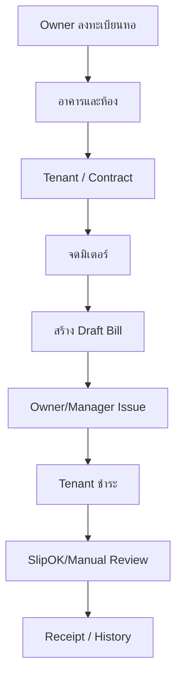

# 00. Executive Summary

HorPlus-Version 2 คือระบบจัดการหอพักแบบ Multi-tenant ที่รองรับงานตั้งแต่ลงทะเบียนหอพัก อาคาร ห้อง ผู้เช่า สัญญา มิเตอร์ บิล การชำระ ใบเสร็จ LINE OA/LIFF แจ้งซ่อม ประกาศ ไปจนถึงสิทธิ์บุคลากร

## Product Goal

- ทำ Core System ให้เสถียรและใช้สาธิตกับเจ้าของหอพักได้ก่อน
- ยกระดับจาก Prototype เป็น Production โดยไม่ทำให้ UX เดิมเสีย
- รองรับอุปกรณ์ LINE WebView, Mobile, iPad และ Desktop
- เตรียม scale มากกว่า 10,000 หอพัก โดยแยกข้อมูลและค่าใช้จ่ายต่อหอพัก
- ใช้ภาษาไทยเป็นหลักและเตรียมโครงสร้าง i18n สำหรับ English

## Locked Product Model

- บุคลากร 3 บทบาท: Owner, Manager, Technician/Housekeeping
- รวมบุคลากรทุกบทบาทไม่เกิน 10 บัญชีต่อหอพัก
- Owner เริ่มต้นด้วย Google Registration; การใช้งานภายหลังและ Tenant ใช้ LINE OA/LIFF
- LINE OA แยกต่อหอพัก
- Free: 1 หอ, 10 ห้อง, 30 LINE sends/month
- Paid: สูงสุด 150 ห้อง/หอ, 300 LINE sends/month
- Paid duration/total price: 1/3/6/12/24 เดือน = 189/529/999/1,799/2,999 บาทรวม VAT
- Trial 30 วัน; `HORPLUS` +60 วัน; จำกัดเริ่มต้น 100 หอ
- Package expiry ล็อกการทำรายการทันที ไม่มี Grace Period

## Core Workflow

## Target Architecture

| Layer | Target |
|---|---|
| Web | React 19 + TypeScript + Vite, Cloudflare CDN/WAF |
| API | Node.js + Express + Zod |
| Data | PostgreSQL + Prisma, RLS + transaction context |
| Queue | Redis + BullMQ-compatible worker |
| Files | Private object storage ใน region ใกล้ไทย |
| Identity | Google OIDC สำหรับ Owner bootstrap; LINE Login/LIFF สำหรับ role portal และ tenant |
| External | LINE Messaging API, SlipOK |
| Observability | Structured log, metrics, alert และ immutable audit |

## Delivery Scope

### Core Production Readiness

- Auth/session/CSRF/RLS
- Dormitory/Building/Room CRUD และ inheritance
- Tenant/Contract/Registration/Approval/Signature
- Meter/Billing/Deposit/Installment/Payment/Receipt
- Staff roles and 10-account limit
- LINE OA/LIFF binding/quota/outbox
- Maintenance/Announcement/Notification
- Subscription/Trial/Promo/Expiry/Platform payment
- Migration, test, backup, monitoring

### Deferred

- Public Dormitory Directory, SEO และ Website Builder
- LINE quota top-up
- Payment gateway เพิ่มเติม
- External Developer Portal แบบสมบูรณ์

## System-wide Acceptance

- ไม่มี request ใดอ่าน/เขียนข้อมูลข้ามหอพักได้
- Client แก้ยอด/role/quota/status ไม่สำเร็จ
- Duplicate request ไม่สร้างบิล เงิน หรือใบเสร็จซ้ำ
- Tenant ไม่เห็น Draft/Voided/ข้อมูลคนก่อน
- Owner/Manager ทำ Finance ได้; Tech ไม่เห็น Finance
- Current code gaps ถูกแก้ผ่าน Migration และไม่ใช้การเปลี่ยนเอกสารย้อนตามโค้ด

