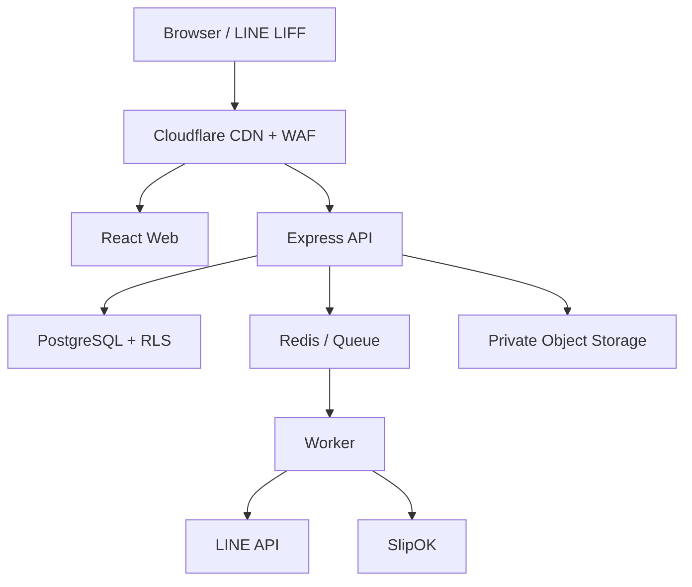

# 02. Target Architecture

## 1. Topology



## 2. Deployment Boundary

| Component | Responsibility | Scale |
|---|---|---|
| Web | Static SPA, routing, UX | Edge cached |
| API | Auth, validation, business rules, transaction | Horizontal stateless |
| Worker | LINE, SlipOK, PDF, scheduled billing/quota | Separate concurrency |
| PostgreSQL | Source of truth, constraints, RLS, ledger | Managed + PITR |
| Redis | Queue, short-lived lock, rate limit | Managed |
| Object storage | Slip, ID, signature, receipt | Private + lifecycle |

Frontend สามารถอยู่ Cloudflare Pages/CDN ส่วน API/Worker ต้องใช้ runtime ที่รองรับ Node/Prisma และเชื่อม PostgreSQL อย่างเสถียร Region ใกล้ประเทศไทย ห้ามย้ายไป edge runtime เพียงเพื่อประหยัดต้นทุนถ้ายังไม่มี integration test รองรับ

## 3. Domain Boundaries

- Identity & Access
- Dormitory & Property
- Tenant & Contract
- Meter & Billing
- Tenant Payment
- Platform Subscription Payment
- LINE & Notification
- Maintenance & Announcement
- Audit & Operations

Tenant Payment กับ Platform Payment ห้ามแชร์ table, numbering, receiver account หรือ approval lifecycle

## 4. Data Access

```text
Route
→ Authentication
→ Resolve Actor
→ Resolve Dormitory
→ Permission
→ Zod validation
→ Transaction + SET LOCAL RLS context
→ Service invariant
→ Repository
→ Audit/Outbox
→ Commit
```

ห้าม Route เรียก Prisma โดยตรง และห้ามใช้ `dormitoryId` จาก body/query เป็นหลักฐานสิทธิ์

## 5. Availability and Cost

- เริ่มด้วย instance ขนาดเล็ก/scale-to-zero ได้ใน layer stateless
- Database ต้องไม่ scale-to-zero จนทำให้ connection/session ไม่เสถียร
- ใช้ connection pool และกำหนด max concurrency ของ Worker
- งานภายนอก retry ด้วย exponential backoff + dead-letter queue
- Backup PostgreSQL แบบรายวันและ PITR ตามบริการที่เลือก
- Object storage version/lifecycle และ replication ตามความสำคัญเอกสาร

## 6. Production Gates

- Environment แยก dev/staging/prod
- Secret manager; ห้าม secret ใน repo/frontend/log
- Migration deploy แบบ one-way compatible ก่อน code switch
- Health/readiness ไม่รายงาน ready เมื่อ dependency สำคัญใช้ไม่ได้
- Structured log มี requestId, actorId, dormitoryId (ไม่ใส่ข้อมูลลับ)

## Acceptance Criteria

- Web/API/Worker deploy แยกกันได้
- API stateless ยกเว้น durable state ใน PostgreSQL/Redis/Object storage
- RLS context ไม่รั่วข้าม pooled connection
- Retry ภายนอกไม่ทำรายการซ้ำ
- รองรับเพิ่ม capacity โดยไม่เปลี่ยน data ownership ต่อหอ

