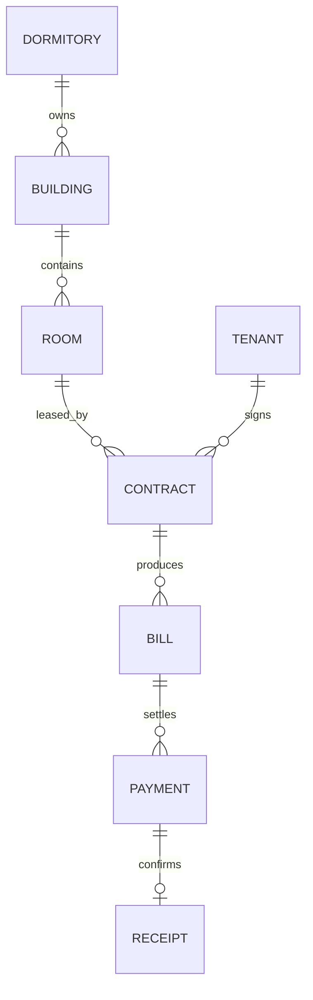

> [!NOTE]
> **[STATUS: CURRENT]**
> Refer to **[21-CURRENT-PRODUCT-RULE-LOCK.md](./21-CURRENT-PRODUCT-RULE-LOCK.md)** for absolute precedence.

# 03. Domain and Data Model

เอกสารนี้เป็น Target Model โค้ดปัจจุบันอาจยังไม่ครบ ต้องใช้ migration ตาม `12-DATA-MIGRATION-PLAN.md`

## 1. Core Relationship



ทุก aggregate ที่เป็นของหอพักต้องมี `dormitory_id NOT NULL` และ repository ต้องตรวจ relation ว่าอยู่หอเดียวกัน

## 2. Identity and Membership

### `users`

- Owner bootstrap identity จาก Google
- LINE identity แยกใน `line_identities`
- ห้ามใช้ email/LINE user ID เป็น primary key

### `dormitory_members`

- `(user_id, dormitory_id)` unique
- `role_code`: `OWNER | MANAGER | TECH`
- `status`: `INVITED | ACTIVE | SUSPENDED | REVOKED`
- one role per user per dormitory
- transaction ต้องนับ active+invited ที่ใช้ slot และห้ามเกิน 10

แนะนำ invariant ด้วย advisory/row lock ที่ `dormitories` ก่อน insert เพื่อป้องกันคำขอพร้อมกันทะลุเพดาน

## 3. Dormitory, Building and Room

### `dormitories`

เก็บ timezone, currency, status, registration owner และ configurable defaults

### `buildings`

- `(dormitory_id, normalized_name)` unique
- billing/rent default override เป็น nullable เพื่อ inherit จาก dormitory

### `rooms`

- `building_id NOT NULL`
- `normalized_room_number`
- unique `(dormitory_id, normalized_room_number)`
- status: `VACANT | RESERVED | OCCUPIED | MAINTENANCE`
- rent mode: `MONTHLY | TERM | DAILY`
- default price fields เป็นค่า operational ปัจจุบัน แต่สัญญาต้อง snapshot

## 4. Tenant and Registration

### `tenant_registration_requests`

ต้องเพิ่ม:

- requested room
- form payload version
- rules/document requirement version
- signature object key/hash
- line identity
- state, reviewer, edit diff, reject reason
- partial unique: หนึ่ง active request ต่อ identity+dormitory

States:

```text
DRAFT → SUBMITTED → UNDER_REVIEW
→ APPROVED
→ CHANGES_REQUESTED → RESUBMITTED
→ REJECTED → RESUBMITTED
```

### `tenants`

- PII encrypted/masked
- status: `PENDING | ACTIVE | MOVED_OUT | ARCHIVED`
- owner-created tenant อาจยังไม่มี LINE binding

### `tenant_co_occupants`

บังคับเฉพาะ `name`, `phone`; ไม่สร้าง LINE user/member โดยอัตโนมัติ

## 5. Contract and Snapshot

### `contracts`

ต้องเก็บ:

- room/tenant/start/end/rent cycle
- price snapshot JSON/version
- deposit type/amount/paid amount
- installment maximum and schedule snapshot
- rules/document template version
- tenant signature hash/object/time/IP/LINE identity
- owner approval/signature (ถ้ามี)
- lifecycle history

Contract Active overlap สำหรับ room เดียวกันห้ามทับกัน ยกเว้น future reservation ที่เริ่มหลัง effective move-out ของสัญญาเดิม

## 6. Deposit and Installment

แยก entity:

- `deposit_charges`: contract, type, amount, status
- `deposit_transactions`: paid/refund/damage_deduction/rent_credit
- `installment_schedules`: sequence, amount, due_date, status

ยอดเงินใช้ `DECIMAL(12,2)`/Decimal.js ห้าม JavaScript floating point

## 7. Meter and Billing

- `billing_cycles`: dormitory + cycle code unique
- `billing_rate_snapshots`: อัตราที่ใช้จริง
- `meter_devices`: room + type + lifecycle
- `meter_readings`: previous/current/unit + evidence + reader
- `bills`: `DRAFT | ISSUED | PARTIALLY_PAID | PAID | OVERDUE | VOIDED`
- `bill_items`: rent/water/electric/common/deposit/installment/fine/adjustment
- `bill_status_history`: append-only

Draft Bill ต้อง unique ต่อ cycle+contract+bill kind เพื่อให้ retry ไม่สร้างซ้ำ

## 8. Payment and Receipt

Tenant Domain:

- `payments`, `payment_evidences`, `payment_reviews`, `receipts`
- SHA-256/QR/reference duplicate guard
- receipt number unique per dormitory

Platform Domain:

- `platform_package_offers`
- `platform_subscriptions`
- `platform_invoices`
- `platform_payments`
- `platform_payment_evidences`
- `platform_entitlement_events`

ห้ามใช้ `payments` ของ Tenant Domain ชำระค่าแพ็กเกจ HorPlus

## 9. Package Model

Offer ต้องเป็น duration-based:

| duration_months | total_price_thb | room_limit | line_quota |
|---:|---:|---:|---:|
| 1 | 189.00 | 150 | 300 |
| 3 | 529.00 | 150 | 300 |
| 6 | 999.00 | 150 | 300 |
| 12 | 1799.00 | 150 | 300 |
| 24 | 2999.00 | 150 | 300 |

Free entitlement = 10 rooms/30 messages. ห้ามเก็บราคา Paid เป็น `monthly_price`

## 10. LINE

- one active `line_oa_integration` per dormitory
- encrypted credentials
- `line_identities`, `line_followers`, `line_role_assignments`, `tenant_line_bindings`
- `line_message_outbox`, `deliveries`, `quota_cycles`, `quota_usage`
- external event/message IDs unique เพื่อ idempotency

## 11. Audit

`audit_events`:

- id, timestamp, request_id
- actor_type/id/role
- dormitory_id
- action, resource_type/id
- before_hash/after_hash หรือ redacted diff
- reason, source, ip hash, user-agent hash
- append-only; application userไม่มี update/delete

## Acceptance Criteria

- room number ซ้ำต่าง building ได้ แต่ใน building เดียวกันไม่ได้
- active/invited staff slot เกิน 10 ไม่ได้แม้ส่งพร้อมกัน
- contract snapshot ไม่เปลี่ยนเมื่อ defaults เปลี่ยน
- paid bill/receipt/history ไม่ถูก hard delete
- Tenant/Platform payment ไม่มี foreign key หรือ service ใช้ปะปนกัน
- schema/migration/RLS/test ใช้ enum/status ชุดเดียวกับเอกสาร


