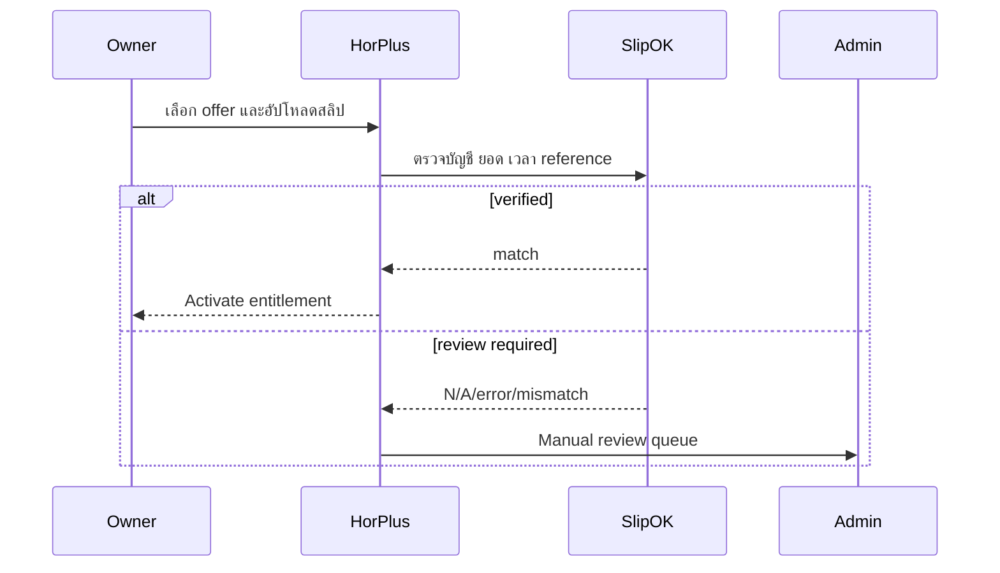

> [!WARNING]
> **[STATUS: SUPERSEDED_IN_PART]**
> Some or all rules in this document may be superseded. Always refer to **[21-CURRENT-PRODUCT-RULE-LOCK.md](./21-CURRENT-PRODUCT-RULE-LOCK.md)** as the absolute source of truth.

# 06. Subscription, Trial and Entitlement

## 1. Offers

| Code | Duration | Total price incl. VAT | Room limit | LINE/month |
|---|---:|---:|---:|---:|
| `FREE` | ไม่หมดอายุ | 0 | 10 | 30 |
| `P01` | 1 เดือน | 189 | 150 | 300 |
| `P03` | 3 เดือน | 529 | 150 | 300 |
| `P06` | 6 เดือน | 999 | 150 | 300 |
| `P12` | 12 เดือน | 1,799 | 150 | 300 |
| `P24` | 24 เดือน | 2,999 | 150 | 300 |

ราคา Paid เป็นยอดรวมตามระยะเวลา ไม่แปลงเป็น monthly plan ในฐานข้อมูลหรือ UI

## 2. Trial and Promo

- standard trial = 30 วัน
- code `HORPLUS` = +60 วัน
- max trial = 90 วัน
- code ใช้ได้ครั้งเดียวต่อ eligible dormitory/user policy
- default redemption capacity = 100 dormitories
- Developer/Admin เปลี่ยน capacity/validity/status ได้
- promo redemption ใช้ transaction lock ป้องกันครั้งที่ 101 ผ่านพร้อมกัน
- trial ใช้ entitlement แบบ Free เว้นแต่เจ้าของผลิตภัณฑ์อนุมัติค่าใหม่

## 3. Account/Dormitory Limit

- Google Account ที่มีเพียง Free entitlement สร้างได้ 1 หอพัก
- Account ที่มี Paid eligibility สร้างได้รวมสูงสุด 10 หอพัก
- แต่ละหอพักซื้อและหมดอายุแยกกัน
- UI แสดง selector เมื่อ membership มากกว่า 1
- limit 10 เป็น config ฝั่ง Developer แต่ client เปลี่ยนไม่ได้

## 4. Entitlement Evaluation

Server คำนวณทุก request:

```text
subscription status
+ effective period
+ package room limit
+ actual non-deleted rooms
+ action type
→ ALLOW | RESTRICTED | DENY
```

ห้ามเก็บเพียง boolean `isPaid` ใน client

## 5. Package Payment



แพ็กเกจห้าม Active จากการ upload อย่างเดียว

## 6. Expiry State Machine

```text
TRIALING/ACTIVE
→ EXPIRED
→ RESTRICTED immediately
→ ACTIVE after verified renewal
```

ไม่มี `PAST_DUE_GRACE` 7 วัน

Restricted:

- ดู dashboard/history ได้
- เปิด package/renewal/upload slip ได้
- ห้าม create/update/delete/issue bill/send LINE/approve payment
- Tenant เห็นเฉพาะข้อมูลที่ issued/paid ก่อน expiry ตาม policy; ห้ามเห็น draft ใหม่

## 7. Free Room Enforcement

- Free active สร้างห้องที่ 11 ไม่ได้
- paid active สร้างห้องที่ 151 ไม่ได้
- หลัง paid หมดและมีเกิน 10 ห้อง ระบบไม่ลบห้อง แต่ Restricted ทั้งหอจนต่ออายุหรือดำเนินการตาม policy ที่ Admin อนุมัติ

## Acceptance Criteria

- offer ทุกตัวคืน total price/duration ถูกต้อง
- expired เวลา boundary Asia/Bangkok ถูกต้องและไม่มี grace
- upload slip ซ้ำไม่เปิด package ซ้ำ
- promo จำกัด 100 แบบ atomic
- entitlement ข้ามหอไม่รั่ว
- client ปลอม paid/roomLimit ไม่ผ่าน


